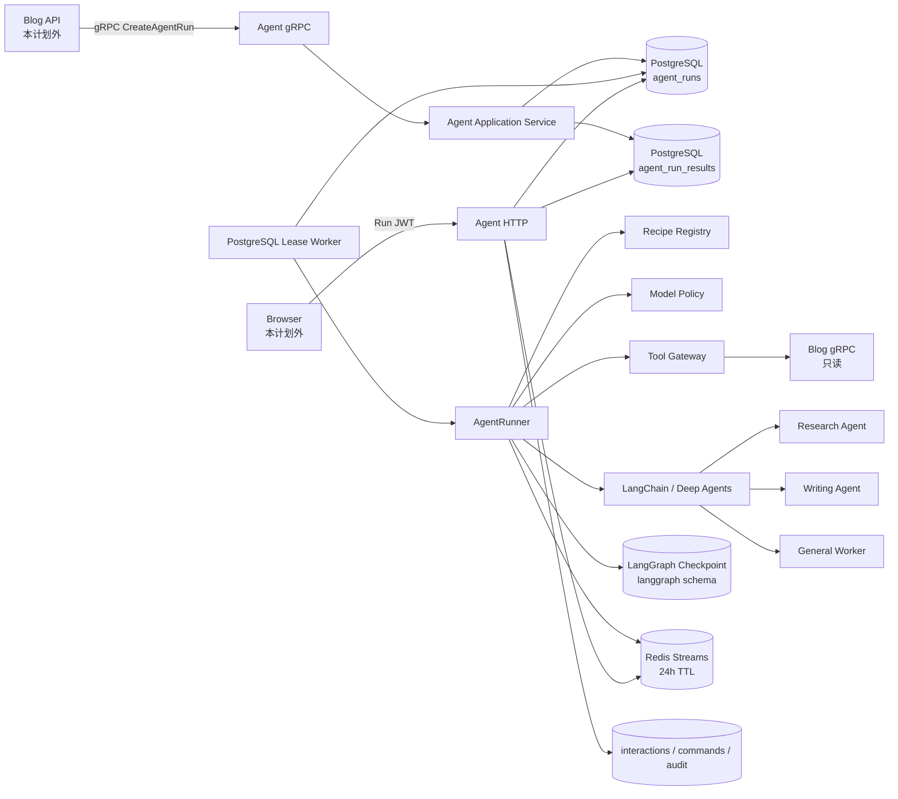
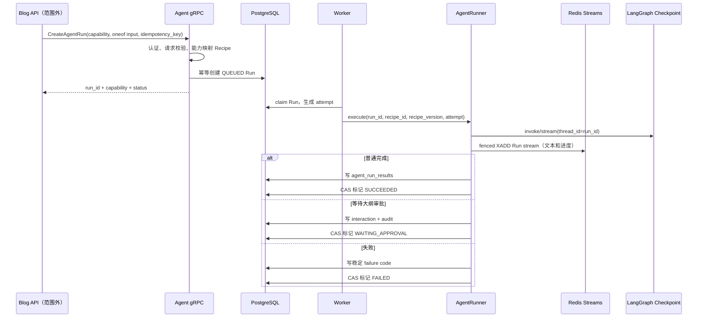
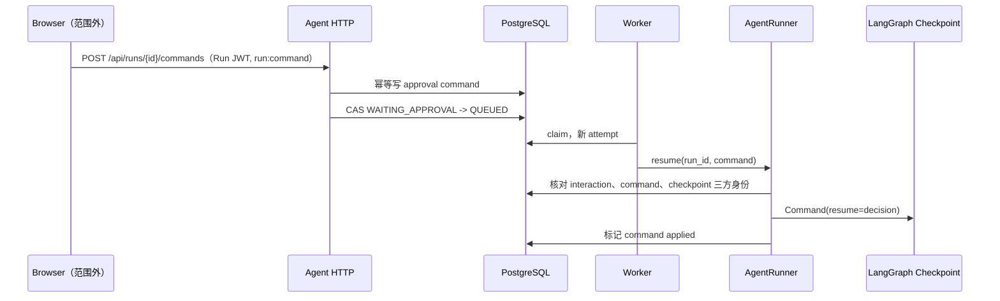

# Agent 原生智能体 Harness 实施计划

> 状态：已完成决策收敛，待实施
> 范围：`agent/`、共享 protobuf 中的 Agent 侧合同、Agent 数据库迁移
> 不在范围：Blog API 调用方、Web 前端、MCP、外部 Web 搜索、Blog 写 Tool、旧 Run 兼容

---

## 一、目标与交付边界

### 1.1 目标

将当前 `SIMPLE/DEEP Runtime + Registry + Router + Normalization` 执行链替换为基于 LangChain、Deep Agents 和 LangGraph checkpoint 的原生 Agent Harness，同时保留项目已有的可靠运行基础：

- PostgreSQL Run 真相；
- PostgreSQL Worker claim/lease/attempt；
- Run JWT 校验；
- SSE 观察与命令提交；
- interaction、command、audit 审批事实；
- 结构化日志、readiness 和有界关闭。

第一版交付四种稳定业务能力：

- `SEARCH`：站内高级搜索；
- `WRITE`：按需研究、生成大纲、人工审批、生成正文；
- `POLISH`：润色用户提供的正文；
- `CHAT`：Main Agent 对话、路由和委派。

### 1.2 第一版明确不做

- 不实现自定义 `StateGraph`、自定义 LangGraph workflow 或自定义 checkpoint；
- 不实现 MCP Client、MCP Server、MCP readiness 或 MCP fallback；
- 不搜索外部 Web；
- 不增加 embedding、向量数据库或混合检索；
- 不注册创建、更新、标签、发布、删除等 Blog 写 Tool；
- 不让客户端选择 Recipe、Recipe 版本、模型、Tool 或质量档位；
- 不把 Redis 用作任务队列、Run 真相或最终结果存储；
- 不实现旧 SIMPLE/DEEP Run 的恢复兼容；当前环境没有需要迁移的旧 Run；
- 不为未来多租户、插件系统、密钥管理或极端故障预留抽象层；
- 不实施 Blog API 和前端调用方改造。

### 1.3 核心原则

1. **业务事实和恢复身份在 PostgreSQL，执行位置在 checkpoint，临时流在 Redis。**
2. **Agent 看到的 Tool 集由 Recipe 决定，Tool 是否审批由 Tool Catalog 决定，执行权限由 Tool 网关最终决定。**
3. **内部 gRPC 接收稳定业务能力，不接收 Agent 内部实现细节。**
4. **先迁移数据库，再切换运行代码；不允许新代码依赖尚未存在的列或表。**
5. **第一版只验证日常主路径和一个基本失败结果，不建设极端故障测试矩阵。**

---

## 二、目标架构

### 2.1 组件关系



### 2.2 存储职责

| 数据 | 唯一真相 | 说明 |
|---|---|---|
| Run 生命周期、能力、Recipe 选择、attempt、lease | PostgreSQL `agent_runs` | Worker 和 API 共用 |
| 最终结构化结果 | PostgreSQL `agent_run_results` | 带结果 schema 版本的 JSONB |
| 大纲审批请求、决定、命令幂等、审计 | 现有 interaction/command/audit 表 | 不由 checkpoint 替代 |
| Agent 消息、Tool 过程、HITL 暂停位置 | LangGraph checkpoint | 使用同一个应用 DSN 和账号，位于 `langgraph` schema |
| 文本增量、阶段进度、临时 SSE 回放 | Redis Streams | 默认 TTL 24 小时；不可作为最终结果真相 |

### 2.3 创建与执行主路径



### 2.4 HITL 恢复主路径



恢复前必须核对：

- `run_id`；
- `interaction_id`；
- `command_id`；
- checkpoint 中待恢复的 approval action ID；
- 当前 Run 状态；
- 当前 Recipe ID 和版本；
- 决定类型和参数 schema。

任何不一致都不得调用 `Command(resume=...)`。

---

## 三、业务能力与 Agent 设计

### 3.1 Recipe 闭集

```python
class Capability(StrEnum):
    SEARCH = "search"
    WRITE = "write"
    POLISH = "polish"
    CHAT = "chat"


@dataclass(frozen=True, slots=True)
class AgentRecipe:
    recipe_id: str
    version: str
    capability: Capability
    agent_kind: AgentKind
    prompt_asset: str
    skill_paths: tuple[str, ...]
    allowed_tools: frozenset[str]
    allowed_subagents: frozenset[str]
    result_schema: type[BaseModel]
    input_schema: type[BaseModel]
    timeout_seconds: int
    recursion_limit: int
```

固定 Recipe：

| Capability | Recipe | 构造方式 | 主要职责 |
|---|---|---|---|
| `SEARCH` | `search.v1` | LangChain `create_agent` | 查询扩展、站内检索、去重、读取、证据综合 |
| `WRITE` | `writing.v1` | Deep Agents `create_deep_agent` | 按需研究、大纲审批、正文生成 |
| `POLISH` | `polish.v1` | LangChain `create_agent` | 按约束润色，不新增未经提供的事实 |
| `CHAT` | `main.v1` | Deep Agents `create_deep_agent` | 对话、能力判断、委派和最终综合 |

Recipe 必须在进程启动时一次性构造并验证，不在请求路径动态加载 Python 对象。

### 3.2 Recipe 版本规则

只有以下合同变化提升 Recipe 版本：

- 输入 schema；
- 输出 schema；
- Agent state schema；
- Tool 名称或参数 schema；
- HITL action/decision schema；
- checkpoint 恢复所依赖的状态形状。

以下内容允许在相同版本内更新：

- Prompt 文本；
- Skill 文本；
- 模型策略；
- Tool 描述文字。

该选择意味着：暂停中的 Run 恢复后，后续模型调用可能使用更新后的 Prompt、Skill 或模型策略。第一版接受这一语义，不保留历史 Prompt 构建产物。

### 3.3 Main Agent

Main Agent 负责：

- 识别聊天请求是直接回答、搜索、写作还是通用处理；
- 委派给 Research、Writing 或 General Worker；
- 合并 Subagent 的结构化结果；
- 对用户可见输出做最终组织。

Main Agent 不负责：

- 修改 Blog 数据；
- 绕过 Tool Gateway；
- 动态注册 Tool；
- 向 Subagent 隐式传递父 Agent 的全部运行上下文；
- 把自由文本当作权限信息。

### 3.4 Research Agent

Research Agent 同时用于：

- `SEARCH` 能力的核心执行；
- Writing Agent 和 Main Agent 的只读研究 Subagent。

执行步骤：

1. 根据用户问题生成少量站内查询；
2. 使用现有 `SearchArticles` 搜索已发布文章和当前用户自己的草稿；
3. 按文章 ID 去重；
4. 读取候选文章内容；
5. 过滤无关内容；
6. 输出带文章身份和证据片段的结构化结果。

第一版不增加向量检索。查询扩展数量和候选读取数量必须设置保守上限，避免模型循环放大。

### 3.5 Writing Agent

Writing Agent 输入：

- 主题；
- 写作要求；
- 可选参考文章 ID；
- 当前用户 ID 和允许读取的数据范围。

执行步骤：

1. 判断现有材料是否足够；
2. 不足时委派 Research Agent；
3. 生成结构化大纲；
4. 调用 `submit_outline_for_approval`；
5. 等待用户批准、编辑或拒绝；
6. 批准后生成正文；
7. 编辑后使用编辑版大纲生成正文；
8. 拒绝时读取反馈并重新生成大纲，最多两次；
9. 达到重试上限后以稳定失败结果结束。

`submit_outline_for_approval` 是内部流程 Tool，不写 Blog 数据，但风险元数据必须标记为 `approval_required`。

同一模型消息中只允许一个待审批大纲 action。若模型同时请求其他 Tool 或多个大纲审批，Runner 将其视为无效 Agent 输出，不创建部分审批。

### 3.6 Polish Agent

Polish Agent：

- 仅处理用户提交的正文和润色要求；
- 保持原意和关键事实；
- 不主动检索资料；
- 不调用 Blog Tool；
- 输出润色正文及简短修改说明。

### 3.7 General Worker

General Worker 用于摘要、提取、格式转换和短文本处理：

使用 LangChain `create_agent` 构造，不使用 Deep Agents 默认 general-purpose Subagent。

- 默认使用 FAST 模型档位；
- 不持有 Blog Tool；
- 不持有 Writing Agent 的大纲审批能力；
- 只接收 Main Agent 显式传入的结构化任务。

### 3.8 最终结果合同

四种结果均为严格 Pydantic 模型，第一版 schema version 为 `v1`：

| 结果 | 必要字段 |
|---|---|
| `SearchResponse` | 原始问题、综合结论、命中文章及其 `article_id/title/visibility/evidence` |
| `ArticleDraft` | 标题、大纲、Markdown 正文、使用的文章来源 |
| `PolishResponse` | 润色正文、修改说明 |
| `ChatResponse` | 最终回复、可选文章来源 |

来源只能引用 Tool 实际返回且当前用户可见的文章。模型生成但无法对应 Tool 结果的文章 ID 不得进入最终结果。结果校验失败时 Run 以 `result_validation_failure` 结束，不保存部分结果。

---

## 四、Prompt、Skill 与框架使用

### 4.1 目录

```text
agent/src/scyg_agent/agents/
├── contracts.py
├── recipes.py
├── registry.py
├── runner.py
├── model_policy.py
├── middleware.py
├── hitl.py
├── prompts/
│   ├── main.md
│   ├── research.md
│   ├── writing.md
│   ├── polish.md
│   └── general.md
└── skills/
    ├── shared/
    │   └── blog-context/SKILL.md
    └── writing/
        └── blog-style/SKILL.md
```

### 4.2 Skill 规则

- 每个 Skill 使用独立目录和 `SKILL.md`；
- `name` 与目录名一致；
- YAML frontmatter 至少包含 `name` 和 `description`；
- Skill 文件必须被显式加入 wheel/sdist；
- backend root 使用 `Path(__file__)` 推导的绝对路径；
- 不依赖当前工作目录；
- Windows 下目录和 source 路径均通过 `pathlib` 构造。

Main 和 Writing 使用 Deep Agents 原生 Skills 能力。Search、Polish 和 General 的稳定规则直接加载到 system prompt，不为普通 Agent 模拟动态 Skill Tool。

### 4.3 Deep Agents Tool surface

Deep Agents 不得直接使用默认的宽泛 Tool surface。构造时：

- 显式注册 Research、Writing、General Subagent；
- 不注册默认 general-purpose Subagent；
- 不注册 shell/execute Tool；
- 不注册写文件、删除文件或任意路径访问；
- 只保留加载只读 Skill 所需的受根目录限制的读取能力，并显式设置 `FilesystemBackend(virtual_mode=True)`；
- Blog Tool 必须经过项目自己的 Tool Gateway。

### 4.4 依赖版本策略

实施开始时升级并固定一个最新稳定、彼此兼容的组合：

- `langchain`；
- `langchain-openai`；
- `langgraph`；
- `langgraph-checkpoint-postgres`；
- `deepagents`。

升级后先执行本地能力探针，只验证：

- `create_agent` 可构造；
- `create_deep_agent` 可构造；
- 自定义 Subagent 可注册；
- Skills backend 能读取打包后的 Skill；
- HITL middleware 能产生 interrupt；
- PostgreSQL checkpointer 能 setup 并读写 checkpoint。

不为 `chat_completions`/`responses` 配置执行真实 Provider 请求探针。

---

## 五、模型策略

### 5.1 配置

```toml
[models]
protocol = "chat_completions" # chat_completions | responses

[models.fast]
model = "..."
base_url = "..."
api_key = "..."
timeout_seconds = 60

[models.standard]
model = "..."
base_url = "..."
api_key = "..."
timeout_seconds = 120

[models.strong]
model = "..."
base_url = "..."
api_key = "..."
timeout_seconds = 180
```

`protocol` 是所有模型档位共享的统一配置项：

- `chat_completions`：显式使用 Chat Completions；
- `responses`：显式使用 Responses API。

不允许 SDK 根据模型名自动猜测协议。

### 5.2 自动档位选择

客户端不能传质量档位。`ModelPolicy` 根据能力和输入复杂度选择：

- General Worker：FAST；
- Polish：默认 FAST，长文本使用 STANDARD；
- Search：STANDARD；
- Writing：默认 STANDARD，长材料或复杂写作要求使用 STRONG；
- Main：默认 STANDARD，需要复杂综合时使用 STRONG。

复杂度判定只使用确定性输入特征，例如字符数、参考文章数量、约束数量和能力类型。第一版不增加另一次模型调用来选择模型。

### 5.3 日志安全

配置允许在 `agent.toml` 或 `.env` 明文保存 Provider key，但：

- 配置对象的 `repr` 不显示 key；
- 日志不输出 Authorization header；
- 异常不拼接 DSN、Redis 密码或 Provider key；
- Provider 原始响应只记录稳定错误分类和必要 request ID。

---

## 六、Tool Catalog 与执行门禁

### 6.1 Tool Catalog

```python
@dataclass(frozen=True, slots=True)
class ToolSpec:
    name: str
    description: str
    input_schema: type[BaseModel]
    risk: ToolRisk
    required_permissions: frozenset[str]
    handler: ToolHandler


class ToolRisk(StrEnum):
    READ_ONLY = "read_only"
    APPROVAL_REQUIRED = "approval_required"
    # 新风险类型在实际引入对应 Tool 时再增加。
```

第一版 Tool：

| Tool | 风险 | 使用方 |
|---|---|---|
| `search_articles` | `READ_ONLY` | Research、Main |
| `get_article` | `READ_ONLY` | Research、Writing、Main |
| `submit_outline_for_approval` | `APPROVAL_REQUIRED` | Writing |

不注册任何 Blog mutation Tool。

### 6.2 三层控制

1. **Recipe allowlist**：决定 Agent 是否能看到 Tool；
2. **Tool Catalog 风险和权限**：决定是否需审批及所需业务权限；
3. **执行时 Tool Gateway**：每次调用前再次校验 Recipe、用户、范围、参数和风险。

禁止只在 Agent 构造时过滤 Tool。历史消息、checkpoint 或恢复命令中的 Tool call 仍必须经过执行时门禁。

### 6.3 用户和数据范围

Tool Runtime Context 使用明确字段：

```python
@dataclass(frozen=True, slots=True)
class AgentRuntimeContext:
    user_id: str
    run_id: str
    recipe_id: str
    recipe_version: str
    permissions: frozenset[str]
    article_scope: ArticleScope
    locale: str
```

Research Subagent 不继承父 Agent 的动态 Tool 集。Main 或 Writing 必须通过结构化 Subagent task 传入：

- `user_id`；
- 允许的数据范围；
- 查询目标；
- 候选数量上限；
- 返回 schema。

Blog gRPC 仍是最终业务权限边界。Agent 的本地校验不能替代 Blog 服务鉴权。

---

## 七、gRPC 合同

### 7.1 统一创建 RPC

Agent 侧提供统一创建合同：

```proto
enum AgentCapability {
  AGENT_CAPABILITY_UNSPECIFIED = 0;
  AGENT_CAPABILITY_SEARCH = 1;
  AGENT_CAPABILITY_WRITE = 2;
  AGENT_CAPABILITY_POLISH = 3;
  AGENT_CAPABILITY_CHAT = 4;
}

message SearchInput {
  string query = 1;
  uint32 max_results = 2;
}

message WritingInput {
  string topic = 1;
  string requirements = 2;
  repeated string reference_article_ids = 3;
}

message PolishInput {
  string content = 1;
  string requirements = 2;
}

message ChatInput {
  string message = 1;
}

message CreateAgentRunRequest {
  string user_id = 1;
  string idempotency_key = 2;
  AgentCapability capability = 3;
  string locale = 4;

  oneof input {
    SearchInput search = 10;
    WritingInput writing = 11;
    PolishInput polish = 12;
    ChatInput chat = 13;
  }
}
```

服务端必须验证 `capability` 与 `oneof input` 精确匹配。调用方不能提交：

- Recipe ID 或版本；
- 模型名或档位；
- Tool 列表；
- Subagent 列表；
- checkpoint/thread ID；
- RuntimeKind。

### 7.2 创建幂等

幂等身份：

```text
(user_id, capability, idempotency_key)
```

相同幂等身份且 payload digest 相同：返回原 Run。

相同幂等身份但 payload digest 不同：返回稳定冲突，不创建新 Run。

服务端将 capability 映射为当前批准的 Recipe，并把以下字段冻结到 Run：

- `capability`；
- `recipe_id`；
- `recipe_version`；
- 输入 payload；
- 输入 schema 版本；
- payload digest。

### 7.3 服务间认证

`CreateAgentRun` 只接受受信任 Blog 服务调用，沿用现有 Agent JWT 验证器，不引入新的 HMAC 认证协议：

- Blog API 使用 Agent 已配置的 RSA/JWT 签发约定；
- Agent 校验签名算法、issuer、audience、过期时间和固定服务主体；
- JWT 必须包含 `agent:runs:create` scope；
- 认证通过后，`user_id` 才被视为 Blog 服务确认的用户身份；
- 认证失败不得创建 Run、占用幂等键或写 Redis；
- 浏览器不能携带 `agent:runs:create` 直接调用创建 RPC。

第一版不新增面向终端用户的 gRPC JWT，也不允许浏览器直接调用创建 RPC。浏览器继续通过 Blog API 获得 Run 和 Run JWT，再访问 Agent HTTP 观察面。

### 7.4 调用方范围

本计划只实施：

- protobuf 合同；
- Python 生成代码；
- Agent gRPC handler；
- Agent application service；
- Agent 侧合同测试。

Blog API 和前端调用方不在本计划中实现。

---

## 八、数据库模型与迁移

### 8.1 `agent_runs`

目标核心字段：

```text
id
user_id
capability
recipe_id
recipe_version
input_schema_version
input_payload_json
input_digest
status
attempt
lease_owner
lease_expires_at
revision
created_at
updated_at
started_at
finished_at
failure_code
failure_message
```

删除旧 Runtime 身份字段和约束：

- `task_type`；
- `runtime_kind`；
- `runtime_version`；
- SIMPLE/DEEP 相关 CHECK；
- 旧 Runtime Registry 依赖。

由于当前没有旧 Run，迁移在删除旧列前执行显式空表保护。若检测到任何 Run，迁移必须中止并要求人工处理；不得自动删除或静默转换业务数据。

### 8.2 `agent_run_results`

```sql
CREATE TABLE agent_run_results (
    run_id uuid PRIMARY KEY REFERENCES agent_runs(id),
    capability text NOT NULL,
    schema_version text NOT NULL,
    result_json jsonb NOT NULL,
    created_at timestamptz NOT NULL,
    updated_at timestamptz NOT NULL
);
```

写入规则：

- 只允许与 Run capability 对应的 Pydantic 输出模型；
- 序列化前完成严格校验；
- 同一 Run 最多一条最终结果；
- Worker 在标记 `SUCCEEDED` 前写入结果；
- 结果写入和 Run 终态更新处于同一个数据库事务；
- 恢复或重复提交时使用结果 digest 防止覆盖不同结果。

### 8.3 LangGraph checkpoint

- 使用同一个应用 PostgreSQL DSN 和账号；
- 使用 `langgraph` schema；
- 应用 migration 负责 Agent truth；
- 官方 checkpointer setup 负责 checkpoint 表；
- 二者不做同一事务假设。

checkpoint config 至少包含：

```python
{
    "configurable": {
        "thread_id": str(run.id),
        "checkpoint_ns": f"{run.recipe_id}:{run.recipe_version}",
    }
}
```

### 8.4 迁移与发布顺序

固定顺序：

1. 停止旧 Worker 和旧 Agent 实例；
2. 运行 Agent migration；
3. 运行 checkpoint setup；
4. 验证 Redis 可用；
5. 部署只理解新 schema 的 Agent；
6. 启动 Worker；
7. 执行 readiness 和最小 smoke test。

不得先部署新代码再补数据库列。

---

## 九、Redis Streams 与 SSE

### 9.1 Redis 配置

```toml
[redis]
url = "redis://localhost:6379/0"
stream_ttl_seconds = 86400
connect_timeout_seconds = 5
read_timeout_seconds = 30
```

Redis 是第一版强依赖：

- startup 无法连接时进程启动失败；
- readiness 检查失败；
- 不接受新 Run；

- 运行中 `XADD` 失败时当前 Run 失败；
- 不回退到 PostgreSQL 临时事件流。

gRPC 创建 handler 还必须检查进程内 Redis health 状态；Redis 已失联时直接返回 `UNAVAILABLE`，不能只依赖上游是否遵守 readiness。

### 9.2 Stream key 与 fencing

每个 Run 使用一个稳定 stream，确保 HITL 恢复产生新 attempt 后，已有 SSE 连接仍能继续收到事件：

```text
agent:run:{run_id}:events
agent:run:{run_id}:current-attempt
```

每次 Worker claim 都在 PostgreSQL 中生成递增 `attempt`。claim 提交后、调用模型前，Worker 使用 Redis Lua 脚本单调推进 `current-attempt`；小于当前值的旧 attempt 不能覆盖它。

所有流写入都经过同一个原子 Lua 脚本：

1. 读取 `current-attempt`；
2. 要求它精确等于调用方的 `attempt`；
3. 匹配时执行 `XADD` 并刷新两个 key 的 TTL；
4. 不匹配时拒绝写入并返回 `stale_attempt`。

事件 envelope：

```json
{
  "run_id": "...",
  "attempt": 3,
  "kind": "text_delta | progress | approval_required | terminal",
  "sequence": 12,
  "occurred_at": "...",
  "payload": {}
}
```

SSE 始终订阅稳定的 Run stream，因此审批恢复和 Worker 重新认领不要求浏览器更换连接。新 attempt 激活后，旧 Worker 的后续写入会被 Lua fencing 拒绝。

Worker 写入前仍需检查 lease cancellation signal；Redis attempt fencing 只负责防止临时流混写，不替代 PostgreSQL lease 和终态 CAS。

### 9.3 TTL

- 每次 `XADD` 后刷新 stream TTL；
- Run 运行期间持续保持 24 小时；
- Run 终态后不立即删除，继续保留 24 小时；
- 不实现复杂的“终态后重新计算 TTL”调度器；
- Redis key 自然过期后，客户端通过 Run snapshot 和最终结果接口读取持久状态。

### 9.4 SSE 恢复

- SSE `id` 直接使用 Redis Stream ID；
- 浏览器通过 `Last-Event-ID` 恢复；
- cursor 不存在但 stream 尚在时，从下一个可用 ID 继续；
- stream 已过期时返回明确的 `stream_expired` 事件，并附持久 Run 状态引用；
- 心跳不写 Redis，只在连接层生成；
- 文本增量不写 PostgreSQL。

### 9.5 持久事件

PostgreSQL 中只保留需要审计或恢复的业务事件：

- Run 状态变化；
- approval required；
- approval decision；
- command applied/rejected；
- final result reference；
- stable failure。

逐 token、逐文本块和普通进度只进入 Redis。

---

## 十、HITL 合同

### 10.1 审批请求

```python
class OutlineApprovalRequest(BaseModel):
    interaction_id: UUID
    action_id: str
    outline: ArticleOutline
    revision: int
    retry_count: int


class OutlineDecisionKind(StrEnum):
    APPROVE = "approve"
    EDIT = "edit"
    REJECT = "reject"


class OutlineDecision(BaseModel):
    interaction_id: UUID
    action_id: str
    kind: OutlineDecisionKind
    edited_outline: ArticleOutline | None = None
    feedback: str | None = None
```

校验规则：

- `APPROVE` 不接受 `edited_outline`；
- `EDIT` 必须携带完整且合法的 `edited_outline`；
- `REJECT` 必须携带非空反馈；
- action ID 必须与当前 interaction 和 checkpoint 中断一致；
- 第一版每个 command 只处理一个大纲 action。

### 10.2 拒绝重试

- 首次拒绝：允许重新生成；
- 第二次拒绝：允许最后一次重新生成；
- 第三次拒绝或再次需要重试：Run 以稳定 `outline_rejected_limit` 失败；
- 重试计数保存在 checkpoint state，并复制到 interaction payload 供审计；
- command 重放不得重复增加计数。

### 10.3 审批真相

- interaction 保存审批请求；
- command 保存用户决定和幂等身份；
- audit 保存请求、决定和应用结果；
- checkpoint 保存模型执行位置；
- Run 状态表示当前是否等待审批。

任何单一来源都不足以单独恢复。`ApprovalReconciler` 必须完成三方匹配后才能 resume。

---

## 十一、Worker 与 Runner

### 11.1 保留的 Worker 能力

保留并适配现有：

- PostgreSQL claim；
- attempt；
- lease renew；
- owner/token/revision CAS；
- stale owner 拒绝；
- 取消；
- shutdown grace period；
- 强制终止后的重新认领。

删除 Runtime 专属分支：

- `RuntimeRegistry`；
- `RuntimeRouter`；
- `RuntimeAdapter`；
- `SIMPLE/DEEP` 选择；
- Runtime native output normalization。

### 11.2 `AgentRunner`

```python
class AgentRunner:
    async def execute(self, run: Run, lease: LeaseContext) -> RunOutcome: ...
    async def resume(
        self,
        run: Run,
        command: CommandSubmission,
        lease: LeaseContext,
    ) -> RunOutcome: ...
```

职责：

1. 根据冻结的 `recipe_id/version` 获取 Recipe；
2. 校验 Run input；
3. 构造 `AgentRuntimeContext`；
4. 选择模型；
5. 使用 `thread_id=run_id` 调用 Agent；
6. 将模型文本和进度批量写 Redis；
7. 识别正常完成、HITL interrupt、取消和失败；
8. 将结构化最终结果写 PostgreSQL；
9. 通过 lease-fenced CAS 更新 Run。

### 11.3 流式批处理

为避免逐 token Redis I/O：

- 在内存累计小文本块；
- 达到字符阈值或短时间间隔后 `XADD`；
- terminal、approval 和错误事件立即 flush；
- flush 失败立即中止当前执行并标记稳定失败；
- 不在内存保留完整正文的第二份无界副本。

### 11.4 失败分类

第一版稳定分类：

```text
invalid_input
unknown_capability
unknown_recipe
model_failure
tool_failure
permission_denied
approval_state_mismatch
outline_rejected_limit
checkpoint_failure
redis_failure
result_validation_failure
lease_lost
cancelled
internal_failure
```

错误消息必须稳定、可安全返回；底层异常写结构化日志但不得包含密钥和 DSN。

---

## 十二、HTTP 观察面

Agent HTTP 保留现有 `/api` 前缀：

```text
GET  /api/runs/{run_id}
GET  /api/runs/{run_id}/events
POST /api/runs/{run_id}/commands
POST /api/runs/{run_id}/cancel
GET  /health/live
GET  /health/ready
```

权限：

| 路由 | Run JWT scope |
|---|---|
| Run snapshot | `run:read` |
| SSE | `run:read` |
| 大纲审批 command | `run:command` |
| cancel | `run:cancel` |

Agent 不签发面向浏览器的用户 JWT。调用方负责取得 Blog 服务签发的 Run JWT；Agent 只验证签名、issuer、audience、subject、run_id、scope 和过期时间。

### 12.1 Run snapshot

返回：

- `run_id`；
- capability；
- 状态；
- attempt；
- 当前审批摘要；
- failure code；
- 最终结果或结果引用；
- stream 是否仍可回放。

不得返回：

- checkpoint 原始 state；
- Provider 原始响应；
- Tool 内部异常；
- API key、DSN 或 Redis URL。

### 12.2 Readiness

readiness 同时要求：

- PostgreSQL 可查询；
- LangGraph checkpoint 已 setup 且可访问；
- Redis 可 `PING`；
- Recipe Registry 完整；
- 所有 Prompt/Skill 可加载；
- gRPC channel 可初始化；
- Worker 未进入 shutdown draining。

由于 Redis 是强依赖，Redis 不可用时 readiness 必须失败。

---

## 十三、配置与组合根

### 13.1 新配置

```python
@dataclass(frozen=True, slots=True)
class RedisSettings: ...

@dataclass(frozen=True, slots=True)
class ModelEndpointSettings: ...

@dataclass(frozen=True, slots=True)
class ModelSettings:
    protocol: ModelProtocol
    fast: ModelEndpointSettings
    standard: ModelEndpointSettings
    strong: ModelEndpointSettings

@dataclass(frozen=True, slots=True)
class AgentHarnessSettings:
    max_concurrent_runs: int
    stream_flush_chars: int
    stream_flush_interval_ms: int
```

第一版只有一个全局 Run 并发上限，不增加按 Recipe、模型或 Tool 的并发池。

### 13.2 组合根资源生命周期

`RuntimeComposition` 改为 `AgentComposition`，统一拥有：

- PostgreSQL engine/session；
- Checkpointer；
- Redis client；
- Blog gRPC channel/client；
- FAST/STANDARD/STRONG 模型对象；
- Tool Catalog/Gateway；
- Recipe Registry；
- AgentRunner；
- Worker；
- HTTP/gRPC servers。

固定关闭顺序：

1. 停止接收新的 gRPC 创建请求；
2. readiness 进入 draining；
3. 停止 Worker claim；
4. 等待运行中 Run 到 grace period；
5. 取消剩余执行；
6. flush Redis 批次；
7. 关闭模型和 Blog gRPC client；
8. 关闭 Redis client；
9. 关闭 checkpointer；
10. 关闭 PostgreSQL engine。

---

## 十四、目标目录

```text
agent/
├── migrations/
│   └── versions/
├── src/scyg_agent/
│   ├── agents/
│   │   ├── contracts.py
│   │   ├── recipes.py
│   │   ├── registry.py
│   │   ├── runner.py
│   │   ├── model_policy.py
│   │   ├── middleware.py
│   │   ├── hitl.py
│   │   ├── prompts/
│   │   └── skills/
│   ├── adapters/
│   │   ├── blog_grpc/
│   │   ├── database/
│   │   ├── langgraph/
│   │   └── redis/
│   ├── api/
│   │   ├── grpc/
│   │   └── http/
│   ├── application/
│   │   ├── create_agent_run.py
│   │   ├── submit_command.py
│   │   ├── get_run.py
│   │   └── cancel_run.py
│   ├── domain/
│   ├── composition.py
│   ├── config.py
│   └── worker.py
└── tests/
    ├── agents/
    ├── adapters/
    ├── api/
    ├── application/
    ├── integration/
    └── worker/
```

不创建：

```text
agents/workflows/
adapters/mcp/
runtimes/simple/
runtimes/deep/
```

---

## 十五、实施阶段

### P0：升级并冻结框架依赖

#### 工作

1. 升级 LangChain、Deep Agents、LangGraph、checkpoint Postgres 依赖；
2. 更新 lock；
3. 编写一次性本地构造探针；
4. 确认 Deep Agents 的 Subagent、Skills、HITL 和 checkpoint API；
5. 记录最终固定版本和必要的 API 适配方式；
6. 删除探针，不将其保留为长期脚本。

P0 实际冻结组合：

- `deepagents==0.7.15`；
- `langchain==1.4.2`；
- `langchain-openai==1.6.2`；
- `langgraph==1.2.11`；
- `langgraph-checkpoint-postgres==3.1.2`；
- 间接 `langgraph-checkpoint==4.1.1`。

探针确认 `create_agent`、`create_deep_agent`、TypedDict Subagent、SkillsMiddleware 和 HumanInTheLoopMiddleware 均可构造。Deep Agents 的 `FilesystemBackend` 必须显式使用 `virtual_mode=True`；默认模式允许绝对路径和 `..` 绕过 `root_dir`，不符合本项目的根目录边界。

探针只做无 Provider 请求的构造验证；真实 PostgreSQL checkpoint `setup/read/write` 留给部署拓扑验收，不在本地探针中伪造。

#### 验收

- Main/Writing Deep Agent 可构造；
- Search/Polish/General 普通 Agent 可构造；
- Skill backend 可绑定打包路径且使用 `virtual_mode=True`；
- HITL middleware 可安装并接受 `interrupt_on` 配置；
- `AsyncPostgresSaver.setup` API 存在；
- 未执行真实 Provider 请求；
- PostgreSQL checkpoint 的真实 setup/read/write 在 P10 环境验收。

### P1：定义新合同和配置

#### 工作

1. 新增 capability、Recipe、输入、输出、HITL 和 failure 合同；
2. 新增统一模型协议配置；
3. 新增 Redis 配置；
4. 修改共享 protobuf，生成 Python 代码；
5. 为 Run domain 的 capability/Recipe/input 快照迁移确定字段合同；物理移除旧 Runtime identity 与数据库字段和 P2 schema/repository 迁移同步完成，避免出现 domain、mapper、数据库三者不一致；
6. 更新配置示例。

P1 已实现：`agent/contracts/proto/scyg/agent/v1` 新增四种 capability、四种严格输入消息和 `CreateAgentRun` RPC；Python 侧新增 `scyg_agent.agents.contracts`，所有输入/输出使用 `extra="forbid"` 的冻结 Pydantic 合同；配置新增 `[models]`、`chat_completions|responses` 和 fast/standard/strong 三档。旧单 Provider 字段暂作为本地配置迁移回退，启动时映射为三档相同配置，不暴露 secret。

#### 验收

- 四种 capability 与 `oneof` 精确匹配；
- `CreateAgentRun` 不包含 Recipe、模型、Tool、Subagent、checkpoint 或 Runtime 字段；
- 输入/输出合同拒绝未知字段并执行长度、数量边界；
- 统一模型协议和三档配置可解析，旧开发配置可安全回退；
- 错误配置在启动期失败；
- 配置异常不泄露 secret；
- Run physical migration is coupled to P2 schema/repository cutover and is not partially applied in P1。

### P2：数据库迁移

#### 工作

1. 为 `agent_runs` 增加 capability/Recipe/input 字段；
2. 新建 `agent_run_results`；
3. 修改 interaction/command payload schema；
4. 增加必要唯一约束和索引；
5. 增加旧 Run 空表保护；
6. 删除旧 Runtime 字段和约束；
7. 更新 repository 和 transaction 边界。

#### 验收

- 空库可从零初始化；
- migration 可重复检查并安全失败；
- 检测到旧 Run 时不会自动删除数据；
- final result 与 Run 终态在同一事务提交。

### P3：Redis Streams

#### 工作

1. 新增 Redis client factory 和生命周期；
2. 实现稳定 Run stream 和 Lua attempt fencing；
3. 实现事件 envelope、批量 flush 和 TTL；
4. 实现 SSE cursor/`Last-Event-ID`；
5. 实现 `stream_expired`；
6. 将 Redis 加入 startup/readiness；
7. 定义 `redis_failure` 终止路径。

#### 验收

- 文本增量和进度可流式读取；
- 短暂断线可从 cursor 恢复；
- 新 attempt 激活后，旧 Worker 不能继续写流；
- Redis 写失败导致 Run 失败；
- PostgreSQL 不保存逐 token 事件。

### P4：Tool Gateway 与 Blog 只读 Tool

#### 工作

1. 建立 Tool Catalog；
2. 实现 Recipe allowlist；
3. 实现执行时 Tool Gateway；
4. 包装 `SearchArticles` 和文章读取 RPC；
5. 显式传递 user ID、权限和文章范围；
6. 实现 `submit_outline_for_approval`；
7. 禁止任何 Blog mutation Tool 注册。

#### 验收

- Research 能搜索已发布文章和本人草稿；
- 不能读取其他用户草稿；
- checkpoint 中伪造的未授权 Tool call 会在执行时被拒绝；
- 第一版 Tool Catalog 中不存在写 Blog Tool。

### P5：模型策略、Prompt 和 Skill

#### 工作

1. 构造三个模型档位；
2. 实现统一 protocol 选择；
3. 实现确定性 ModelPolicy；
4. 编写五类 Prompt；
5. 编写 shared/writing Skills；
6. 配置打包数据；
7. 禁用 Deep Agents 默认危险 Tool。

#### 验收

- FAST/STANDARD/STRONG 能按输入特征选择；
- protocol 不被 SDK 自动猜测；
- wheel 安装后仍能加载 Prompt/Skill；
- Agent 看不到 shell、任意文件写入或默认通用 Subagent。

### P6：四类 Agent 与 Subagent

#### 工作

1. 实现 Research Agent；
2. 实现 Polish Agent；
3. 实现 General Worker；
4. 实现 Writing Deep Agent；
5. 实现 Main Deep Agent；
6. 注册显式 Subagent；
7. 实现 Recipe Registry 启动校验。

#### 验收

- Search 完成查询扩展、去重、读取和证据输出；
- Polish 不调用检索 Tool；
- Writing 仅在资料不足时研究；
- Main 只能委派已批准 Subagent；
- General Worker 不持有 Blog Tool。

### P7：HITL 与恢复

#### 工作

1. 实现 OutlineApprovalRequest/Decision；
2. 将 interrupt 写入 interaction/audit；
3. 复用 `run:command` 接收决定；
4. 实现 ApprovalReconciler；
5. 实现 approve/edit/reject；
6. 实现最多两次拒绝重试；
7. 实现 command applied/rejected 幂等状态。

#### 验收

- approve 后生成正文；
- edit 后严格使用编辑版大纲；
- reject+feedback 可重新生成两次；
- 重放同一 command 不会重复恢复；
- interaction、command、checkpoint 不一致时拒绝恢复。

### P8：AgentRunner 与 Worker 切换

#### 工作

1. 实现 `AgentRunner.execute/resume`；
2. 连接 checkpoint、Redis 和结果表；
3. 将 Worker 调度从 Runtime Router 切换到 Recipe Registry；
4. 保留 lease renew/cancel/shutdown；
5. 实现 Redis attempt fencing 和 PostgreSQL 终态 CAS；
6. 实现稳定失败映射；
7. 移除 normalization 链路依赖。

#### 验收

- 新 Run 可由 Worker 完成；
- WAITING_APPROVAL Run 可恢复；
- lease 丢失后旧执行不能提交终态；
- 取消能停止 Agent 执行；
- 最终结构化结果可读取。

### P9：gRPC 与 HTTP 接入

#### 工作

1. 实现 `CreateAgentRun`；
2. 实现 capability 到 Recipe 映射；
3. 实现创建幂等和 payload digest 冲突；
4. 更新 Run snapshot；
5. 将 SSE 后端切到 Redis Streams；
6. 更新 command/cancel；
7. 更新 Run JWT scope 校验。
8. 在创建 handler 执行 Redis health gate；

#### 验收

- 每种 capability 均能创建正确 Recipe Run；
- capability/input 不匹配会拒绝；
- 相同幂等请求返回同一 Run；
- 不同 payload 复用幂等键返回冲突；
- `run:read`、`run:command`、`run:cancel` 边界有效。
- Redis 不可用时创建 RPC 返回 `UNAVAILABLE`，且不创建 Run；

### P10：组合根与启动检查

#### 工作

1. 将 `RuntimeComposition` 改为 `AgentComposition`；
2. 统一管理 PostgreSQL、checkpoint、Redis、gRPC、模型和 servers；
3. 更新 readiness；
4. 更新关闭顺序；
5. 更新启动命令和配置加载；
6. 确保 migration/setup 在服务启动前完成。

#### 验收

- 完整应用可启动；
- Redis、PostgreSQL 或 checkpoint 不可用时 readiness 失败；
- shutdown 不再 claim 新 Run；
- 关闭后无遗留 client/session。

### P11：清理旧 Runtime

#### 删除

- `agent/src/scyg_agent/runtimes/simple/`；
- `agent/src/scyg_agent/runtimes/deep/`；
- `agent/src/scyg_agent/runtimes/base.py`；
- `agent/src/scyg_agent/runtimes/registry.py`；
- `agent/src/scyg_agent/runtimes/router.py`；
- Runtime profiles；
- normalization 模块；
- 旧 Runtime adapters、factories 和 composition；
- SIMPLE/DEEP 配置；
- 旧 Runtime 测试和文档描述。

#### 保留或迁移

- lease、attempt、CAS 和 cancellation 行为迁入 Worker/Application；
- interaction/command/audit 行为迁入 HITL；
- Blog gRPC client 迁入 Tool Gateway；
- checkpoint 配置迁入 Agent composition；
- HTTP auth/SSE 路由迁入新的观察面。

#### 验收

- 源码不存在 `RuntimeKind.SIMPLE/DEEP` 执行分支；
- 不存在旧 Registry/Router/Adapter 导入；
- 不存在兼容 alias、弃用入口或双执行路径；
- `runtimes/` 目录被完全删除。

### P12：日常主路径验证与文档同步

#### 保留的测试

只保留能防止真实回归的测试：

1. gRPC 四种 capability 创建和一个错误输入；
2. 创建幂等和 payload 冲突；
3. Search 读取已发布文章和本人草稿；
4. Writing 无需研究直接生成；
5. Writing 需要研究后生成；
6. 大纲 approve；
7. 大纲 edit；
8. 大纲 reject 后重试；
9. Redis cursor 恢复；
10. Redis 写失败使 Run 失败；
11. final result 与 Run 终态一致；
12. lease 丢失拒绝旧 Worker 提交；
13. Run JWT scope；
14. startup/readiness 基本失败结果。

不建设：

- 穷举权限矩阵；
- 极端并发；
- 长时间网络抖动；
- Redis cluster/failover；
- PostgreSQL 主从切换；
- Provider 协议真实请求矩阵；
- 所有模型输出排列；
- 旧 Run 兼容测试。

#### Smoke test

最终必须实际运行一次完整日常场景：

```text
gRPC 创建 WRITE Run
→ Worker claim
→ Writing Agent 按需站内研究
→ 大纲进入 WAITING_APPROVAL
→ run:command 提交 approve
→ Worker resume
→ Redis SSE 输出正文增量
→ PostgreSQL 保存 ArticleDraft
→ Run SUCCEEDED
→ snapshot 返回最终结果
```

另运行一个基本失败场景：Redis 写入失败后 Run 进入 `FAILED/redis_failure`，不产生伪成功结果。

#### 文档

按项目文档方法论同步：

- `agent/README.md`；
- `agent/agent.toml.example`；
- `agent/.env.example`；
- `agent/docs/agent-architecture.md`；
- protobuf 使用说明；
- migration 和本地启动顺序；
- Redis 依赖和 24 小时临时流语义。

---

## 十六、验收标准

### 16.1 功能

- 四种 capability 通过统一 gRPC 创建；
- Search 仅使用站内已发布文章和本人草稿；
- Writing 支持按需研究和大纲 HITL；
- Polish 不擅自检索或新增事实；
- Main 可委派 Research、Writing、General；
- 第一版不存在 Blog 写 Tool；
- 最终结果持久化到 PostgreSQL；
- 文本增量通过 Redis Streams 回放。

### 16.2 一致性

- Run 真相不在 Redis；
- approval 真相不只在 checkpoint；
- final result 不只在消息历史；
- capability 与 Recipe 的映射只在 Agent 服务端；
- Worker 只执行 Run 冻结的 Recipe；
- 旧 attempt 不能继续写入当前 Run stream；
- lease 丢失的 Worker 不能提交终态。

### 16.3 安全与权限

- 浏览器入口继续验证 Run JWT；
- 审批复用 `run:command`；
- Tool 每次执行都检查 Recipe allowlist、用户权限和数据范围；
- Research 不能读取其他用户草稿；
- Deep Agents 不暴露 shell、任意文件写入或默认通用 Subagent；
- 日志和异常不泄露密码、API key、JWT 或 DSN。

### 16.4 运维

- migration、checkpoint setup、Redis 检查先于应用流量；
- Redis 不可用时 readiness 失败；
- Worker 使用 PostgreSQL lease，不使用 Redis 队列；
- shutdown 有界且不再接收新任务；
- 配置和资源生命周期全部由组合根统一管理。

### 16.5 清理

- 旧 SIMPLE/DEEP Runtime 实现、测试、配置和文档全部删除；
- 不保留兼容映射、别名或双路径；
- 不存在 MCP 或自定义 workflow 占位代码；
- 不存在未注册但可执行的 Blog 写 Tool。

---

## 十七、关键风险与控制

| 风险 | 控制 |
|---|---|
| 最新框架 API 与旧计划假设不同 | P0 先做本地构造探针并固定版本 |
| Prompt/Skill 原地更新影响暂停 Run | 已接受；合同变化才升 Recipe 版本 |
| Redis 写失败中断正常生成 | 已选择 fail-stop；稳定映射 `redis_failure` |
| Redis 与 PostgreSQL 无跨库事务 | Redis 只承载临时流；最终状态只以 PostgreSQL 为准 |
| 旧 Worker 晚到事件污染新执行 | 稳定 Run stream + Redis Lua current-attempt fencing |
| HITL command 与 checkpoint 不一致 | ApprovalReconciler 三方核对后才 resume |
| Subagent 越权读取 | 固定 Tool 集、显式 task context、Blog 服务最终鉴权 |
| Deep Agents 默认 Tool surface 过宽 | 显式 Subagent 和最小只读 Skill backend |
| Blog 调用方尚未改造 | 明确不在本计划；Agent 侧合同先完成并以生成客户端验收 |
| 数据库 schema 与代码部署错序 | 固定 migration → setup → deploy → worker 顺序 |

---

## 十八、完成定义

本计划完成必须同时满足：

1. 统一 gRPC 能创建四种 Agent Run；
2. PostgreSQL Worker 能执行、暂停、恢复、取消和终结 Run；
3. Redis Streams 能承载 24 小时临时文本和进度回放；
4. PostgreSQL `agent_run_results` 是最终结果真相；
5. Writing 的 approve/edit/reject 主路径可用；
6. Research 能读取已发布文章和当前用户自己的草稿；
7. Tool 权限在执行时重新校验；
8. 旧 SIMPLE/DEEP Runtime 被完整删除；
9. 完整 WRITE smoke test 和 Redis 基本失败 smoke test 通过；
10. 文档、配置示例、migration 和启动顺序同步完成。
