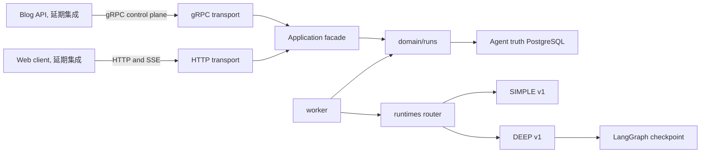

# SCYG Agent 架构总览

## 目的、范围与交付状态

SCYG Agent 是当前仓库中已实现的单进程 Python 服务。它承载 gRPC 控制面、HTTP/SSE 客户端面、固定运行时目录、Worker、租约恢复和 PostgreSQL 通知监听。默认并发容量为 SIMPLE 4、DEEP 1。

本文说明已经存在的服务边界和运行模型，供开发者定位模块与阅读后续细节文档。它不是协议规范，也不表示 Blog 或浏览器路径已经接通。

当前尚未交付 Blog 登录、Run 创建 REST、Run JWT 签发和前端集成。这些属于 T22 至 T31 的延期工作，不能作为当前服务能力宣传。

## 系统边界与模块地图

Agent 只拥有自己的服务、Agent truth 和 LangGraph checkpoint 存储。它不访问 Blog 数据库，也不持有 Blog DSN。Blog API 未来通过 gRPC 调用控制面，浏览器未来通过 HTTP/SSE 访问客户端面，两者目前均不构成已接通的端到端产品路径。



主要模块如下。

| 位置 | 职责 |
| --- | --- |
| `__main__.py`、`cli_runtime.py` | 进程入口、配置检查、信号等待和有界关闭。 |
| `composition.py`、`lifecycle.py` | 生产组合根、组件顺序、readiness 与生命周期状态机。 |
| `transport/grpc` | 供 Blog API 使用的控制面适配器。 |
| `transport/http` | Run 查询、SSE、输入、命令和取消的客户端面适配器。 |
| `domain/runs` | Run 聚合、状态转换、revision、租约与端口合同。 |
| `adapters/database` | Agent truth 的 PostgreSQL 仓储、事件、审计和原子终态提交。 |
| `adapters/langgraph` | 独立 checkpoint 存储接入与就绪检查。 |
| `runtimes` | 静态任务目录、SIMPLE 和 DEEP 适配器及画像。 |
| `worker` | 认领、执行、续租、终态提交、恢复和 drain。 |
| `deployment.py` | 一次性部署初始化、迁移和 checkpoint setup。 |

## 目录结构与功能落位指南

目录按责任边界组织，不按调用频率或单个协议字段组织。查找代码时，先判断功能属于传输、应用协作、领域规则、外部实现，还是组合与部署，再沿下表定位。新增功能只跨越所需层次，不能为了方便把领域规则写进 transport 或 adapter。

### 运行边界与基础设施目录

| 目录 | 职责与落位规则 |
| --- | --- |
| `agent/docs` | Agent 架构、开发和运行边界说明。影响职责、能力状态或验证结论时更新这里的相应文档，不在源码注释中复制完整运行手册。 |
| `agent/deploy/postgres/init` | PostgreSQL 容器初始化阶段的单一应用角色和基础对象脚本。这里只放部署前置 SQL，不放 Agent truth 的业务表迁移。 |
| `agent/migrations`、`agent/migrations/versions` | 前者保存 Alembic 迁移环境，后者保存 Agent truth 的迁移历史。新增或改变 Run、事件、命令、审计等持久化结构时，在 `versions` 追加迁移，并同步数据库 adapter 的读写模型和部署测试。 |
| `agent/scripts` | QA、合同检查和受控验证驱动脚本。脚本用于检查或观察已存在的服务边界，不承载产品业务规则，也不把延期能力写成已交付能力。 |
| `agent/src/scyg_agent` | 进程根模块和组合边界。`__main__`、`cli_runtime`、`config`、`bootstrap`、`composition`、`lifecycle` 分别负责入口、信号、配置、观测初始化、真实组件装配和生命周期；根模块中的 deployment 代码负责一次性迁移和 checkpoint setup。涉及新组件时先在这里完成组合，再由 servers 或 worker 使用已经构造好的依赖。 |
| `agent/src/scyg_agent/generated` | contracts generation 产生的 protobuf、gRPC 绑定及其包结构。它是生成产物，禁止手工修改；协议变化应修改仓库根目录 `contracts/` 中的协议源或其生成配置，然后重新生成并运行 drift 检查。 |
| `agent/src/scyg_agent/servers` | gRPC 和 HTTP server 组件的启动、停止、readiness 及服务实例封装。这里负责服务组件生命周期，不放具体领域规则或协议映射细节。 |
| `agent/src/scyg_agent/worker` | Run 的认领、调度、执行、续租、恢复、持久化协调和 drain。调度或恢复策略在这里表达，但 Run 状态合法性仍由 domain 负责。 |
| `agent/src/scyg_agent/runtimes` | 固定运行时注册表、路由、版本和共用运行时合同。运行时选择必须保持静态 `(task_type, v1)` 映射，不增加动态插件或恢复时迁移路径。 |
| `agent/src/scyg_agent/runtimes/simple` | SIMPLE v1 的模型、provider、解析、结果和运行时实现。它不使用工具、中断或 checkpoint。 |
| `agent/src/scyg_agent/runtimes/deep` | DEEP v1 的图、引擎、适配、来源和生产组合。需要 checkpoint 的执行状态放在这里并通过既有端口或 adapter 使用，不把 checkpoint 细节泄漏进 domain。 |

### 领域、应用与外部适配目录

| 目录 | 职责与落位规则 |
| --- | --- |
| `agent/src/scyg_agent/application` | `facade` 和应用模型，是传输层与领域协作的独立边界。跨请求的用例编排、认证后身份传递、幂等入口和领域调用应先落在这里；该层不依赖 HTTP、gRPC、FastAPI 或 protobuf，transport 不得绕过 facade 直接拼装仓储或运行时。 |
| `agent/src/scyg_agent/transport/grpc` | gRPC 服务的认证接入、请求转换、状态映射和 service 实现。这里只处理协议边界，然后调用 application facade。 |
| `agent/src/scyg_agent/transport/http` | HTTP 路由、请求 schema、认证接入和 SSE 适配。这里只处理 HTTP 表面和传输错误映射，然后调用 application facade，不在路由中实现状态机或数据库规则。 |
| `agent/src/scyg_agent/domain/runs` | Run 聚合、模型、命令、事件、状态机、revision、lease 和领域错误。新增 Run 规则先修改这里，再通过端口访问外部能力。 |
| `agent/src/scyg_agent/domain/ports` | 领域需要的最小抽象合同，例如事件、命令、审计、交互、工具和终态提交端口。端口不依赖具体数据库、gRPC 客户端、LangGraph 或配置实现。 |
| `agent/src/scyg_agent/adapters/auth` | JWT、公钥、claims、principal 和凭据验证等外部认证实现。它提供认证结果，不决定 Run 的业务状态或应用用例。 |
| `agent/src/scyg_agent/adapters/blog_grpc` | 面向 Blog 的 gRPC 客户端、合同、安全和状态映射。Blog 外部调用应通过这里实现，不把 Blog 数据模型或网络细节带入 domain。 |
| `agent/src/scyg_agent/adapters/database` | Agent truth PostgreSQL 的仓储、查询、事件、命令、交互、工具、审计、围栏和终态提交实现。数据库业务数据的持久化细节留在这里，领域规则仍留在 `domain`。 |
| `agent/src/scyg_agent/adapters/langgraph` | LangGraph checkpoint 的独立存储实现、配置值和 schema 支持。它不代替 Agent truth，也不承载 Run 状态或幂等真相。 |

依赖方向固定为 `transport -> application facade -> domain -> ports`。`adapters` 实现 `domain/ports` 或其他边界合同，由组合根注入。`composition` 和 `deployment` 是组合边界，负责选择并连接具体实现、资源和生命周期；不能把 adapter 依赖反向塞入 domain，也不能让 transport 直接依赖数据库或运行时实现。

### 测试目录与验证范围

测试目录按被验证的责任边界分类。新增代码应优先在对应分类增加最小行为测试，跨组件行为再增加 integration 或 production 覆盖。

| 目录 | 适合验证的内容 |
| --- | --- |
| `agent/tests/domain` | `ports` 的合同和 `runs` 的状态机、命令、事件、lease、revision 与领域错误。 |
| `agent/tests/adapters` | `auth`、`blog_grpc`、`database`、`langgraph` 各适配器的转换、持久化、认证和 checkpoint 行为。 |
| `agent/tests/runtimes` | 共用运行时注册与路由，以及 `simple`、`deep` 的解析、输出、版本和恢复相关行为。 |
| `agent/tests/application` | application facade 的用例协作、所有权绑定和闭合结果映射。 |
| `agent/tests/transport` | `grpc`、`http` 的请求转换、认证、错误映射和传输行为。 |
| `agent/tests/worker` | 调度容量、认领、执行、续租、持久化所有权、终态提交、恢复和关闭 drain。 |
| `agent/tests/deployment` | 初始化、迁移和容器合同的日常主路径。 |
| `agent/tests/production` | 生产组合、资源工厂和具体 DEEP source 的组合行为，不替代领域单元测试。 |
| `agent/tests/integration` | 需要多个边界协同的已批准拓扑场景，当前按 `t20` 和 `worker` 分类；没有环境证据时不能宣称动态 E2E 已通过。 |
| `agent/tests` 根目录 | 启动、配置、组合、生命周期、合同生成和全局 QA 检查等跨目录基础行为。 |

### 新功能怎么放

下表给出最小落位。配套修改只在功能确实跨越该边界时进行，优先保持单向依赖和共享 facade。

| 功能类型 | 优先落点 | 可能的配套修改 | 测试位置与限制 |
| --- | --- | --- | --- |
| 新 HTTP API | `transport/http`，共享用例落在 `application/facade` | 需要新领域行为时修改 `domain/runs` 和所需 `domain/ports`，再在 `composition` 注入实现 | `tests/transport/http`、`tests/application`，必要时加 integration；不能在路由中写业务规则或绕过 facade。 |
| 新 gRPC 控制操作 | `transport/grpc`，共享用例落在 `application/facade` | 修改 contracts 后重新生成 `generated`，必要时补 `blog_grpc` 的外部客户端合同和组合注册 | `tests/transport/grpc`、`tests/application`，协议生成检查必须通过；不能把生成绑定当作手工业务层。 |
| Run 领域规则或状态 | `domain/runs` | 若需要外部能力，先增加最小 `domain/ports`，再由 `adapters/database` 或其他 adapter 实现；若改变持久化结构再追加 migration | `tests/domain/runs`，跨边界时补 adapters 或 integration；规则不能放 transport、worker 或 adapter。 |
| 新数据库 truth 或迁移 | `migrations/versions` 与 `adapters/database` | 同步记录、查询、端口实现，必要时更新 `deploy/postgres/init` 的部署前置 SQL 和 `deployment` 组合 | `tests/adapters/database`、`tests/deployment`，需要真实拓扑时加 integration；数据库细节不能进入 domain。 |
| 新 SIMPLE 或 DEEP runtime | 对应 `runtimes/simple` 或 `runtimes/deep`，注册和选择落在 `runtimes` | 更新固定 registry、profile、composition 和 worker 所需的运行时合同；DEEP 需要 checkpoint 时配套 `adapters/langgraph` | `tests/runtimes/simple` 或 `tests/runtimes/deep`，再补 `tests/runtimes` 的路由和身份漂移测试；不能增加动态插件路径。 |
| 新 Worker 调度或恢复规则 | `worker` | 需要改变合法状态时同步 `domain/runs`，需要持久化时通过 ports 和 database adapter，生命周期变化时更新 `composition` 或 `servers` | `tests/worker`，跨拓扑行为加 `tests/integration/worker`；Worker 不能自行重写领域状态机。 |
| 新外部 Blog gRPC、认证或存储适配器 | 分别落在 `adapters/blog_grpc`、`adapters/auth` 或 `adapters/database` | 先确认对应 port 或 application 合同，再由 `composition` 注入；外部模型只在 adapter 边界转换 | `tests/adapters` 对应分类，必要时补 production 或 integration；不得让 domain 依赖外部 SDK、网络或存储细节。 |
| 新配置或部署行为 | 配置落在根模块配置与组合边界，部署落在 `deployment`、`deploy/postgres/init` 或相关 migration | 更新资源工厂、生命周期、部署合同和必要文档；只增加当前拓扑需要的行为 | `tests/deployment`、根目录组合或配置测试，必要时 `tests/production`；不能借此引入未交付的多进程、动态插件或其他架构。 |

## 启动与关闭生命周期

入口链固定为 `scyg_agent.__main__` -> `cli_runtime.run_application` -> `ProductionApplicationFactory.build` -> `AgentApplication`。

组合根先构造无 I/O 的组件计划，再按权威顺序启动：Agent truth 数据库、Alembic 迁移检查、checkpoint、运行时门面，随后按启用的 feature flag 追加 gRPC、Worker、HTTP。每个组件必须完成启动并通过探针，聚合 readiness 通过后应用才从 `STARTING` 进入 `RUNNING`。启动失败会逆序清理已打开组件，且不会发布 ready。

`/health/live` 只反映进程生命周期，不探测下游。`/health/ready` 返回各已启动组件的脱敏探针结果。

`SIGINT`、`SIGTERM` 与 Windows `SIGBREAK` 都进入同一关闭路径。关闭请求会合并，应用撤销就绪后在配置的总时间预算内逆序停止组件。Worker 先停止接收并在 drain 预算内收敛，服务端与数据库等资源随后释放。超时或关闭错误会将应用置为失败状态，而不是无限等待。

## gRPC 控制面

gRPC 是面向未来 Blog API 的控制面，`AgentControlService` 当前提供 `CreateRun` 和 `GetRun`。服务端先认证 Blog 服务身份、检查调用取消与 deadline，再把请求转给共享应用门面。

`CreateRun` 将规范化的创建请求写入 Agent truth，并保持幂等。运行时选择在创建时冻结。`GetRun` 返回最新持久化 Run 快照。公开 RPC 状态由传输层映射，详细字段、错误码和生成绑定以现有协议文档与代码为准，本文不另行定义合同。

## HTTP/SSE 客户端面

HTTP 路由位于 `/api`，没有 HTTP 创建 Run 入口。当前表面包括 Run 快照、持久事件 SSE、交互输入、公开命令和取消请求。所有客户端路由使用 Run JWT 认证与 scope 校验，JWT 不应出现在 URL、查询参数、日志或 SSE data 中。

SSE 的真相是 Agent truth 中按数值 cursor 排序的 `agent_events`。服务先回放已持久化事件，再由通知唤醒后重新查询并继续发送。通知不是事件真相。断线不会取消 Run，重连不会重跑模型或工具调用。

命令、输入和取消操作依赖持久化 identity、交互和审计事实处理幂等性。完整路由、cursor、错误响应和重放规则请见 [Agent 服务流式架构](../../docs/agent-streaming-architecture.md)。

## 领域与持久化真相

Agent truth 与 LangGraph checkpoint 是两个独立的持久化责任域，但当前使用同一个数据库和应用账号。

| 数据 | 唯一真相 | 用途 |
| --- | --- | --- |
| Run、状态、revision 和 lease | Agent truth 表 | 调度、围栏、状态机和恢复决策。 |
| `agent_events` | Agent truth 表 | SSE cursor 回放与终态投影。 |
| commands、interactions、tool calls、audit | Agent truth 表 | 幂等性、交互赢家与可审计副作用。 |
| LangGraph checkpoint | 同一数据库的 `langgraph` schema | 仅用于 DEEP 执行状态和恢复。 |

checkpoint 不是事件日志，不是 Run 状态真相，也不是幂等真相。Alembic 迁移只管理 Agent truth。checkpoint setup 属于部署初始化，运行时 readiness 仅验证其对象、迁移序列和依赖兼容性。

## SIMPLE 与 DEEP 运行时

运行时目录是启动时构造的固定 `(task_type, v1)` 映射。创建时解析并保存选择，恢复时必须与当前静态目录完全一致。未知任务或版本会失败，不存在动态发现插件或恢复时迁移运行时的路径。

| task_type | 固定运行时 |
| --- | --- |
| `summary`、`question`、`polish` | SIMPLE `v1` |
| `compose`、`research`、`revise` | DEEP `v1` |

SIMPLE 用于无工具、无中断、无 checkpoint 的流式任务。DEEP 由 LangGraph 编译图执行，可在持久化中断后从 checkpoint 恢复，并受其任务画像限制。默认调度容量为 SIMPLE 4、DEEP 1。具体资源限制、权限画像和任务行为以 [Agent 服务流式架构](../../docs/agent-streaming-architecture.md) 为准。

## Worker、lease 与恢复

Worker 从 Agent truth 中按运行时容量认领待执行 Run，并以 lease、owner、token 与 revision 实现执行围栏。它执行固定路由、续租、持久化事件和审计，并通过原子终态提交将 Run 结果、事件和审计事实协调写入。

失去 lease 的 Worker 不能提交终态。租约过期且外部 RPC 尚未开始的执行可被后续 Worker 回收。`rpc_started_at` 之后外部结果未知，系统不会自动重放。正常关闭应让 Worker 在有界 drain 内收敛到可恢复状态，不能以直接杀进程替代常规关闭。

当前交付是单进程模型。多进程容量、通知丢失演练和更广的恢复场景尚未获得动态拓扑验证，因此本文不承诺这些部署形态。

## 配置与部署

进程在当前工作目录读取可选的 `agent.toml`，再由 `SCYG_AGENT_` 环境变量补齐文件未提供的字段；同一字段以配置文件为准，最后使用类型默认值。长期运行服务使用同一个 `scyg_agent` 应用账号访问 Agent truth 和 checkpoint，不使用管理员连接。JWT 私钥不属于 Agent，Agent 只读取用于验证的公钥。

已有 PostgreSQL 的本机开发使用 `scyg-agent setup` 读取 `agent.toml`，一次创建或同步一个应用角色、执行 Agent Alembic 迁移并初始化 checkpoint；管理员密码仅在命令执行时输入。Compose 入口仍是 `agent/compose.yaml`，其中 `agent-setup` 使用同一个 DSN 完成初始化。

## 验证状态与延期边界

静态 QA 与 T34 harness 合同已确认。T34 的 S1 至 S3 动态执行目前为 `blocked_by_environment`，原因是缺少 Docker、Compose 和获批 Agent PostgreSQL 拓扑。没有 S1 至 S3 的真实执行 receipt，因此不能把当前状态写成完整 E2E 已通过。

T34 首版只覆盖认证 SIMPLE Run 至终态 SSE、双 SSE 连接的 cursor 回放，以及取消或命令的幂等重放。崩溃和 lease 恢复演练、DEEP 等待输入恢复、BlogTool deadline、浏览器、扩展 JWT 矩阵及扩展 T34 场景不在当前结论内。

## 文档地图

| 文档 | 适合回答的问题 |
| --- | --- |
| 本文 | 服务由哪些模块组成，数据和责任归谁，当前能宣称什么。 |
| [Agent 服务流式架构](../../docs/agent-streaming-architecture.md) | HTTP/SSE、固定运行时、持久化所有权与 T34 边界的详细合同。 |
| [Agent 服务开发](../../docs/agent-service-development.md) | 静态检查、本地 Compose 拓扑、配置与开发入口。 |
| [Agent 服务运行手册](../../docs/runbooks/agent-service.md) | 部署前检查、SSE 缺口、关闭、恢复、故障与扩容约束。 |

## 最小启动命令

在 `agent/` 目录中，`--check` 只解析配置并组合 FastAPI，不绑定端口、不连接 PostgreSQL，也不启动 gRPC 或 Worker：

```powershell
uv run --locked python -m scyg_agent --check
```

已有 PostgreSQL 的首次本机启动先执行 `setup`，它会提示输入管理员密码；随后 `run` 进入完整进程生命周期：

```powershell
uv run --locked scyg-agent setup
uv run --locked scyg-agent run
```

`task qa:agent:static` 不需要 Docker。完整 `task qa:agent` 需要 Docker、Compose、`agent/.env` 或等价完整拓扑环境变量，并会在这些前置条件不满足时失败。
