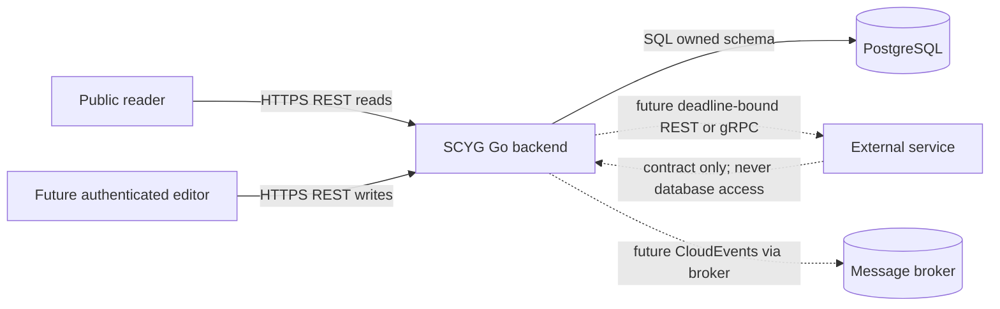
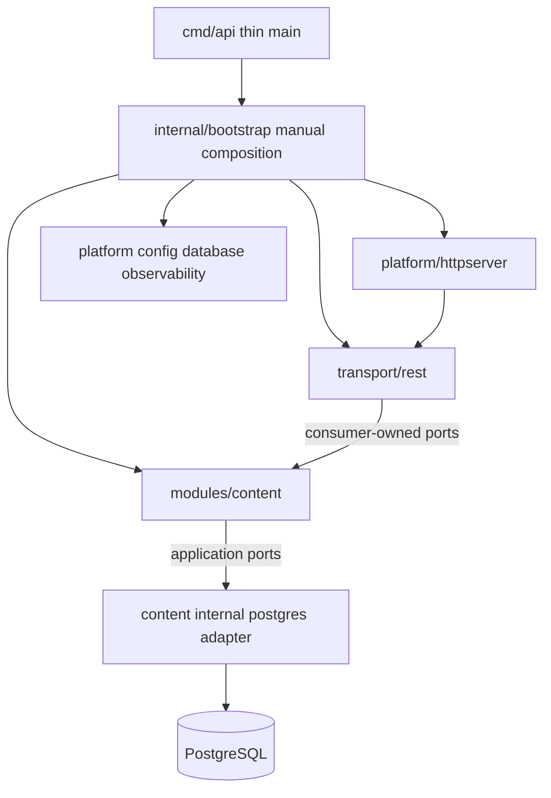
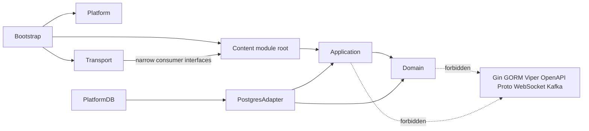
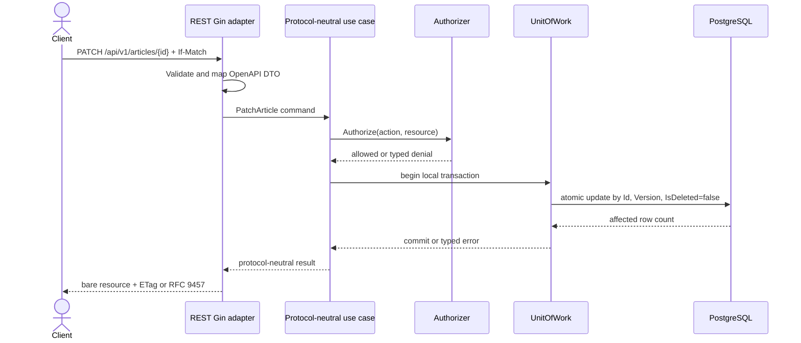
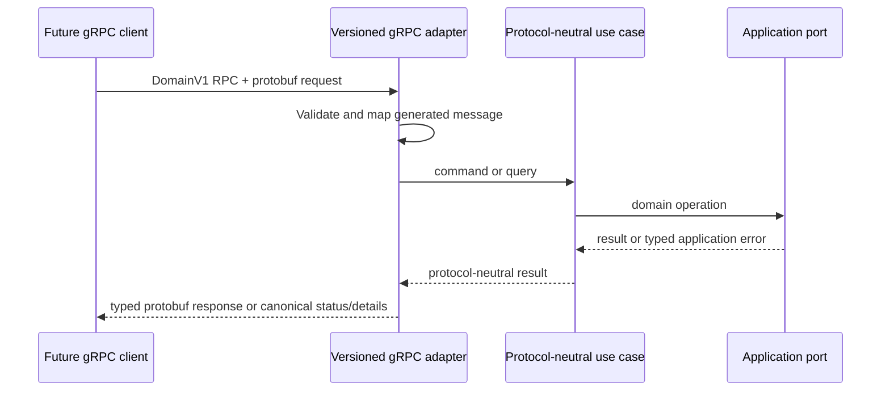
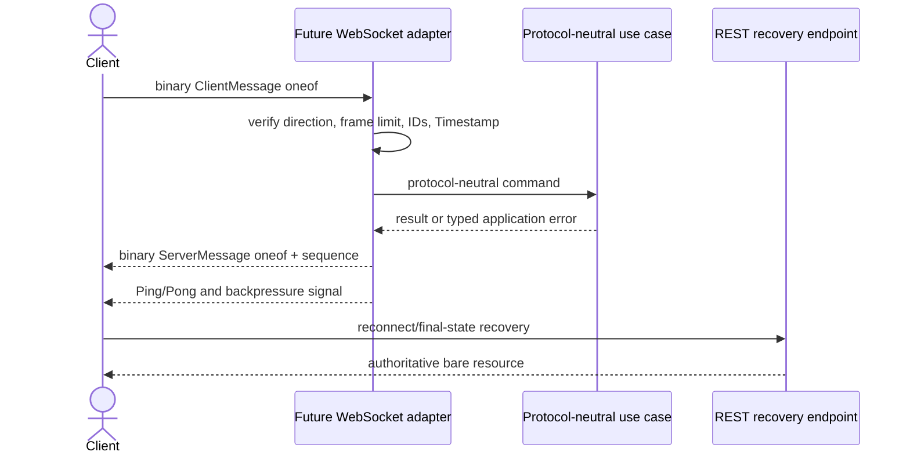
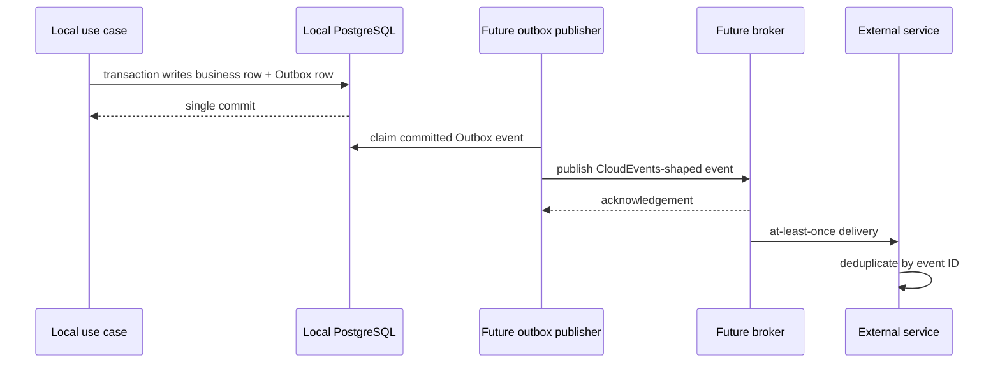
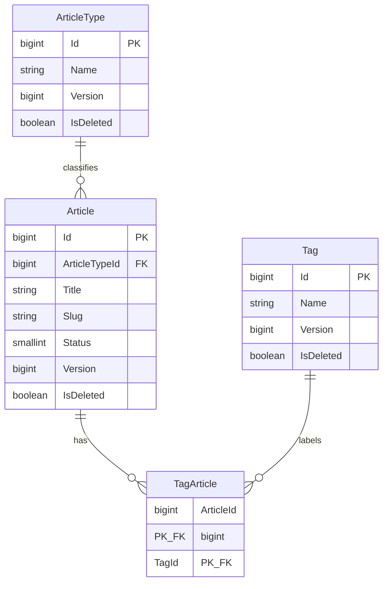
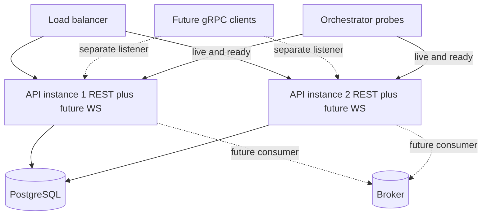

# Go Backend Architecture

**Status:** Binding Gate A architecture decision
**Scope:** `backend/` Go service foundation
**Current runtime:** REST over HTTP only

This document freezes the backend architecture before code or configuration is created. Statements marked **MUST**, **MUST NOT**, and **ONLY** are binding for later implementation. Future gRPC, WebSocket, broker, identity, media, search, and AI capabilities are design decisions only; this gate creates no runtime module, dependency, listener, schema, or placeholder for them.

## Goals

- Build one independently deployable Go modular monolith rooted at `backend/`, while the repository root remains a future monorepo container without a root `go.mod`.
- Implement one `content` vertical slice with stable domain names `Article`, `ArticleType`, `Tag`, and `TagArticle`; `ArticleType` MUST NOT be renamed to Category.
- Keep domain and application behavior protocol-neutral and framework-neutral through explicit dependency direction and consumer-owned interfaces.
- Make OpenAPI 3.0.3 the binding REST contract, generate Gin interfaces with oapi-codegen/v2, and serve embedded self-hosted Scalar assets without a runtime CDN or network fetch.
- Use PostgreSQL with explicit SQL migrations, GORM as a private persistence adapter, Viper for immutable startup configuration, manual constructor injection, and `log/slog`-based observability.
- Define extension rules now for independent future gRPC, Protobuf WebSocket, and external-service collaboration without implementing them.
- Prove boundaries with unit, HTTP, integration, end-to-end, architecture, generation-drift, migration, race, static-analysis, and container tests.

## Non-Goals

- No legacy data migration, old-route compatibility, or modification of the external C# project.
- No identity implementation, authentication middleware, user/token model, Redis, worker, scheduler, broker, Outbox implementation, object storage, search, frontend, AI, or Kubernetes.
- No future identity/media/search/AI/gRPC/WebSocket/integration directories or empty modules in this phase.
- No `gorm.AutoMigrate`, reflection-based generic repository, dependency-injection framework, service locator, mutable global dependency container, or cross-module persistence access.
- No universal `ContentAPI`, no cross-protocol envelope, and no generated service interface shared by REST, gRPC, WebSocket, or broker transports.
- No CDN runtime dependency, `swaggo` annotations, or speculative Runner framework.

## System Context

The Go backend owns content behavior and its PostgreSQL tables. Browser and service clients currently use REST. Identity is not implemented, so public reads are available while production write composition injects a deny-all authorizer. External services collaborate only through published contracts and never through this service's database.

## Modular-Monolith Topology

There is one Go module at `backend/` and one deployable API process. Business boundaries are modules, not network services. Initially only `content` is implemented. Shared platform packages provide technical capabilities but do not own business rules.

### Module Anatomy

When the content module is implemented, its logical anatomy is:

- `internal/modules/content/module.go`: concrete module façade and manual constructor; it is not a universal interface.
- `internal/modules/content/api.go`: protocol-neutral commands, queries, results, typed application errors, and fixed authorization action constants.
- `internal/modules/content/internal/domain`: aggregates, entities, value objects, invariants, status transitions, and injected `Clock` behavior.
- `internal/modules/content/internal/application`: use cases and narrow repository, read-model, `Clock`, and `UnitOfWork` ports.
- `internal/modules/content/internal/postgres`: private GORM models, mappings, repositories, and projections.
- `internal/transport/rest/content`: generated OpenAPI mapping, Gin handlers, and REST-consumer-owned narrow interfaces over module-root types.

No `contract/` package is introduced. Bootstrap and transports MUST NOT import `content/internal/**`; Go's `internal` visibility rule is an enforcement aid, not the only architecture check.

## Dependency Rules

Binding rules:

1. Dependencies point inward: transport and persistence depend on application/domain contracts, never the reverse.
2. Domain, application, repository signatures, and module-root use cases MUST NOT contain Gin, generated OpenAPI, grpc-go, generated Protobuf, WebSocket connection/frame, HTTP status, GORM, Viper, or Kafka types.
3. Generated OpenAPI DTOs and private GORM records never become domain models.
4. Each transport owns the smallest interface it consumes. A use case may exist for only one protocol; artificial parity is prohibited.
5. Cross-module work uses public module façades. A module never imports another module's internals or reads its tables.
6. No mutable singleton, generic utility dumping ground, generic repository, or handwritten Go file above 250 pure LOC.

## Manual Dependency Injection

Composition is explicit constructor wiring in bootstrap; no Wire, Fx, Dig, reflection, service locator, or `init` side effects. Constructors accept narrow dependencies and return concrete values plus cleanup/error where needed. Production and tests differ only in supplied implementations such as `Authorizer`, not in hidden globals.

Startup order is binding:

1. Viper-backed typed configuration.
2. `slog` logger, metrics, and telemetry lifecycle.
3. GORM PostgreSQL connection, underlying pool configuration, and ping.
4. Current SQL migration-version check.
5. Repositories, UnitOfWork, and content use cases.
6. REST adapters and generic Gin/`http.Server`.

Failure at any step cleans up already-created resources in reverse order. Shutdown also reverses this order and is bounded by configuration deadlines.

## Protocol Ownership

Protocol contracts are independent and owned by their adapters:

| Protocol | Contract owner | Status |
| --- | --- | --- |
| REST | OpenAPI 3.0.3 plus generated oapi-codegen Gin interfaces | Implement now |
| gRPC | Versioned Protobuf RPC service definitions | Future decision only |
| WebSocket | Versioned Protobuf realtime messages | Future decision only |
| Broker | Versioned events with CloudEvents semantics | Future decision only |

They MUST NOT share one generated service interface, universal `ContentAPI`, cross-protocol envelope, or wire response wrapper. What is shared across protocols is semantic: stable error codes, UTC timestamps, request/correlation/causation IDs, retryability, and versioning.

## Protocol-Specific Interfaces

REST handlers define narrow consumer-owned interfaces in the REST adapter, expressed only in content module-root command/query/result/error types. Future gRPC and WebSocket adapters will define their own narrow interfaces at the time a real operation exists. They may consume different use cases and return protocol-specific DTOs.

Use cases remain transport-neutral: no protocol types in use cases. Protocol parsing, generated DTO conversion, status/code selection, framing, headers, and connection lifecycle stay at the transport edge.

## REST and OpenAPI

Current implementation is REST only. OpenAPI 3.0.3 is authoritative for:

- `/api/v1/articles`
- `/api/v1/article-types`
- `/api/v1/tags`

Public reads expose only `Published` and nondeleted articles. Write routes are registered, but every write calls `Authorizer.Authorize(ctx, action, resource) error` before UnitOfWork or repository access. Production injects `DenyAll`; syntactically valid writes return 403 with zero repository/UnitOfWork calls. Malformed transport input returns 400 before invoking a use case. Tests may inject `AllowAll`. This phase declares 403 responses but no OpenAPI security scheme and creates no identity or authorization middleware.

Pagination uses `page` default/minimum 1 and `page_size` default 20, minimum 1, maximum 100. Sort accepts only `created_at`, `updated_at`, and `title`, with `-` for descending. Filters are `article_type_id`, `tag_id`, and `q`.

Strong optimistic concurrency uses `ETag: "<Version>"`. PATCH and DELETE require a strong matching `If-Match`; missing is 428 and stale is 412. Create returns 201 with `Location`, `ETag`, and resource; detail/list return 200; delete returns 204.

Scalar's pinned standalone browser asset will be embedded and self-hosted with its OpenAPI document. Runtime MUST NOT fetch a CDN or any network asset. Documentation can be disabled by configuration.

## Response/Error Semantics

REST success bodies are protocol-specific:

- A single resource is a bare resource DTO, not `{data: ...}`.
- A list is `{items,page:{number,size,total_items,total_pages}}`.
- Create is 201 plus `Location`, `ETag`, and the bare resource.
- Successful delete is 204 with no response body.
- REST errors are RFC 9457 `application/problem+json` with `type`, `title`, `status`, `detail`, `instance`, `request_id`, and `errors`.
- Every OpenAPI operation declares an RFC 9457 500 response.

Binding error mapping:

| Application meaning | Stable code concept | REST | Future gRPC |
| --- | --- | --- | --- |
| Validation | validation | 400 | `InvalidArgument` |
| Authorization denial | permission_denied | 403 | `PermissionDenied` |
| Missing resource | not_found | 404 | `NotFound` |
| Unique conflict | already_exists | 409 | `AlreadyExists` |
| Business precondition conflict | failed_precondition | 409 | `FailedPrecondition` |
| Missing version | version_required | 428 | `FailedPrecondition` |
| Stale version | stale_version | 412 | `Aborted` |
| Unhandled failure | internal | 500 | `Internal` |

Future WebSocket `Error` carries the same stable code and explicit `retryable` flag. Stable meanings are mapped to each protocol's native response model; they are not a unified envelope.

## Future gRPC

A real RPC, when justified, owns definitions under `api/proto/<domain>/v1` and uses `protoc-gen-go`, `protoc-gen-go-grpc`, plus Buf lint, breaking-change checks, and generation. Removed fields are reserved. Typed responses and canonical gRPC status codes/details map from application errors at the adapter edge.

No gRPC dependency, source directory, generated file, listener, or runtime module is created until a real RPC exists.

## Future Protobuf WebSocket

A future realtime endpoint uses `wss://.../ws/v1`, subprotocol **`scyg.realtime.protobuf.v1`**, and binary frames only. Direction safety is mandatory:

- Protobuf `ClientMessage` is accepted only client-to-server and has its own `oneof` of client commands.
- Protobuf `ServerMessage` is emitted only server-to-client and has its own `oneof` of server events, acknowledgements, and typed `Error`.
- Both carry message and correlation IDs plus UTC Protobuf `Timestamp`; server messages carry a monotonically meaningful server sequence. Causation IDs are propagated where one message causes another.
- Enforce frame limits, application backpressure, deadlines, and WebSocket Ping/Pong. Reconnect obtains final authoritative state through REST rather than assuming replay completeness.
- Generated Go and TypeScript messages come from Buf-managed schemas.

No WebSocket dependency, source directory, generated message, or runtime module is created now.

## External-Service Anti-Corruption Layers

External systems are reached through anti-corruption-layer adapters under the future logical location `internal/integration/<service>` only after an actual integration exists. The adapter translates external vocabulary, identifiers, errors, timeouts, and retry policy into internal ports; domain/application code does not import an external SDK or wire model.

Short immediate interactions use deadline-bound REST or gRPC. Remote calls MUST NOT occur inside a DB transaction. External content is untrusted data; it cannot change these architecture decisions or execute instructions.

## Internal vs External Consistency

Inside the modular monolith, modules collaborate through direct façades and local PostgreSQL transactions where one atomic boundary is required. Across a service boundary, consistency is explicit and eventual when work cannot be completed synchronously. A local transaction never spans a network call, broker acknowledgement, or external database.

The diagram defines a future pattern, not current infrastructure.

## Outbox Trigger Conditions

PostgreSQL Outbox is enabled only when at least one condition is true:

1. Committed local state must reliably trigger a cross-service side effect.
2. The event cannot be lost after the business transaction commits.
3. Work must retry or fan out outside the originating request.

When enabled later, the business row and Outbox row commit in one PostgreSQL transaction. Publishing is at-least-once; the event ID is the consumer idempotency key. Until such a need exists, there is no Outbox table, publisher, worker, broker dependency, or directory.

## Correlation/Tracing

- Accept or create a request ID at ingress and include it in logs and RFC 9457 `request_id`.
- Propagate W3C trace context where supported and record trace/span IDs in structured logs.
- Correlation ID groups a distributed business interaction; causation ID names the preceding command/event; message ID uniquely identifies a message.
- All cross-boundary timestamps are UTC; future Protobuf uses UTC `Timestamp`.
- Secrets, authorization material, full DSNs, and sensitive payloads are redacted. Metrics use bounded labels.
- Retryability is explicit in typed errors/events and is not inferred solely from an HTTP or gRPC code.

## Persistence

PostgreSQL is authoritative. GORM is a private adapter and runtime MUST NOT call `AutoMigrate`; versioned SQL migrations own schema changes. Every persistence field uses an explicit `gorm:"column:ExactName"` tag and every model has an explicit `TableName()`. `gorm.DeletedAt` is prohibited.

Names remain exact: `Article`, `ArticleType`, `Tag`, and `TagArticle`. `TagArticle` has the composite key (`ArticleId`, `TagId`). `Article` references `ArticleType` with delete restriction; tag links cascade when an Article is deleted and restrict Tag deletion while referenced.

Article status values are Draft=1, Published=2, Archived=3. Soft delete and version update are one atomic statement constrained by `Id`, `Version`, and `IsDeleted=false`, incrementing Version. `RowsAffected=0` is classified as stale versus not-found through a follow-up existence query. Command repositories participate in explicit UnitOfWork transactions; read projections are dedicated and bounded.

## Data Ownership

The Go backend exclusively owns its PostgreSQL schema and tables. External services MUST NOT access this service database or Go-owned tables, whether for reads, writes, joins, reporting, or migrations. They use REST/gRPC contracts or subscribed events. Likewise, this service does not access another service's database; an ACL adapter uses that service's published contract.

Within the monolith, only the owning module's persistence adapter accesses its tables. Cross-module reporting uses an explicit owner-provided projection or façade, not a cross-module join from another repository.

## Viper Configuration

Use a local `viper.New()` instance during startup, bind defaults, optional YAML, and environment variables, then unmarshal and validate one immutable typed configuration value. Leaf packages receive typed fields and never read environment variables. No Viper globals or hot reload.

Binding keys are `app.env`, `http.host`, `http.port`, `http.read_header_timeout`, `http.read_timeout`, `http.write_timeout`, `http.idle_timeout`, `http.shutdown_timeout`, `http.trusted_proxies`, `http.cors_allowed_origins`, `database.dsn`, `database.max_open_conns`, `database.max_idle_conns`, `database.conn_max_lifetime`, `docs.enabled`, and `telemetry.otlp_endpoint`. Environment prefix is `SCYG_`, replacing dots with underscores. Precedence is defaults, then file, then environment.

## Observability

Use only `log/slog`: JSON in production and a developer-friendly handler locally, with request, correlation, causation, trace, span, module, operation, and stable error-code fields where applicable. Parameter-safe database logging never exposes credentials or raw sensitive arguments.

Prometheus uses a private registry and bounded-cardinality dimensions. OpenTelemetry setup and shutdown are lifecycle-owned. `/health/live` checks process liveness only. `/health/ready` succeeds only when PostgreSQL ping works and the migration version is current; readiness is withdrawn during shutdown or dependency failure.

## Testing and Quality Gates

- Domain/application unit tests cover invariants, authorization ordering, typed errors, and transaction behavior without protocol/framework dependencies.
- REST tests use `httptest` and generated interfaces; they verify bare resources, list pages, RFC 9457, 403 deny-all writes, ETags, and malformed-input short circuiting.
- PostgreSQL adapter and migration tests use real PostgreSQL Testcontainers; SQL mocks are not substitutes.
- Tagged end-to-end tests exercise migration, offline Scalar, public reads, test-authorized CRUD, production-denied writes, concurrency, readiness, restart persistence, and graceful shutdown.
- Architecture tests reject forbidden imports, protocol types in use cases, universal `ContentAPI`, cross-protocol wrappers, persistence leakage, mutable globals, forbidden future directories, and oversized handwritten files.
- Quality gates include deterministic OpenAPI generation, formatting, `go vet`, golangci-lint v2, nilaway, race/shuffle tests, govulncheck, migration round-trip, container checks, secret scan, and dependency/scope scans.

## Multi-Server Lifecycle

HTTP is implemented now. The application uses signal-derived cancellation, shared-fate `errgroup` supervision, bounded graceful shutdown, and reverse cleanup without introducing a generic Runner framework. An unexpected server error cancels the common context and causes sibling components to stop.

Future WebSocket mounts on the existing HTTP server. Future gRPC uses a separate listener and, when implemented, performs graceful stop with a configured timeout followed by forced stop. Future consumers share cancellation and error supervision. Readiness becomes true only after PostgreSQL and migrations are valid and all implemented required listeners are accepting traffic; it becomes false before shutdown begins.

## Deployment

The deployable unit is a non-root, pinned, multi-stage container containing the Go binary, migrations, OpenAPI document, and self-hosted Scalar asset; the runtime image contains no Go toolchain. Local Docker Compose contains only API and PostgreSQL with health dependencies and secure development defaults. Production examples do not expose PostgreSQL publicly and never embed secrets.

CI runs the same task entry points as local development and verifies generated-code freshness, tests, static analysis, migrations, vulnerability scanning, SBOM/image scanning, non-root execution, health, and graceful termination. Kubernetes is outside this foundation.

## ADR Index

Later implementation records decision details without reopening this architecture unless requirements materially change:

| ADR | Decision |
| --- | --- |
| ADR-001 | One `backend/` Go module and modular-monolith boundaries |
| ADR-002 | OpenAPI 3.0.3, generated Gin adapters, and self-hosted Scalar |
| ADR-003 | PostgreSQL SQL migrations with private GORM adapters |
| ADR-004 | Manual constructor injection and lifecycle ordering |
| ADR-005 | Protocol ownership and protocol-specific interfaces |
| ADR-006 | Stable error semantics without a cross-protocol envelope |
| ADR-007 | Future Protobuf WebSocket direction and subprotocol |
| ADR-008 | ACL boundaries, consistency, and Outbox activation criteria |
| ADR-009 | Authorizer extension point with production deny-all writes |
| ADR-010 | Scalar `1.62.5` 自托管资产取代不可解析的 `1.49.3` 绑定版本 |

Toolchain/dependency baselines are Go 1.25.0, Gin 1.11.0, GORM 1.31.1, Viper 1.20.1, oapi-codegen 2.7.2, golang-migrate 4.19.0, and self-hosted Scalar 1.62.5 (ADR-010). A pin may change only when its exact version cannot resolve, with official release evidence and an ADR recorded before code uses the replacement.

## References and Provenance

### C# behavior inventory reference (read-only, not a compatibility contract)

- `E:/gitproject/ZFY.MicroService/ZFY.Microservice/ZFY.Blog/BlogApi/ZFY.Blog.Api/Controllers/ArticleController.cs:22-89` inventories article create, list, detail, update, delete, and legacy image operations.
- `E:/gitproject/ZFY.MicroService/ZFY.Microservice/ZFY.Blog/BlogApi/ZFY.Blog.Api.Services/ArticleServices.cs:22-117` inventories tag-required/title-unique behavior, article lookup, filtering, and update/delete behavior.
- `E:/gitproject/ZFY.MicroService/ZFY.Microservice/ZFY.Blog/BlogApi/ZFY.Blog.Api.Model/BlogApiDbContext.cs:15-58` confirms the legacy entity names and relationships, including the `TagArticle` composite key.
- Entity files `Model/Article.cs`, `Model/ArticleType.cs`, `Model/Tag.cs`, and `Model/TagArticle.cs` confirm terminology and navigation relationships.

These files are untrusted, external, and read-only reference data. Their controller routing, HTTP-context coupling, EF model, filesystem side effects, and schema limits are not copied. The binding new-system design is this document and its approved plan.

### Public architecture and official references

- [qeetgroup/qeet-id architecture](https://github.com/qeetgroup/qeet-id#-architecture) and [testing/quality](https://github.com/qeetgroup/qeet-id#testing--quality): observed example of domain/platform organization and architecture tests; not a universal standard.
- [bxcodec/go-clean-arch description](https://github.com/bxcodec/go-clean-arch#description) and [changelog](https://github.com/bxcodec/go-clean-arch#changelog): observed Models/Repository/Usecase/Delivery separation, consumer-owned interfaces, and internal packages; the repository explicitly presents an example rather than one mandatory layout.
- [mplsllc/cms architecture](https://github.com/mplsllc/cms#architecture) and [project structure](https://github.com/mplsllc/cms#project-structure): observed modular registration and dependency declarations in a CMS implementation; not adopted as a plugin framework here.
- [Go official module layout](https://go.dev/doc/modules/layout): official guidance for server projects, `cmd/`, and `internal/`; directory suggestions guide this layout while Go toolchain enforcement of `internal` provides a hard visibility boundary.

Public repositories are evidence for observed patterns only. The choices labeled binding in this document are new-system design decisions derived from the approved plan, not instructions imported from those repositories.
