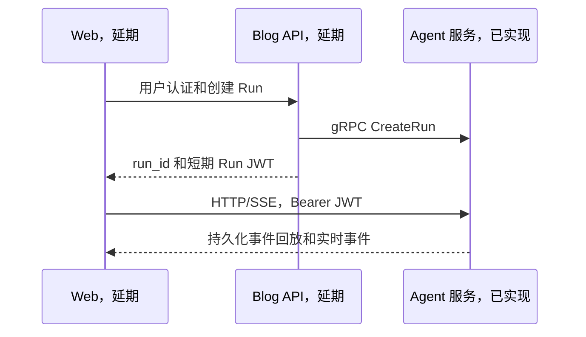
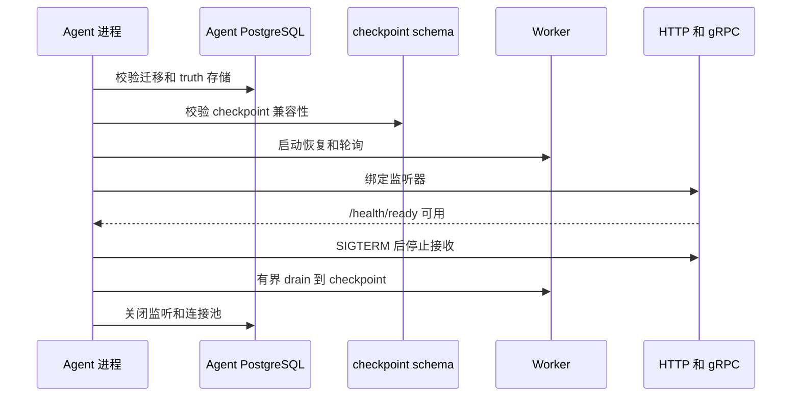
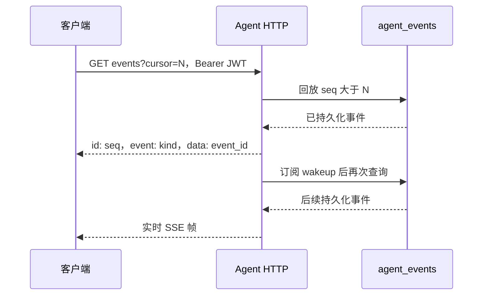
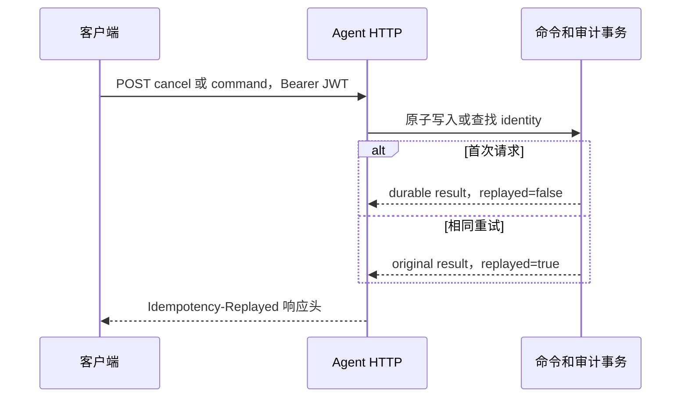

# Agent 服务流式架构

## 当前交付边界

当前仓库已实现一个单进程 Python Agent 服务。一个进程承载 HTTP/SSE、gRPC、Worker、租约恢复和 PostgreSQL 通知监听器。默认容量为 SIMPLE 4、DEEP 1。

Blog API 身份、创建 Run、签发 Web Run JWT，以及前端页面仍是 T22 至 T31 的延期工作，当前不能作为可用能力宣传。下图描述已冻结的集成边界，不表示 Blog 或 Web 路径已在本仓库接通。

Agent 不访问 Blog 数据库。长期目标是同一 PostgreSQL 实例中的独立 `scyg_agent` 数据库，由同一个 `scyg_agent` 应用账号访问 Agent truth 和 LangGraph checkpoint。`agent/compose.yaml` 的本地拓扑只开放 `127.0.0.1` 上的 PostgreSQL、HTTP 8080 和 gRPC 9090。

## 启动和关闭

启动顺序是配置、日志和遥测、Agent 数据库及 Alembic、checkpoint 就绪、固定运行时目录、gRPC、Worker 和恢复、事件监听、HTTP readiness。任何前置失败都会释放已取得的资源，不发布 ready。

关闭由 `SIGTERM`、`SIGINT` 或 Windows `SIGBREAK` 进入同一有界流程。Compose 给 Agent 30 秒运行时关闭预算和 40 秒容器宽限期。不要通过杀进程替代正常关闭，除非在租约恢复演练中按受控步骤执行。

## HTTP、SSE 与命令合同

Agent HTTP 路由都在 `/api` 下，且没有 HTTP 创建 Run 入口。

| 路径 | 方法 | 作用 |
| --- | --- | --- |
| `/api/runs/{run_id}` | `GET` | 已授权 Run 快照，包含状态、运行时、revision、attempt 和当前 cursor |
| `/api/runs/{run_id}/events` | `GET` | `text/event-stream` 持久事件回放并继续跟随 |
| `/api/runs/{run_id}/input` | `POST` | 提交一次绑定 interaction 的输入 |
| `/api/runs/{run_id}/commands` | `POST` | 提交公开命令 |
| `/api/runs/{run_id}/cancel` | `POST` | 独立持久化取消请求 |

所有 Web 路由要求唯一的 `Authorization: Bearer <run-jwt>`。令牌必须通过 RS256、issuer、audience、用户、Run 和 scope 校验。

JWT must not appear in URL, query, or SSE query. 日志、浏览器历史、代理访问日志和错误回显同样不得记录令牌。

SSE 使用数值 cursor。客户端可传 `Last-Event-ID`，或传 `?cursor=<非负整数>`。两者同时存在时必须满足 `Last-Event-ID == cursor`。服务只回放 `seq > cursor` 的 `agent_events`，通知只是唤醒提示，不能充当事件真相。游标过旧或未来游标返回 `409`，格式错误或冲突输入返回 `400`。

每个 SSE 帧的 `id:` 是数字 cursor，`data` 至少有稳定的 `event_id`。终态名称为 `run_succeeded`、`run_failed` 或 `run_cancelled`。断线不取消 Run，重连也不得重跑模型或工具。

命令和输入经持久化命令、交互和审计真相处理。首次 mutation 返回 `Idempotency-Replayed=false`；相同身份和相同不可变输入重放原结果并返回 `Idempotency-Replayed=true`。改变相同身份的不可变内容返回冲突，且不产生第二次状态、事件或工具副作用。

## 固定运行时目录

目录是静态 `(task_type, v1)` 映射，Run 创建后保留选择，恢复时不能迁移或动态发现插件。

| task_type | 运行时 | 边界 |
| --- | --- | --- |
| `summary`、`question`、`polish` | SIMPLE `v1` | 流式，无工具、无中断、无 checkpoint，递归 4、上下文 32768、超时 120 秒 |
| `compose` | DEEP `v1` | 允许读取、搜索和创建草稿 |
| `research` | DEEP `v1` | 只允许读取和搜索 |
| `revise` | DEEP `v1` | 允许读取、搜索、更新草稿和添加标签 |

三个 DEEP profile 都限制递归 64、上下文 131072、超时 900 秒，支持中断和 checkpoint。发布文章权限没有进入当前 profile。未知任务或版本在创建或恢复前失败。

## 持久化所有权

| 数据 | 唯一真相 | 用途 |
| --- | --- | --- |
| Run、租约和 revision | Agent truth 表 | 调度、围栏、状态和恢复 |
| `agent_events` | Agent truth 表 | SSE cursor 回放和终态投影 |
| commands、interactions、tool calls、audit | Agent truth 表 | 幂等、交互赢家和可审计副作用 |
| LangGraph checkpoint | 独立 `langgraph` schema | 仅执行恢复，不能替代事件、状态、命令或审计 |

Alembic 负责 Agent truth 迁移。checkpoint setup 是部署阶段动作，运行时 readiness 只读校验对象、迁移序列和依赖兼容性。Agent 账户不得持有 Blog DSN，也不得访问 Blog 表。

## 当前验证状态与延期事项

T34 首版只定义三项真实表面验证：S1 认证 SIMPLE Run 直到终态 SSE，S2 两条 SSE 连接按持久化 cursor 严格递增且无重复 `event_id`，S3 取消或命令的幂等重放。T34 harness 已获独立合同确认，但动态状态为 `blocked_by_environment`。本机缺少 Docker、Compose 和获批 Agent PostgreSQL 拓扑，S1 至 S3 没有真实执行或 receipt。静态 QA 和 harness 确认不是动态 E2E 证明。

以下情形不属于首版 T34：崩溃和租约恢复、DEEP 等待输入恢复、BlogTool deadline、浏览器和管理端回归、扩展 JWT 矩阵、S4 至 S7 场景。T22 至 T31 的 Go Blog 集成和前端流式体验同样延期。

扩容前必须以真实 PostgreSQL 验证多进程 lease fencing、容量、通知丢失回放、关闭 drain 和 checkpoint 恢复。仅在单进程的 SIMPLE 4、DEEP 1 容量不足且这些验证完成后，才考虑增加 Worker 进程。不能用 Redis、动态 runtime 或共享内存绕过现有数据库围栏。
