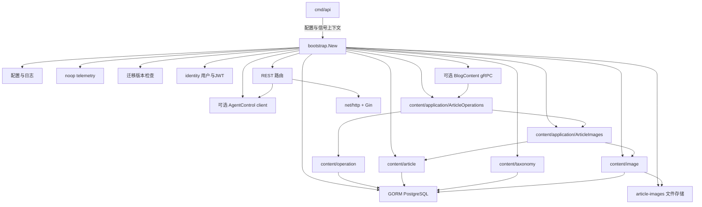
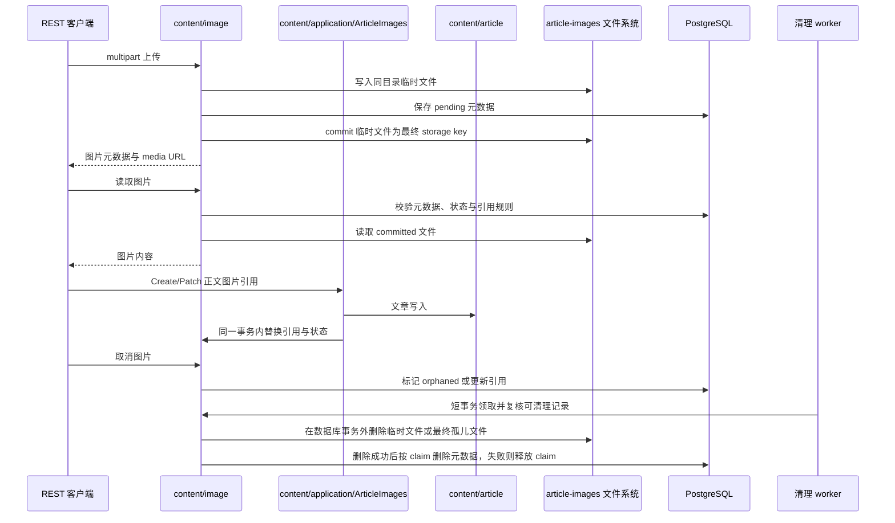

# Go 后端当前架构

## 范围与运行现状

后端是独立部署的 modular monolith，提供 REST over HTTP，包含 content 与 identity 模块，数据归后端拥有并存放 PostgreSQL，文章图片使用本地文件系统。启用 Agent 集成时，Blog 通过 AgentControl gRPC 调用 Agent，并在同一进程提供内部 BlogContent gRPC。

当前已提供用户登录、短期 Bearer JWT、请求上下文授权与 Blog↔Agent 双向接入；不包含 WebSocket、消息 broker、Outbox、对象存储、Kubernetes 或 OTLP exporter。本轮跨服务真实验收进行中，具体 QA 证据由主验收统一补充。旧绑定决策见历史文档 [go-backend-architecture.md](go-backend-architecture.md)，现行扩展规则见 [module-extension.md](../guides/module-extension.md)。

## 目录边界与新增功能落点

以下是稳定的目录边界，而非会随业务演进变化的逐文件清单：

```text
backend/
├── cmd/                              # api、migrate、healthcheck 可执行入口
├── api/                              # OpenAPI 源契约
├── internal/bootstrap/               # 手工组合与生命周期装配
├── internal/platform/                # config、database、persistence、HTTP server、observability、blob storage
├── internal/modules/content/         # content 根共享协作者与 feature/application
│   ├── security.go                   # Action、Resource、Authorizer、CurrentAuthor
│   ├── clock.go                      # 共享 Clock
│   ├── article/                      # 文章 feature：规则、查询、Persistence Record 与仓储
│   ├── taxonomy/                     # ArticleType、Tag feature
│   ├── image/                        # 图片、Blob、引用与清理 feature
│   ├── operation/                    # 全局文章操作成功幂等账本
│   └── application/                  # 跨 feature 事务动作
├── internal/modules/identity/        # 用户、登录与JWT签发验证
├── internal/transport/rest/content/  # REST 窄接口、DTO、HTTP 映射
├── internal/transport/rest/agent_*.go # Agent HTTP/SSE 薄代理
├── internal/transport/grpc/blogcontent/ # 八个 Blog 管理 RPC 与标准 health
├── internal/adapters/agent/           # AgentControl 出站连接与调用预算
├── internal/generated/proto/         # 根 contracts/ 的生成物
├── migrations/                       # 嵌入式 SQL schema migrations
├── README.md                         # 指向根 docs/services/backend/ 的文档入口
└── Dockerfile / compose.yaml         # 交付定义
```

测试通常与受测包相邻，或位于现有后端测试包中；不为新增功能另设一棵通用测试目录。模块落点和交付路径以 [`../guides/module-extension.md`](../guides/module-extension.md) 为准。文件拆分采用业务边界优先、技术职责其次的导航规则；命名和文件拆分是 review guidance，不是组织扫描器的硬合同。

| 新增内容 | 放置位置 | 责任 |
| --- | --- | --- |
| 文章规则、查询、持久化 | `internal/modules/content/article/` | Article feature 的 Service、Query Service、Repository、Persistence Record、校验与错误 |
| 分类与标签 | `internal/modules/content/taxonomy/` | taxonomy feature 的按业务主体拆分的 Service、Query Service、Repository、Persistence Record、校验与错误 |
| 图片与 Blob 生命周期 | `internal/modules/content/image/` | 图片 Service、引用替换、Repository、Persistence Record、Blob、Policy 与清理 |
| 跨 feature 文章协作 | `internal/modules/content/application/` | `ArticleImages` 协调文章/图片；`ArticleResponses` 维护文章/分类的读取快照及写响应事务 |
| content 共享协作者 | `internal/modules/content/security.go`、`clock.go` | 授权、作者身份和 Clock；不承载业务方法 |
| REST handler | `internal/transport/rest/content/` | 窄接口、DTO、headers、HTTP 状态、multipart 和错误映射 |
| OpenAPI 契约 | `api/openapi.yaml` | REST 对外 API 的源契约 |
| 生成的 OpenAPI bindings | `internal/generated/openapi/` | 仅由生成流程产出，不手工编辑 |
| 共享 Proto / Go 生成物 | 根 `contracts/proto/scyg/` / `internal/generated/proto/` | Blog↔Agent 源合同 / 仅由 `task proto:generate` 产出 |
| Agent HTTP/SSE 与 gRPC | `internal/transport/rest/agent_*.go`、`internal/transport/grpc/blogcontent/`、`internal/adapters/agent/` | JWT 薄代理、管理业务适配、出站连接 |
| 全局文章写入幂等 | `internal/modules/content/operation/`、`internal/modules/content/application/article_operations.go` | 成功账本 / 同事务业务写入与仲裁 |
| bootstrap 依赖接线 | `internal/bootstrap/` | feature/application、路由、worker 与生命周期资源的构造和清理 |
| 测试 | 相邻受测包或既有后端测试包 | 领域、持久化、transport、架构和用户可观察行为验证 |

向现有 `content` 模块增加能力时，按上表把规则、查询和持久化放入最近适用的 feature；跨 feature 写入放入具名 `content/application` 动作；REST 映射放入 `internal/transport/rest/content/`。简单功能使用聚焦测试和 `qa:feature`；改变契约或数据时使用 `qa:contract`，schema 变更增加 migration roundtrip 与真实数据库 integration 或 E2E；改变生命周期、新模块或边界时保留架构 import checks 及相关 bootstrap、数据库、container 和 E2E 门禁。公开 REST 契约变更必须同步更新 `api/openapi.yaml` 和生成 bindings；只有 schema/data 变更才需要 SQL migration，只有生命周期或依赖接线变更才需要 bootstrap wiring。只有出现一个真实且独立的业务领域时，才新建顶层模块。

文件导航规则：先按业务主体、生命周期、不变量、事务边界或独立变更原因划分文件，再在每个业务边界内区分 Service、Repository、持久化 Record、Projection 和 Mapper。文件名优先使用 `<business>_<role>.go`；数据库行结构优先使用 `<business>_record.go` 或 `<business>_gorm.go`。不得使用跨业务的通用 `query.go`、`write.go`，也不得在一个文件中混合 Service、Repository、Record 和 Mapper。文件大小只是 review 触发条件，不是机械拆分阈值。

必须保持以下硬边界：feature 的业务代码不导入同一顶层模块的 sibling feature 或 `application`；`content/application` 只负责具名跨 feature 协作与事务，不写 SQL、不访问 Persistence Record/Repository；feature 的 Service/校验与 application 不导入 Gin、HTTP DTO 或 OpenAPI generated，feature Repository 才能使用 GORM 与 platform/database 完成自身表的持久化；REST 只依赖消费方窄接口；持久化通过版本化 SQL migrations 演进，不使用 `AutoMigrate`；bootstrap 独占运行时构造，并负责 migration、readiness、创建失败和关闭时的有界逆序资源清理。详细规则见 [`../guides/module-extension.md`](../guides/module-extension.md)。


## 可执行入口

- `cmd/api` 是 API 进程入口。它解析 `-config <YAML路径>` 或 `-config=<YAML路径>`，缺省为 `config.local.yaml`，建立 `SIGINT`/`SIGTERM` 信号上下文，然后创建并运行 `bootstrap.App`。见 [`cmd/api/main.go`](../../../../backend/cmd/api/main.go) 与 [`cmd/api/config_args.go`](../../../../backend/cmd/api/config_args.go)。
- `cmd/migrate` 是独立的数据库结构管理入口。它只从 YAML 读取 `database.dsn`，支持 `up`、`down`、`version` 和 `force VERSION`，不使用运行时环境覆盖。见 [`cmd/migrate/main.go`](../../../../backend/cmd/migrate/main.go)。
- `cmd/healthcheck` 是容器健康探测入口，依次请求 `/live` 和 `/ready`。见 [`cmd/healthcheck/main.go`](../../../../backend/cmd/healthcheck/main.go)。

## 组合、启动与关闭

[组合根](../../../../backend/internal/bootstrap/construct.go)装配配置、日志、数据库、迁移检查、用户仓储、LoginService、TokenService、上下文作者与授权，以及内容 features、图片事务、清理 worker、REST 和 HTTP server。启用 Agent 时还装配 AgentControl 客户端、BlogContent gRPC、operation 账本及 ArticleOperations。开发环境显式设置开发作者 ID 时使用开发身份，默认使用认证上下文。没有动态依赖注入容器。

构造阶段要求迁移版本匹配 [CurrentVersion](../../../../backend/migrations/runner.go) 且非 dirty；当前包含第 5 版 article_operations 迁移。失败时不进入运行态，运行时不自动迁移或 AutoMigrate。数据库构造时 ping，图片存储根解析为绝对路径并创建；AgentControl 连接非阻塞，不要求 Agent 在线。



`App.Start` 先启动清理 worker，启用 Agent 时绑定 BlogContent listener，再绑定 HTTP listener，最后开放 readiness 与标准 `grpc.health.v1.Health` 的 SERVING 状态。任一 listener 绑定失败均使启动失败并回收资源；Agent 离线不影响 Blog `/ready`。`App.Run` 等待信号取消、HTTP 或 gRPC 服务错误。`App.Shutdown` 共享并发关闭结果：撤回 HTTP readiness 和 gRPC health，排空 HTTP/SSE，再用独立 `agent.grpc_shutdown_timeout` 预算排空 gRPC，停止 worker，关闭 Agent client、数据库和遥测。worker 未确认退出时，数据库和遥测保持存活，允许后续关闭继续等待。见 [`internal/bootstrap/app.go`](../../../../backend/internal/bootstrap/app.go) 与 [`agent_integration.go`](../../../../backend/internal/bootstrap/agent_integration.go)。

## 配置责任与边界

运行时配置由 `internal/platform/config` 负责，来源优先级为：内置默认值 < YAML 文件 < `SCYG_` 环境变量。配置加载后会移除 `qa` 段，QA 管理 DSN 不进入 API 运行配置。具体加载和字段映射见 [`internal/platform/config/load.go`](../../../../backend/internal/platform/config/load.go)。不要在本文或其他提交文档中展开本机 `config.local.yaml` 的内容。

API 入口负责选择配置文件路径，bootstrap 负责把已验证配置传给数据库、HTTP 和图片存储构造器。`cmd/migrate` 是有意分离的纯 YAML 入口，支持数据库初始化所需的迁移命令，但它不改变 API 运行时配置责任。

`agent.enabled` 默认 `false`，此时 Agent HTTP/SSE 整组不注册并返回 404，不构造 Agent client 或 BlogContent listener。默认 `agent.target=127.0.0.1:9090`、`agent.blog_content_listen=127.0.0.1:50051`；`unary_timeout`、`sse_idle_timeout` 与 `grpc_shutdown_timeout` 分别限制一元调用/订阅建立、SSE 空闲和帧写入、gRPC 排空。字段以 [`config.example.yaml`](../../../../backend/config.example.yaml) 和 [`config/agent.go`](../../../../backend/internal/platform/config/agent.go) 为准。

## HTTP 与 OpenAPI
[`api/openapi.yaml`](../../../../backend/api/openapi.yaml) 是 REST API 契约的唯一所有者。生成的绑定和传输模型位于 [`internal/generated/openapi`](../../../../backend/internal/generated/openapi)，REST 内容 handler 在边界处把生成 DTO、multipart、`ETag`/`If-Match` 和 RFC 9457 错误映射为 article、taxonomy、image 与 application 的协议无关命令、查询和结果类型。运行时文档由 [`internal/transport/rest/apidocs`](../../../../backend/internal/transport/rest/apidocs) 提供 `/docs`、`/openapi.yaml` 和 `/docs/assets/scalar.js`；Scalar 资产自托管，不依赖运行时 CDN。

文章正文原样保存非空 UTF-8 Markdown，包括首行 TAB/空格缩进与尾部空格、换行；仅用去空白检查拒绝全空白输入。正文允许换行、回车和制表符，拒绝其他控制字符；标题与摘要继续使用严格文本校验。受管图片仅从 Markdown 图片节点识别，相对媒体路径与 HTTP(S) 绝对 URL 均按 `/media/article-images/` 路径提取存储键，继续由图片工作流校验存储键和归属并提交引用。文章响应必需的分类摘要 `articleType` 只包含 `id`、`name`、`image`；`application.ArticleResponses` 在只读 RepeatableRead 事务内通过 article/taxonomy 的 InTx 查询装配读取结果，写响应则在原写事务内补齐摘要，保留本次写入版本。分类读取使用活跃分类字典，不依赖只含已发布文章的公共 taxonomy 投影；REST mapper 只做 DTO 校验和转换。已有文章的分类装配失败返回安全的 HTTP 500，不误报文章不存在，写入装配失败则整体回滚；原始原因只保留在内部错误链。

八个 Blog JWT Agent 入口为 `POST /api/v1/ai/search`、`POST /api/v1/ai/write`、`POST /api/v1/ai/polish`、`POST /api/v1/ai/chat`、`GET /api/v1/runs/{runId}`、`GET /api/v1/runs/{runId}/events`、`POST /api/v1/runs/{runId}/resume`、`POST /api/v1/runs/{runId}/cancel`。Blog 将认证 `user_id` 传给 Agent，由 Agent 校验 owner；创建与恢复要求 UUIDv4 `Idempotency-Key`。SSE 转发不透明 `Last-Event-ID` 和 Agent 编码 frame，不由 Blog 保存 Run 状态、事件或结果。源合同仍为 OpenAPI，适配在 [`agent_handler.go`](../../../../backend/internal/transport/rest/agent_handler.go) 与 [`agent_events.go`](../../../../backend/internal/transport/rest/agent_events.go)。

内部 BlogContentService 提供 SearchArticles、GetArticle、ListTags、ListArticleTypes、CreateArticle、UpdateArticle、PublishArticle、ArchiveArticle 八 RPC，使用现有管理投影、分页、排序白名单、状态机、版本与图片引用规则；`user_id` 必须对应活动账号并经过现有业务授权。双向 gRPC 依赖可信内部网络，不使用 service JWT，不应公开端口，也不改变 Agent 生产 Tool 写权限。共享 Proto 位于根 [`contracts/proto/scyg/`](../../../../contracts/proto/scyg/)，由 `task proto:generate` 生成至 `internal/generated/proto/`，不是未来 `api/proto/` 空壳。

## `content` 模块边界

content 与 identity 是并列模块。content 根只保留共享 security.go 与 clock.go；article、taxonomy、image、operation 分别承载内容能力和成功账本，跨 feature 读写由 application.ArticleImages、ArticleResponses 与 ArticleOperations 拥有事务边界。REST 与 gRPC 只持有操作所需的窄接口，不接收数据库、Repository 或 Blob filesystem。

依赖方向如下：

- `content/article` 负责文章规则、查询、Persistence Record、Repository、校验与错误，不导入 taxonomy、image 或 `content/application`。
- `content/taxonomy` 负责 ArticleType、Tag 的规则、查询和 Persistence Record；为删除判定执行局部只读查询，但不导入 article Record 或 package。
- `content/image` 负责图片元数据、引用关系、Persistence Record、Blob、Policy、上传/读取/取消和清理，不导入 article 或 `content/application`。
- `content/application` 只负责具名跨 feature 协作与事务；`ArticleImages` 协调 article/image，`ArticleResponses` 调用各 feature 的 InTx 查询装配分类摘要，不写 SQL、不访问 Persistence Record 或 Repository。
- `content/operation` 拥有全局 UUIDv4 `operation_id` 成功账本；`ArticleOperations` 在同一 PostgreSQL 事务中仲裁键、写文章与图片引用、记录成功。成功时起算 24 小时，失败回滚不占键；有效成功键重放返回绑定文章的当前管理投影，仍经过当前用户授权。Create/Update 的 Blob 预备读取在事务外完成，预备错误只在排除成功重放后影响新写入；过期成功记录由现有 worker 有界清理。
- `internal/transport/rest/content` 负责 OpenAPI DTO、HTTP 状态、headers、multipart 和错误响应，依赖消费方窄接口，不把传输类型带入 feature/application。

跨顶层业务模块协作时，只能调用对方公共 API 或消费方定义的窄接口；模块目录和扩展规则见 [`../guides/module-extension.md`](../guides/module-extension.md)。


## PostgreSQL、迁移与文章图片

PostgreSQL 连接由 [database.go](../../../../backend/internal/platform/database/database.go)创建、配置连接池并 ping。GORM 留在持久化适配器内。迁移由 [runner.go](../../../../backend/migrations/runner.go)管理，要求版本以其 CurrentVersion 为准：

初始内容表统一使用小写 snake_case 物理命名：`article_types`、`tags`、`articles`、`article_tags`；主键与关联列使用 `id`、`article_type_id`、`article_id`、`tag_id`，生命周期列使用 `created_at`、`updated_at`、`deleted_at`、`is_deleted`。Go 领域名称 `Article`、`ArticleType`、`Tag`、`TagArticle` 只表示业务概念，不作为 PostgreSQL 表名或列名。GORM Record 必须显式声明 `TableName()` 与 `gorm:"column:snake_case"`，禁止依赖默认命名推断。
采用完整审计/软删除契约的 feature Record 匿名嵌入 `internal/platform/persistence.AuditFields`；其字段映射和 GORM 自动时间回调约束集中维护在 `backend/internal/platform/persistence/audit_fields.go`。该共享类型不改变 feature 的表所有权、版本条件或删除语义；图片状态、关联和 claim Record 继续使用各自生命周期字段。新增 feature 遵循 [`../guides/module-extension.md`](../guides/module-extension.md) 的持久化规则。

1. [`000001_initial.up.sql`](../../../../backend/migrations/000001_initial.up.sql) 建立初始内容表结构。
2. [`000002_article_images.up.sql`](../../../../backend/migrations/000002_article_images.up.sql) 增加 `article_images` 元数据表和 `article_image_references` 引用表，并约束 `pending`、`committed`、`orphaned` 状态及图片元数据。
3. [`000003_article_image_cleanup_claims.up.sql`](../../../../backend/migrations/000003_article_image_cleanup_claims.up.sql) 为清理 worker 增加短期 claim token 和过期时间，使多实例清理可安全分工并在失败后重试。
4. [000004_users.up.sql](../../../../backend/migrations/000004_users.up.sql) 建立 users 与默认活动用户 admin，只保存 bcrypt 密码哈希。
5. [`000005_article_operations.up.sql`](../../../../backend/migrations/000005_article_operations.up.sql) 建立全局 UUID operation_id 成功账本及成功/过期时间约束。

文章图片使用配置的存储目录，运行时会转换为绝对路径，并由 `blobstorage.Filesystem` 在固定根目录内管理文件。当前生命周期是：



上传先验证图片内容并写入临时文件，再保存数据库元数据，随后提交最终文件。提交失败时会按已提交或未提交状态保留必要的补偿信息。取消只处理允许取消的 `pending` 图片并使其进入可清理状态；孤儿文件由清理 worker 依据配置的 pending TTL、orphan grace 和清理间隔处理。清理 worker 先在短事务中领取带租约的候选记录，再在事务外删除 Blob，最后仅凭仍有效的 claim 删除元数据；Blob 删除失败会释放 claim，进程崩溃则由 claim 过期恢复。读取会检查数据库元数据和文件一致性，`article-images` media 路径只服务可见的最终文件，孤儿状态不会作为有效媒体返回。这里描述的是当前图片模块的生命周期，不等同于对象存储或事件驱动媒体管线。

## 容器、Compose 与质量门禁

[`Dockerfile`](../../../../backend/Dockerfile) 使用仓库根构建上下文，复制根 `contracts/` 并生成内部 Go Proto bindings，再以固定摘要的 Go 构建阶段编译 `api`、`migrate` 和 `healthcheck`，复制到非 root 的 distroless 静态运行时。运行时镜像没有 shell、包管理器、Go 工具链或源码，并通过 `/healthcheck` 检查 `/live` 与 `/ready`。

[`compose.yaml`](../../../../backend/compose.yaml) 运行 PostgreSQL、一次性 migrate 和 API。API 等待 PostgreSQL 健康及迁移成功，使用只读根文件系统、有限的 `/tmp`、去除 capabilities 和非特权安全选项；初始化流程见[开发指南](../guides/backend-development.md#6-配置和-qa-数据库)。运行配置使用 `SCYG_` 环境变量注入。

仓库根 [`compose.yaml`](../../../../compose.yaml) 是 Blog↔Agent 联合集成定义，使用根构建上下文；Blog 等待自身数据库及初始化就绪，不依赖 Agent 在线。AgentControl 与 BlogContent 使用 Compose 内部地址，gRPC 端口不发布到宿主机；该集成定义不同于后端自身容器门禁。

根工作流 [`backend-quality.yml`](../../../../.github/workflows/backend-quality.yml) 把质量门禁分成三组：静态与生成物门禁，数据库迁移 roundtrip、integration 和 E2E，容器 smoke、SBOM 与高危漏洞扫描。对应本地任务聚合在 [`Taskfile.yml`](../../../../backend/Taskfile.yml)。这些是当前仓库声明的质量检查入口，不表示本文执行过这些命令。

## 明确排除的未来能力

尚未实现 WebSocket、broker、CloudEvents、Outbox、对象存储或 Kubernetes；身份登录、用户 token 与 Blog↔Agent gRPC/HTTP/SSE 接入已存在，不属于未来能力。协议与集成见 [protocol-integration-extension.md](../guides/protocol-integration-extension.md)，模块约束见 [module-extension.md](../guides/module-extension.md)。源码接入不等同于本轮验收已通过。

## Source of truth

| 主题 | 当前事实的主要来源 |
| --- | --- |
| API 进程入口与信号生命周期 | [`cmd/api/main.go`](../../../../backend/cmd/api/main.go)、[`internal/bootstrap/app.go`](../../../../backend/internal/bootstrap/app.go) |
| 手工组合与启动门禁 | [`internal/bootstrap/construct.go`](../../../../backend/internal/bootstrap/construct.go)、[`migrations/runner.go`](../../../../backend/migrations/runner.go) |
| 运行时配置 | [`internal/platform/config/load.go`](../../../../backend/internal/platform/config/load.go)、[`internal/platform/config/types.go`](../../../../backend/internal/platform/config/types.go) |
| REST 契约 | [`api/openapi.yaml`](../../../../backend/api/openapi.yaml)、[`internal/generated/openapi`](../../../../backend/internal/generated/openapi) |
| REST 路由 | [`internal/transport/rest/router.go`](../../../../backend/internal/transport/rest/router.go) |
| 运行时 API 文档 | [`internal/transport/rest/apidocs/`](../../../../backend/internal/transport/rest/apidocs/)、[ADR-010：Scalar 自托管资产版本](adr-010-scalar-asset-pin.md) |
| 内容模块边界 | [`internal/modules/content/security.go`](../../../../backend/internal/modules/content/security.go)、[`internal/modules/content/clock.go`](../../../../backend/internal/modules/content/clock.go)、[`internal/modules/content/article/`](../../../../backend/internal/modules/content/article/)、[`internal/modules/content/taxonomy/`](../../../../backend/internal/modules/content/taxonomy/)、[`internal/modules/content/image/`](../../../../backend/internal/modules/content/image/)、[`internal/modules/content/application/`](../../../../backend/internal/modules/content/application/)、[`../guides/module-extension.md`](../guides/module-extension.md) |
| PostgreSQL 适配与迁移 | [`internal/platform/database/database.go`](../../../../backend/internal/platform/database/database.go)、[`internal/platform/persistence/audit_fields.go`](../../../../backend/internal/platform/persistence/audit_fields.go)、各 feature 的 `*_record.go`/`*_repository.go`、[`migrations/000001_initial.up.sql`](../../../../backend/migrations/000001_initial.up.sql)、[`migrations/000002_article_images.up.sql`](../../../../backend/migrations/000002_article_images.up.sql)、[`migrations/000003_article_image_cleanup_claims.up.sql`](../../../../backend/migrations/000003_article_image_cleanup_claims.up.sql) |
| 文章图片文件生命周期 | [`internal/platform/blobstorage/filesystem.go`](../../../../backend/internal/platform/blobstorage/filesystem.go)、[`internal/modules/content/image/`](../../../../backend/internal/modules/content/image/)、该 feature 的具名 cleanup 文件 |
| 容器与 Compose | [`Dockerfile`](../../../../backend/Dockerfile)、[`compose.yaml`](../../../../backend/compose.yaml) |
| CI 与质量门禁 | [`Taskfile.yml`](../../../../backend/Taskfile.yml)、[`backend-quality.yml`](../../../../.github/workflows/backend-quality.yml) |
| 历史架构与扩展规则 | [`go-backend-architecture.md`](go-backend-architecture.md)、[`protocol-integration-extension.md`](../guides/protocol-integration-extension.md) |
