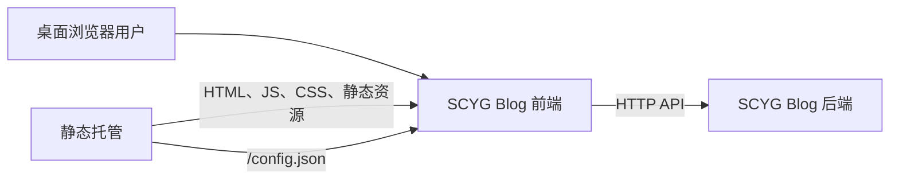
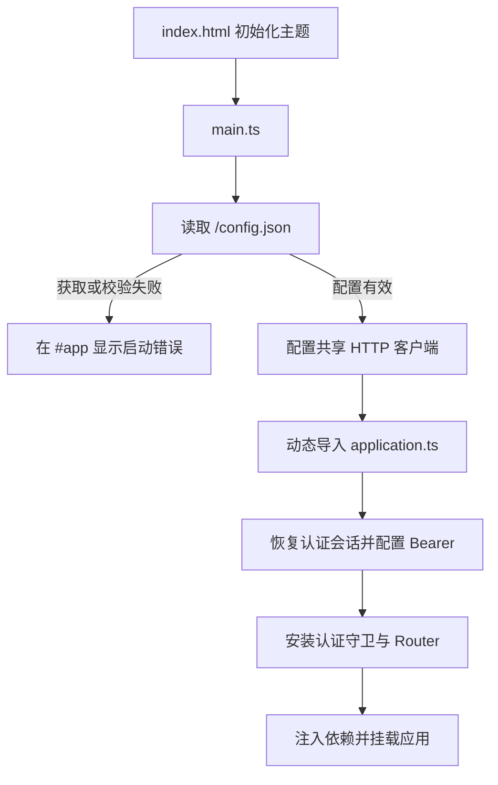

# 前端服务架构

## 目标与范围

本文帮助前端维护者和集成人员理解 SCYG Blog 前端的运行边界、模块职责和关键失败路径。下文源码路径均相对于 [`frontend/`](../../../frontend/)；业务页面规则、完整 API 字段和视觉 Token 不在本文展开，它们分别由业务实现、请求适配器和 [设计系统](design.md) 维护。

## 系统上下文

前端是由浏览器运行的 Vue 单页应用。静态托管方交付构建产物和运行时配置，浏览器根据配置直接访问后端 HTTP API。



前端负责：

- 装载运行时配置并完成浏览器应用初始化；
- 组织公共、作者和管理三个路由域；
- 管理页面级客户端状态、主题和滚动恢复；
- 将页面请求转换为后端 API 请求，并在边界解析响应；
- 清理进入 Markdown 阅读界面的不可信 HTML。

前端不负责后端数据持久化、身份签发、服务端权限判定或生产静态托管。管理后台仍未启用；作者域使用后端签发的短期 Bearer JWT。

## 运行时组件

| 组件 | 权威位置 | 职责 |
| --- | --- | --- |
| HTML 入口 | `index.html` | 提供 `#app` 挂载点，在模块加载前初始化主题，加载 `src/main.ts`。 |
| 启动协调 | `src/main.ts`、`src/bootstrap.ts` | 初始化主题，读取运行时配置，配置 HTTP 客户端，延迟导入并挂载应用。 |
| 应用装配 | `src/application.ts` | 创建 Vue 应用，安装 Pinia、Router 和滚动恢复服务，提供配置与 API 服务容器。 |
| 运行时配置 | `src/config/` | 从 `/config.json` 获取并校验 `serverUrl`，向组件树提供只读配置。 |
| 路由 | `src/router/` | 组合路由域、处理旧地址、同步标题并协调导航滚动。 |
| 页面与布局 | `src/views/`、`src/layouts/` | 呈现路由页面及公共、作者布局，不拥有 HTTP 基础设施。 |
| 客户端状态 | `src/stores/` | 管理文章流、编辑草稿、分类标签、认证状态和 UI 状态。 |
| 服务层 | `src/services/` | 封装作者运行时、写入门禁、图片生命周期和滚动恢复等跨组件机制。 |
| 请求边界 | `src/request/` | 提供共享 HTTP 客户端、类型化 API 适配器、响应解析和稳定错误结构。 |
| 内容安全 | `src/security/` | 使用独立 DOMPurify 策略清理 Markdown HTML。 |
| 主题与样式 | `src/theme/`、`src/assets/` | 管理主题状态、语义 Token 和全局样式。 |

## 启动主路径

启动顺序是运行约束，不应由页面绕过：

1. `index.html` 从本地存储或系统颜色偏好设置根主题，减少首帧主题闪烁。
2. `src/main.ts` 加载全局样式并再次初始化主题运行时。
3. `bootstrapApplication` 请求同源 `/config.json`，超时为 10 秒。
4. 配置通过严格 Schema 校验：只接受包含 HTTP(S) `serverUrl` 的对象，末尾单个 `/` 会被移除。
5. `configureHttp` 设置共享 Axios 实例的 `baseURL`。
6. 动态导入应用模块，创建 Vue 应用、Pinia、API Services 和认证会话控制器，恢复未过期的浏览器会话。
7. 配置 Axios Bearer provider 与 `401` 失效处理，安装认证路由守卫、Router 和滚动恢复，再注入运行时依赖并挂载到 `#app`。



启动边界只将 `RuntimeConfigError` 转换为稳定的中文页面错误。其他编程错误或应用挂载错误不会被伪装成配置故障。

## 路由域

总路由按 `admin → author → public` 的顺序组合，确保公共 catch-all 不会吞掉保留域。

| 路由域 | 当前行为 | 所有者 |
| --- | --- | --- |
| 公共域 | `/`、`/articles`、`/articles/:id`、`/login`、旧地址重定向和公共 404。公共文章数据来自后端 API。 | `src/router/modules/public.ts` |
| 作者域 | `/author/articles/new`、`/author/articles/:id/edit`、`/author/taxonomy`。匿名访问跳转登录页，已认证会话使用真实管理 API。 | `src/router/modules/author.ts` |
| 管理域 | `/admin` 及其后代统一呈现“管理后台暂不可用”，不会进入公共 404。 | `src/router/modules/admin.ts` |

旧地址兼容仅负责把合法标识映射到当前路由；非法标识停留在类型化错误页面。路由成功后根据 `meta.title` 更新唯一文档标题。

## 请求与数据边界

页面不直接配置 Axios。请求路径是：

```text
页面或 Store → 注入的 API Services → 领域 API 适配器 → HttpTransport → 后端
```

- `src/request/http.ts` 维护唯一共享 Axios 实例，默认超时 10 秒并请求 JSON。
- API 适配器负责 URL、查询参数、请求体和外部响应到前端模型的转换。
- 外部响应以 `unknown` 进入边界，由 Zod Schema 或类型解析器验证后才能进入页面和 Store。
- Axios 失败统一转换为 `HttpRequestError`，保留稳定的 `status`、`code` 和可展示消息；调用方决定页面反馈。
- `createApiServices` 在应用挂载时创建一次，并通过 Vue Injection 提供；缺少提供者会立即抛出错误。

完整端点和字段以 `src/request/api/`、`src/types/` 及后端接口定义为准，本文不复制易变化的业务契约。

## 状态与能力边界

Pinia Store 显式区分匿名、恢复中、已认证和已过期。`src/services/auth-session.ts` 使用生成的 `LoginResponse` Schema 校验 localStorage，会话过期或后端返回 `401` 时清除令牌；前端不解析或信任 JWT payload。

作者路由守卫和写入门禁都读取同一会话状态。后端当前只提供 login 和短期访问令牌，因此本地退出只清除浏览器会话，不伪造 refresh、me 或服务端 logout 能力。

## 安全边界

- 共享 Axios 客户端只通过认证会话服务读取 Bearer Token，不在页面或 Store 拼接 `Authorization`。
- 文章、分类和图片写入通过共享 mutation guard 在调用适配器前判定已认证状态；后端鉴权仍是最终边界。
- Markdown HTML 通过私有 DOMPurify 实例、标签与属性白名单及 URL 规则清理；页面不得另建宽松策略。
- 外部 API 数据在请求适配层校验，页面不得把未解析的 `unknown` 当作领域对象。
- 浏览器端门禁只减少误用，不替代后端鉴权和授权。

## 主要失败结果

| 失败点 | 可观察结果 | 排查入口 |
| --- | --- | --- |
| `/config.json` 无法获取或超时 | 应用不挂载，显示“运行时配置加载失败，请检查 config.json 后重试。” | 浏览器 Network、部署的 `config.json` |
| 配置 JSON 或 `serverUrl` 无效 | 与配置获取失败显示相同稳定错误 | `src/config/runtime.ts`、实际配置内容 |
| 后端请求失败 | API 调用以 `HttpRequestError` 拒绝，页面按调用场景展示失败 | Network、`src/request/http.ts`、对应适配器 |
| API 响应结构不符合 Schema | 边界解析失败，数据不会进入 Store 或页面模型 | `src/request/generated/zod.gen.ts`、对应请求适配器、后端响应 |
| 匿名访问作者路由 | 跳转 `/login`，登录成功后返回原站内地址 | 认证会话服务与路由守卫 |
| 登录会话过期或 API 返回 `401` | 清除本地 Bearer 会话，后续作者导航要求重新登录 | `src/services/auth-session.ts`、`src/request/http.ts` |
| 未知 `/admin/**` 地址 | 仍由管理域呈现不可用状态 | `src/router/modules/admin.ts` |

## 相关文档

- [服务入口](README.md)
- [开发指南](development.md)
- [部署与运行手册](operations.md)
- [设计系统](design.md)
