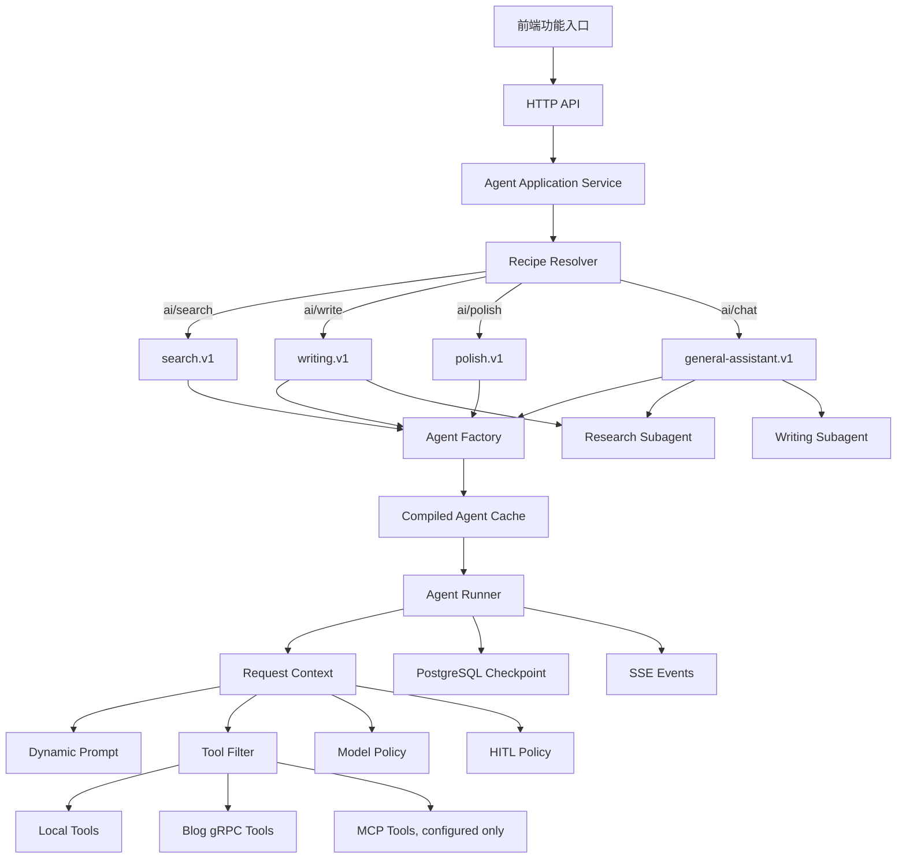

# SCYG Agent 第一版框架重构实施计划

| 项目 | 内容 |
| --- | --- |
| 状态 | 草稿，待实施 |
| 版本 | 1.0 |
| 日期 | 2026-09-21 |
| 适用范围 | `agent/` 项目 |
| 目标读者 | Agent 服务开发者、评审者与验收人员 |

## 一、执行摘要

第一版删除现有 SIMPLE/DEEP 自研运行时、适配器注册表、OpenAI SSE 解析器、固定审批图和运行时输出规范化链，改用 Deep Agents、LangChain 与 LangGraph 已提供的 Agent loop、流式输出、checkpoint、Subagent、Skill、动态上下文和 HITL 能力。

API 负责确定性选择版本化 `AgentRecipe`：高级搜索、智能写作、润色和开放聊天分别进入 `search.v1`、`writing.v1`、`polish.v1` 和 `general-assistant.v1`。意图明确的 API 不经过 Main Agent；只有开放聊天由 Main Agent 决定是否委派 Research Agent 或 Writing Agent。Agent 按职责划分，模型由每个 Recipe 的 `ModelPolicy` 按任务复杂度和预算选择。

第一版不实现任何自定义 LangGraph，不创建 `workflows/`，也不提供 `CompiledSubAgent`。所有 Agent 均通过 `create_deep_agent` 或适合简单任务的 `create_agent` 构造。后续只有在实际评估证明标准 Agent loop 无法稳定满足确定顺序、恢复或并行编排要求时，才另行设计自定义图。

实施采用干净切换：新路径完成验证后一次性替换生产装配和 Worker 执行入口，随后删除旧 `runtimes/` 及绑定测试、配置、文档和兼容导出。数据库迁移不得主动删除已有业务数据；旧运行时字段如需物理删除，放入单独获批的数据清理变更。

## 二、目标、非目标与约束

### 2.1 目标

1. 为高级搜索、智能写作、润色和开放聊天提供独立、稳定的 API 能力。
2. 使用成熟 Agent 框架管理模型循环、Tool 调用、流式输出、Subagent、Skill、checkpoint 和 HITL。
3. 通过 `AgentRecipe` 统一描述 Prompt、Tool、Skill、Subagent、中间件、模型策略、输出结构和版本。
4. API 意图明确时直接调用目标 Agent，消除无意义的 Main Agent 路由调用。
5. 保留现有认证、PostgreSQL、Blog gRPC、HTTP/SSE 和进程生命周期中仍有价值的基础设施。
6. 对读取与写入 Tool 建立最小权限边界；写操作继续由 Blog 服务保证权限和幂等。
7. 持久化 `recipe_id`、`recipe_version` 和 `thread_id`，确保 HITL 恢复使用原始 Agent 结构。
8. 将框架类型限制在 Agent 边界内，HTTP、应用状态和数据库不直接依赖第三方内部消息类型。
9. 删除旧运行时实现和重复协议，不保留长期双路径。
10. 建立可重复的行为验收，覆盖直接路由、Tool 权限、模型选择、结构化输出、HITL 和恢复。

### 2.2 第一版非目标

1. 不实现自定义 LangGraph、`CompiledSubAgent` 或业务工作流图。
2. 不实现多租户插件系统、运行时 Python 模块发现或外部 Recipe 热加载。
3. 不允许客户端提交任意 Tool、Skill、中间件或模型名称。
4. 不为每个标题、摘要、SEO、标签等小任务创建独立 Subagent。
5. 不让模型自行决定用户权限、HITL 豁免或预算上限。
6. 不实现 Agent 自主发布、删除文章或批量修改已发布内容。
7. 不在第一版创建文件系统沙箱、代码执行器或长期自主记忆。
8. 不为旧 SIMPLE/DEEP Runtime 保留兼容 Adapter、别名、Registry 或双写路径。
9. 不主动删除现有业务数据；旧表或列的物理清理不属于本计划。
10. 不把 MCP 作为所有 Tool 的强制传输方式。

### 2.3 已确认约束

- `agent/pyproject.toml` 已固定 Python 3.12、`deepagents==0.6.12`、`langgraph==1.2.9` 和 PostgreSQL checkpointer。
- Agent truth 与 LangGraph checkpoint 使用同一个应用数据库、账号和 DSN；`public` 与 `langgraph` 仅是数据组织边界。
- 明文配置允许保存在 `agent.toml` 或 `.env`，但日志不得主动输出密码、API key 或完整敏感请求。
- HTTP transport 只负责协议映射；共享用例进入 application/agents 边界，不在路由里实现 Agent 决策。
- Blog 外部能力继续通过适配器访问；Agent 不直接访问 Blog 数据库。
- 初始化和迁移必须幂等、可重试，不主动删除已有业务数据。
- 第一版优先覆盖日常主路径和一个基本失败结果，不保留穷举权限矩阵或复杂故障注入。

### 2.4 设计假设

- 前端能够分别调用高级搜索、智能写作、润色和开放聊天 API。
- Blog gRPC 当前继续作为 Blog 能力的首个真实实现；未来 MCP Server 可接入同一 Tool catalog，而不改变 Agent Recipe。
- 写操作由 Blog 服务接受并持久化幂等键；LangGraph checkpoint 不承担外部副作用幂等真相。
- 第一版保持现有异步 Run、Worker 和 SSE 产品模型，避免把长时间搜索和写作绑定到单个 HTTP 请求生命周期。
- Main、Research、Writing Agent 初期可使用同一 Provider，但允许通过配置映射到不同模型。

## 三、目标架构



### 3.1 权威边界

| 信息 | 权威位置 |
| --- | --- |
| API 到 Agent 的映射 | `agents/recipes/registry.py` |
| Recipe 内容和版本 | `agents/recipes/*.py` |
| 当前用户、权限、质量等级和预算 | `AgentRequestContext` |
| 当前 Run 的产品状态 | Agent truth PostgreSQL |
| Agent 对话和 HITL 中断状态 | LangGraph checkpoint |
| Tool 可用上限 | Recipe 的 Tool allowlist |
| Tool 最终可见集合 | Recipe allowlist、用户权限和 feature flag 的交集 |
| 外部写操作幂等 | Blog 服务及 Tool idempotency key |
| 模型路由规则 | `agents/models/policy.py` |
| Prompt 正文 | `agents/prompts/` |
| Skill 正文 | `agents/skills/` |

## 四、第一版目录结构

```text
agent/src/scyg_agent/
├── agents/
│   ├── __init__.py
│   ├── contracts.py
│   ├── context.py
│   ├── factory.py
│   ├── runner.py
│   │
│   ├── recipes/
│   │   ├── __init__.py
│   │   ├── models.py
│   │   ├── registry.py
│   │   ├── search.py
│   │   ├── writing.py
│   │   ├── polish.py
│   │   └── general_assistant.py
│   │
│   ├── models/
│   │   ├── __init__.py
│   │   ├── catalog.py
│   │   ├── policy.py
│   │   └── selector.py
│   │
│   ├── middleware/
│   │   ├── __init__.py
│   │   ├── dynamic_prompt.py
│   │   ├── tool_filter.py
│   │   ├── model_selection.py
│   │   ├── budget.py
│   │   ├── redaction.py
│   │   └── hitl.py
│   │
│   ├── subagents/
│   │   ├── __init__.py
│   │   ├── research.py
│   │   ├── writing.py
│   │   └── general_worker.py
│   │
│   ├── tools/
│   │   ├── __init__.py
│   │   ├── catalog.py
│   │   ├── search.py
│   │   ├── articles.py
│   │   ├── drafts.py
│   │   ├── web.py
│   │   ├── validation.py
│   │   └── mcp.py
│   │
│   ├── prompts/
│   │   ├── base.md
│   │   ├── main.md
│   │   ├── research.md
│   │   ├── writing.md
│   │   ├── polish.md
│   │   └── endpoints/
│   │       ├── search.md
│   │       ├── write.md
│   │       ├── polish.md
│   │       └── chat.md
│   │
│   └── skills/
│       ├── research/
│       │   ├── advanced-search/SKILL.md
│       │   ├── source-evaluation/SKILL.md
│       │   └── citation/SKILL.md
│       ├── writing/
│       │   ├── technical-writing/SKILL.md
│       │   ├── blog-style/SKILL.md
│       │   ├── article-structure/SKILL.md
│       │   ├── seo/SKILL.md
│       │   └── revision/SKILL.md
│       └── shared/
│           └── markdown/SKILL.md
│
├── application/
│   ├── agent_service.py
│   ├── agent_models.py
│   └── ...
│
├── transport/http/
│   ├── ai_router.py
│   ├── ai_schemas.py
│   ├── router.py
│   └── ...
│
├── adapters/
│   ├── blog_grpc/
│   ├── langgraph/
│   └── mcp/
│       ├── __init__.py
│       ├── clients.py
│       └── loader.py
│
├── worker/
│   ├── executor.py
│   ├── service.py
│   └── ...
│
├── composition_runtime.py
├── composition.py
└── config.py
```

第一版明确没有：

```text
agents/workflows/
agents/subagents/compiled.py
任何自定义 StateGraph
任何 CompiledSubAgent
```

## 五、核心合同

### 5.1 AgentRecipe

```python
@dataclass(frozen=True, slots=True)
class AgentRecipe:
    id: str
    version: str
    kind: AgentKind
    prompt: PromptSpec
    model_policy: ModelPolicy
    tool_allowlist: frozenset[str]
    skill_sources: tuple[str, ...]
    subagent_ids: tuple[str, ...]
    middleware_profile: MiddlewareProfile
    interrupt_policy: InterruptPolicy
    response_schema: type[BaseModel] | None
    max_iterations: int
```

要求：

- Recipe 在进程启动时注册和验证。
- `(id, version)` 唯一。
- 不支持运行时模块发现。
- Recipe 的 Tool、Skill、Subagent 和中间件引用必须在启动时解析成功。
- Recipe 对象不可变。
- Recipe 变更必须提升版本；已暂停 Run 继续使用原版本。

### 5.2 AgentRequestContext

```python
@dataclass(frozen=True, slots=True)
class AgentRequestContext:
    request_id: str
    user_id: str
    user_role: str
    recipe_id: str
    recipe_version: str
    endpoint: str
    locale: str
    quality: QualityLevel
    allowed_scopes: frozenset[str]
    enabled_features: frozenset[str]
    max_iterations: int
    conversation_id: str | None
    article_id: str | None
```

Context 由认证后的 application service 构造。客户端不能直接控制：

- `user_id`、`user_role`；
- `allowed_scopes`；
- `enabled_features`；
- Recipe ID/version；
- Tool allowlist；
- HITL 豁免；
- 真实模型名称。

### 5.3 结构化结果

第一版至少定义：

```text
SearchResponse
ResearchReport
ArticleDraft
PolishResponse
ChatResponse
AgentInterrupt
AgentFailure
```

第三方 `AIMessage`、`Command`、Tool event 等只在 `agents/runner.py` 和 middleware 内部使用，不直接成为 HTTP 或数据库合同。

## 六、第一版 Recipe

### 6.1 `search.v1`

| 项目 | 内容 |
| --- | --- |
| 执行对象 | Research Agent |
| API | `POST /api/ai/search` |
| Prompt | 基础规则 + Research 角色 + Search API 场景 |
| Tool | `search_articles`、`semantic_search`、`get_article`，配置启用后增加 Web/MCP 搜索 |
| Skill | advanced-search、source-evaluation、citation |
| Subagent | 无 |
| ModelPolicy | STANDARD；多来源、冲突分析或 high quality 使用 STRONG |
| HITL | 无 |
| 输出 | `SearchResponse` |

必须保证：

- 搜索请求不创建 Main Agent 调用；
- 每个结论可关联来源 ID；
- 找不到结果时返回合法空结果和说明，不编造来源；
- Research Agent 没有任何写入 Tool。

### 6.2 `writing.v1`

| 项目 | 内容 |
| --- | --- |
| 执行对象 | Writing Agent |
| API | `POST /api/ai/write` |
| Prompt | 基础规则 + Writing 角色 + Write API 场景 |
| Tool | 文章读取、搜索、Markdown/引用校验；草稿写入由权限和 HITL 控制 |
| Skill | technical-writing、blog-style、article-structure、seo、citation、markdown |
| Subagent | Research Agent |
| ModelPolicy | STANDARD；长篇技术文章、多来源综合或 high quality 使用 STRONG |
| HITL | create/update draft 按配置；所有真实发布不在第一版 Agent 主路径 |
| 输出 | `ArticleDraft` 或 `AgentInterrupt` |

必须保证：

- 已提供完整 `ResearchReport` 时不重复搜索；
- 缺少事实材料时可以委派 Research Agent；
- Writing Agent 输出包含未确认事项，不把推断写成来源事实；
- 未批准前不得执行受保护写 Tool。

### 6.3 `polish.v1`

| 项目 | 内容 |
| --- | --- |
| 执行对象 | 轻量 `create_agent` 或单轮模型 Agent |
| API | `POST /api/ai/polish` |
| Tool | 默认无 |
| Skill | blog-style、revision、markdown |
| Subagent | 无 |
| ModelPolicy | FAST；超长输入使用 STANDARD |
| HITL | 无 |
| 输出 | `PolishResponse` |

必须保证：

- 不加载搜索、Blog 写入和 Subagent Tool；
- 保留原文事实和代码块；
- 请求只改变表达时，不新增未经用户提供的事实。

### 6.4 `general-assistant.v1`

| 项目 | 内容 |
| --- | --- |
| 执行对象 | Main Agent |
| API | `POST /api/ai/chat` |
| Tool | 少量读取 Tool；写入 Tool 按权限和 HITL 暴露 |
| Skill | 产品使用规则、markdown |
| Subagent | Research Agent、Writing Agent、General Worker |
| ModelPolicy | STANDARD；复杂多步骤或 high quality 使用 STRONG |
| HITL | 受保护写 Tool |
| 输出 | `ChatResponse` 或 `AgentInterrupt` |

必须保证：

- Main Agent 只在开放聊天入口使用；
- Main Agent 收到 Subagent 的结构化结果，不接收全部中间 Tool 日志；
- Main Agent 不能将 Research Agent 授权扩展为写权限；
- 简单问题可直接回答，不强制委派 Subagent。

## 七、Tool 与 MCP 策略

### 7.1 第一版 Tool 分类

读取类：

```text
search_articles
semantic_search
get_article
list_tags
web_search（配置后启用）
fetch_web_page（配置后启用）
```

本地确定性 Tool：

```text
validate_markdown
validate_citations
check_article_structure
calculate_reading_time
```

写入类：

```text
create_article_draft
update_article_draft
add_article_tags
```

第一版不把 `publish_article` 和 `delete_article` 暴露给模型。

### 7.2 Tool 可见性

每次模型调用前计算：

```text
Recipe allowlist
∩ 当前用户权限
∩ 当前环境 feature flags
∩ 当前对话阶段限制
```

Tool 过滤只减少 Recipe 的上限，不允许动态增加 Recipe 未声明的高权限 Tool。

### 7.3 MCP

第一版实现 MCP 接入边界，但不强制迁移现有 Blog gRPC：

1. `adapters/mcp/clients.py` 管理已配置 MCP Client 的启动和关闭。
2. `adapters/mcp/loader.py` 将已批准的 MCP Tool 转换为 Tool catalog 项。
3. `agents/tools/mcp.py` 只暴露 Recipe allowlist 中已批准的 MCP Tool。
4. MCP Server 地址、启用状态和 Tool allowlist 来自服务端配置。
5. 没有配置 MCP Server 时，Agent 使用本地和 Blog gRPC Tool，启动不创建伪造 MCP Tool。
6. 不在每个请求中重新连接 MCP Server 或重新发现全部 Tool。

## 八、Prompt、Skill 与中间件

### 8.1 Prompt 分层

顺序固定为：

```text
平台基础 Prompt
→ Agent 角色 Prompt
→ API 场景 Prompt
→ 服务端可信的权限/环境说明
→ 用户长期偏好（如果存在）
```

用户输入始终作为 Human Message，不拼接到 System Prompt。

### 8.2 Skill

- Recipe 决定 Agent 可看到的 Skill 根目录。
- Skill 由 Deep Agents 按需加载。
- Subagent 拥有独立 Skill 集，不默认继承 Main Agent 的全部 Skill。
- Skill 只保存方法、规则、模板和检查清单，不执行业务 I/O。
- Skill 修改不改变状态 schema 时，可保持 Recipe 版本；改变 Agent 决策合同或输出语义时必须提升 Recipe 版本。

### 8.3 中间件

全局固定：

```text
Runtime context
Tracing
Timeout
Budget/max iterations
Redaction
Safe error mapping
```

Recipe 固定：

```text
Dynamic prompt
Tool filter
Model selection
Skills
Subagents（仅需要的 Recipe）
Conditional HITL（仅可能写入的 Recipe）
Structured output
```

禁止每个请求任意增删或重排中间件。动态需求在固定中间件内部根据 `AgentRequestContext` 处理。

## 九、模型策略与配置

### 9.1 模型档位

```text
FAST
STANDARD
STRONG
```

配置保存每个档位的 Provider 和模型标识，不把真实模型名暴露为客户端参数。

建议新增配置项：

```toml
[models.fast]
provider = "openai-compatible"
model = "<configured-model>"

[models.standard]
provider = "openai-compatible"
model = "<configured-model>"

[models.strong]
provider = "openai-compatible"
model = "<configured-model>"

[agents]
default_quality = "balanced"
max_iterations = 12

[mcp]
enabled = false
servers = []
```

配置中的模型名称在实施时使用部署方提供的真实值；计划不预设具体商业模型。

### 9.2 选择规则

- `polish.v1` 短输入使用 FAST。
- 普通搜索和写作使用 STANDARD。
- `quality=high`、多来源冲突分析、长篇技术文章或跨来源综合使用 STRONG。
- 结构化输出失败允许升级一次，不允许循环升级。
- 模型必须支持当前 Recipe 需要的 Tool calling 和 structured output；不兼容模型在启动期拒绝注册。

## 十、HTTP 与执行流程

### 10.1 新增 HTTP 入口

```text
POST /api/ai/search
POST /api/ai/write
POST /api/ai/polish
POST /api/ai/chat
POST /api/runs/{run_id}/resume
GET  /api/runs/{run_id}
GET  /api/runs/{run_id}/events
POST /api/runs/{run_id}/cancel
```

创建类接口返回：

```json
{
  "run_id": "...",
  "status": "queued",
  "recipe_id": "search",
  "recipe_version": "v1",
  "stream_url": "/api/runs/.../events"
}
```

API 请求 schema 不接受 Tool 名、中间件、Recipe 版本、真实模型名或 HITL 豁免。

### 10.2 创建流程

```text
HTTP 认证
→ application service 校验请求
→ 按 endpoint 选择固定 Recipe
→ 构造 AgentRequestContext
→ 持久化 Run、recipe_id/version、thread_id 和输入
→ Worker 认领
→ AgentRunner 获取已缓存 Agent
→ invoke/stream
→ 将产品状态和可公开事件写入 Agent truth
→ SSE 返回进度、文本、引用、审批和终态
```

### 10.3 HITL 流程

```text
Agent 提出受保护 Tool 调用
→ HITL middleware 产生 interrupt
→ checkpoint 保存 Agent 状态
→ Run 进入 waiting_for_approval
→ SSE 发出 approval_required
→ 用户 approve/edit/reject
→ /resume 读取原 recipe_id/version/thread_id
→ 使用同一编译 Agent 和 Command 恢复
→ Tool 执行或拒绝
→ Run 继续或进入终态
```

### 10.4 失败结果

第一版至少区分：

```text
invalid_request
unauthorized
forbidden
recipe_not_found
recipe_version_unavailable
model_failure
tool_failure
structured_output_failure
approval_rejected
cancelled
timeout
internal_failure
```

错误返回和普通日志不包含 API key、数据库密码、完整 Provider 响应或敏感 Tool 参数。

## 十一、Run、Worker 与持久化调整

### 11.1 Run 记录

新增或替换为以下 Agent 执行身份：

```text
recipe_id
recipe_version
thread_id
quality
status
result_reference
error_kind
```

产品状态收敛为：

```text
queued
running
waiting_for_approval
succeeded
failed
cancelled
```

不再以 SIMPLE/DEEP 作为调度容量和恢复身份。

### 11.2 Worker

Worker 保留：

- 认领；
- 容量限制；
- 续租；
- 取消；
- 有界 drain；
- 丢失所有权后禁止提交。

Worker 删除：

- `RuntimeRouter`；
- `RuntimeNativeOutput` 收集；
- SIMPLE/DEEP 分离信号量；
- `normalize_runtime()`；
- Provider/Deep 专属异常分派。

Worker 改为调用统一 `AgentRunner.execute(run)` 或 `AgentRunner.resume(run, decision)`，并消费应用自有的流式投影。

### 11.3 数据迁移

迁移要求：

1. 增加 Recipe 和 thread 字段，先允许读取现有记录。
2. 新代码只创建新 Recipe Run。
3. 不自动删除旧 Run、事件、interaction 或 tool operation 数据。
4. 旧 runtime 列停止读写后，记录为后续数据清理候选。
5. 物理删除旧列或表必须单独评审并先完成备份/保留策略。

## 十二、分阶段实施计划

### 阶段 1：依赖、配置和合同基线

**动作**

1. 确认 `deepagents==0.6.12` 与当前 LangChain/Provider 集成的实际 API。
2. 将直接 import 的 LangChain Provider 包加入 `pyproject.toml` 并固定版本。
3. 在 `config.py` 增加模型档位、Agent 限制和 MCP 配置。
4. 创建 `agents/contracts.py`、`context.py` 和 `recipes/models.py`。
5. 定义四个 Recipe ID/version 和结构化输出模型。
6. 定义应用自有 `AgentInterrupt` 与 `AgentFailure`，隔离第三方类型。

**交付物**

- 可导入的 Agent 核心合同；
- 经过配置校验的模型档位；
- Recipe 数据模型；
- 新配置示例。

**验收**

- 非法模型档位、重复 Recipe、未知 Tool/Skill/Subagent 引用在启动期失败；
- 配置错误不输出配置值；
- `basedpyright` 对新合同无错误。

**停止边界**

- Provider 集成无法支持 Tool calling 或 structured output 时停止，不进入 Agent 构造阶段；不得退回手写 SSE。

### 阶段 2：Tool Catalog 和外部适配

**动作**

1. 将现有 `BlogGrpcClient` 封装为 LangChain Tool，不让 Agent 直接依赖 gRPC 类型。
2. 实现读取 Tool：搜索、语义搜索、文章读取和标签读取。
3. 实现本地校验 Tool：Markdown、引用和文章结构。
4. 实现草稿写 Tool，并向 Blog 请求传递稳定 idempotency key。
5. 创建 Tool catalog，记录名称、风险、权限和实现。
6. 增加 MCP Client 生命周期和已批准 Tool loader；未配置时返回空 MCP Tool 集。

**交付物**

- Tool catalog；
- Blog gRPC Tool adapter；
- 本地确定性 Tool；
- MCP 接入边界。

**验收**

- Research Tool 集中不存在写 Tool；
- viewer、editor 等角色得到正确 Tool 交集；
- 同一 idempotency key 的草稿写请求在 Blog 边界只产生一次业务结果；
- Tool 错误返回稳定分类，不暴露 gRPC/Provider 原文。

**停止边界**

- Blog 写接口无法提供幂等语义时，第一版禁用所有写 Tool，但继续完成搜索、写作生成和预览；不得用 checkpoint 冒充外部幂等。

### 阶段 3：Prompt、Skill 和中间件

**动作**

1. 编写基础、Main、Research、Writing、Polish Prompt。
2. 编写第一版 Skill，并确保每个 Skill 只有明确职责。
3. 实现 dynamic prompt middleware。
4. 实现 Tool filter middleware。
5. 实现 ModelPolicy 和 model selection middleware。
6. 实现最大迭代、预算、超时和 redaction middleware。
7. 实现 Tool 风险驱动的 HITL 配置。

**交付物**

- Prompt 和 Skill 文件；
- 固定的中间件栈；
- FAST/STANDARD/STRONG 模型策略；
- Tool/HITL 动态策略。

**验收**

- `/ai/search` Prompt 明确直接搜索，不要求 Main Agent 再路由；
- 用户输入不进入 System Prompt；
- Tool 过滤只能减少 Recipe allowlist；
- 写 Tool 在实际调用前中断；
- 读取 Tool 不产生审批中断；
- FAST 到 STRONG 最多升级一次。

### 阶段 4：Subagent 和 Recipe 构造

**动作**

1. 实现 Research Agent、Writing Agent 和 General Worker 定义。
2. Main Agent 注册 Research、Writing、General Worker。
3. Writing Agent只注册 Research Subagent。
4. Search 和 Polish Recipe 不注册 Subagent。
5. 创建 `recipes/registry.py`，以 `(id, version)` 注册四个 Recipe。
6. 创建 `AgentFactory`，按 Recipe/version 编译并缓存 Agent。
7. 启动时预编译或验证所有生产 Recipe。

**交付物**

- 四个可构造 Recipe；
- 三个 Subagent 定义；
- AgentFactory 和编译缓存。

**验收**

- Search Recipe 不包含 Main Agent 或 `task` Tool；
- Writing Recipe 只能委派 Research；
- Main Recipe 能委派 Research/Writing/General Worker；
- 每个 Subagent 使用独立 Prompt、Tool 和 Skill；
- 同一 Recipe/version 不重复编译；
- 不存在 `StateGraph`、`CompiledSubAgent` 或 `agents/workflows`。

### 阶段 5：AgentRunner 与框架投影

**动作**

1. 实现统一 `AgentRunner.execute()`、`resume()` 和 `stream()`。
2. 将框架消息映射为应用投影：文本、引用、Tool 状态、审批和终态。
3. 使用 PostgreSQL checkpointer 和稳定 `thread_id`。
4. 在 Run 恢复前校验 Recipe ID/version。
5. 将取消、超时和 Provider/Tool 失败映射为应用错误。

**交付物**

- AgentRunner；
- 流式投影；
- checkpoint 恢复；
- 统一错误边界。

**验收**

- Search、Writing、Polish 和 Chat 都走同一 Runner；
- 中断后使用同一 thread 和 Recipe 版本恢复；
- 终态后不再产生文本或 Tool 事件；
- 取消后不继续提交业务写结果；
- 框架内部类型不进入 HTTP schema 或 Agent truth 记录。

### 阶段 6：Application、HTTP 和 SSE 接入

**动作**

1. 增加 `application/agent_service.py`，负责 API 到 Recipe 的确定性映射。
2. 增加四个创建请求 schema 和统一创建响应。
3. 增加 `transport/http/ai_router.py`。
4. 将 Run snapshot 增加 Recipe 字段，移除对外 SIMPLE/DEEP 语义。
5. 扩展 SSE 投影以支持文本、引用、审批和终态。
6. 将现有输入/命令路径收敛为 `/resume` 的审批决定合同。

**交付物**

- 四个 AI API；
- 统一 Run 创建和查询合同；
- 前端可消费的 SSE；
- HITL 恢复入口。

**验收**

- `/ai/search` 固定创建 `search.v1`；
- `/ai/write` 固定创建 `writing.v1`；
- `/ai/polish` 固定创建 `polish.v1`；
- `/ai/chat` 固定创建 `general-assistant.v1`；
- 客户端无法覆盖 Recipe、Tool、模型或权限；
- 未授权用户不能读取或恢复他人的 Run。

### 阶段 7：Worker、组合根和生命周期切换

**动作**

1. 用 AgentFactory/AgentRunner 替换 `RuntimeRouter` 注入。
2. Worker 改为统一 Agent 容量，不再按 SIMPLE/DEEP 分组。
3. `composition_runtime.py` 装配模型、Tool、MCP、Recipe、Factory 和 Runner。
4. 生命周期按依赖顺序打开 checkpointer、Provider、MCP Client 和 Blog Client。
5. readiness 验证 Recipe、模型、Tool catalog、checkpoint 和已启用 MCP Server。
6. 更新关闭顺序，停止 Worker 后关闭 Agent 外部资源。

**交付物**

- 生产 Agent 组合；
- 统一 Worker；
- 新 readiness 诊断；
- 有界关闭路径。

**验收**

- 应用启动时全部生产 Recipe 可解析；
- MCP 禁用时不影响启动；启用但不可用时 readiness 失败且不发布 ready；
- Worker 丢失 lease 后不提交 Agent 终态；
- 正常关闭停止认领并有界 drain；
- 生产组合不再 import `scyg_agent.runtimes`。

### 阶段 8：持久化迁移与恢复

**动作**

1. 新增 Recipe、thread、quality 和统一状态字段迁移。
2. 更新 Run repository、records、mapper 和 query。
3. 更新 snapshot、SSE 和审计编码。
4. 为 HITL 保存可恢复的 thread/Recipe 身份。
5. 验证旧业务数据不会在迁移中被删除。

**交付物**

- Alembic migration；
- 更新后的数据库 adapter；
- Recipe 版本恢复能力。

**验收**

- migration 可重复执行检查且不删除旧业务行；
- 新 Run 持久化完整 Recipe 和 thread 身份；
- 暂停后的 Run 只能用相同 Recipe 版本恢复；
- Recipe 版本缺失时返回稳定失败，不自动升级到新版本。

### 阶段 9：清理旧实现

本阶段只在新路径完成搜索、写作、聊天、润色和 HITL smoke 后执行。

**删除**

```text
agent/src/scyg_agent/runtimes/
agent/tests/runtimes/
```

**同步删除或改写**

- `composition_runtime.py` 中旧 SIMPLE/DEEP 装配；
- Worker 的 `RuntimeRouter`、`RuntimeKind` 容量和 normalization；
- `pyproject.toml` 中旧 coverage omit；
- 旧 Provider/SSE parser 相关依赖和测试；
- 旧 runtime 配置字段；
- 旧 re-export、类型别名和兼容入口；
- 生产和 integration 测试中的 Deep source fixture；
- `agent/docs/agent-architecture.md` 中 SIMPLE/DEEP 描述；
- 其他引用 `scyg_agent.runtimes` 的代码、测试和文档。

**保留并迁移**

- PostgreSQL checkpointer；
- JWT 验证；
- Blog gRPC Client；
- Run repository、lease、取消和 drain；
- HTTP/SSE 传输基础；
- 配置加载和敏感值清洗；
- 数据库迁移与部署初始化。

**验收**

- 源码和测试中没有 `scyg_agent.runtimes` import；
- 没有 SIMPLE/DEEP Adapter、Registry、Profile、Normalizer 或旧输出类型；
- 没有为旧 Run 构造的兼容分支；
- 旧文档不再把已删除运行时写成当前能力。

**回滚边界**

- 清理提交前保留可回退的版本控制提交点；
- 数据库 migration 不删除旧数据，因此代码回滚仍可读取历史数据；
- 不在生产环境通过脚本自动删除旧表或列。

### 阶段 10：验证与交付

**静态验证**

```text
uv run ruff check .
uv run ruff format --check .
uv run basedpyright
```

**目标测试**

```text
uv run pytest tests/agents
uv run pytest tests/application tests/transport/http tests/worker
uv run pytest tests/adapters/blog_grpc tests/adapters/langgraph tests/adapters/database
```

**运行时 smoke**

1. 启动真实 Agent 服务和 PostgreSQL checkpoint。
2. 发起高级搜索，观察 `search.v1`、引用和终态。
3. 发起润色，确认没有搜索、Subagent 或写 Tool。
4. 发起智能写作，确认可直接生成草稿；缺少材料时委派 Research Agent。
5. 发起开放聊天，确认 Main Agent可直接回答或委派。
6. 触发受保护草稿写 Tool，确认先进入 `waiting_for_approval`。
7. 批准后恢复同一 thread，确认写操作只发生一次。
8. 拒绝后确认 Tool 未执行并进入明确结果。
9. 重启服务后恢复暂停 Run，确认使用原 Recipe 版本。
10. 取消运行中的 Run，确认不再提交终态或业务写结果。

**项目级验证**

- 运行现有项目静态 QA；
- 更新并运行受本次改动影响的 CLI、composition、lifecycle 和 deployment 检查；
- 真实外部 Provider、Blog 和 MCP 验证仅在凭据和环境可用时执行，并保存脱敏 receipt。

## 十三、测试规划

### 13.1 保留的高价值测试

| 测试 | 保护的行为 |
| --- | --- |
| Recipe endpoint routing | API 明确意图不会误入 Main Agent |
| Tool permission filtering | Research/viewer 不获得写权限 |
| Model policy | 给定复杂度和预算选择稳定模型档位 |
| Search structured response | 结论和来源保持可关联 |
| Writing structured response | 草稿字段完整且未确认事项显式 |
| HITL before side effect | 未批准前写 Tool 零调用 |
| HITL resume idempotency | 批准和重试只产生一次业务结果 |
| Recipe version resume | checkpoint 不被错误的新版本恢复 |
| Worker lease ownership | 丢租 Worker 不提交结果 |
| Redaction | 日志和错误不出现密钥或完整敏感值 |

### 13.2 不保留的测试

- AdapterIdentity 和 identity drift；
- RuntimeRegistry 重复项和静态任务覆盖；
- SIMPLE SSE parser 的逐帧实现测试；
- RuntimeNativeOutput 类型分派；
- SIMPLE/DEEP normalization 内部事件顺序；
- 固定 approval/execute 图节点实现；
- 精确类型防伪但没有消费者可见行为的测试；
- 仅断言字段转发、默认值或 mock 调用次数的低价值测试。

## 十四、风险与缓解

| 风险 | 表现 | 缓解措施 |
| --- | --- | --- |
| Deep Agents 版本 API 与文档不一致 | Agent 构造或 middleware 参数不可用 | 阶段 1 先做最小真实构造探针，固定直接依赖版本 |
| 动态 Tool 过多 | 模型选错 Tool、上下文膨胀 | Recipe 最小 allowlist，运行时只能过滤不能扩权 |
| 通用 Worker 职责膨胀 | 输出不稳定、权限过宽 | Research/Writing 保持专业合同，General Worker 仅处理低风险小任务 |
| 不同模型 Tool 能力不一致 | 动态切换后 Tool calling 失败 | 启动期验证模型能力，同一 Recipe 只在兼容模型集合内切换 |
| HITL 恢复使用新 Recipe | checkpoint 解析或工具语义漂移 | Run 持久化 Recipe ID/version，恢复严格匹配 |
| Agent checkpoint 被误当作幂等真相 | 崩溃后重复写 Blog | Tool 传递幂等键，Blog 服务唯一约束和结果重放 |
| Prompt/Skill 数量增长 | 规则冲突、选择错误 | Recipe 限定 Skill 根；公共规则单点维护；变更走行为评估 |
| MCP 服务不可用 | Agent 启动或 Tool 调用失败 | MCP 按配置启用；启用服务纳入 readiness；本地 Tool 不伪装 MCP |
| 切换期间双路径分歧 | 同一 Run 行为不一致 | 只允许开发分支短期并存，生产切换后立即删除旧路径 |
| 数据迁移破坏历史记录 | 旧 Run 无法审计 | migration 只新增/停用字段，不自动删除业务数据 |
| 流式事件与框架事件耦合 | 框架升级影响前端 | `AgentRunner` 映射为应用自有流式投影 |
| 成本失控 | Main/Subagent 重复调用或强模型滥用 | max iterations、预算、确定性 ModelPolicy、一次升级上限和 tracing |

## 十五、统一验收标准

第一版完成必须同时满足：

1. 四个 API 分别固定路由到四个 Recipe。
2. `/ai/search` 和 `/ai/write` 不经过 Main Agent。
3. Main Agent 仅存在于开放聊天 Recipe。
4. Research Agent 无写权限，Writing Agent 只能按合同委派 Research。
5. Tool 可见集合不超过 Recipe allowlist 和用户权限交集。
6. FAST/STANDARD/STRONG 模型选择可复现，最多升级一次。
7. 所有 Agent 输出映射为应用自有结构，不向 API 暴露框架内部类型。
8. 写 Tool 在批准前零副作用，批准重试仍只产生一次业务结果。
9. 暂停 Run 可在进程重启后按原 Recipe/version/thread 恢复。
10. Worker 丢失 lease 或收到取消后不能提交后续结果。
11. MCP 禁用时主路径可运行；启用时纳入生命周期与 readiness。
12. `agent/src/scyg_agent/runtimes/` 和 `agent/tests/runtimes/` 已删除。
13. 源码、测试和文档中不再存在旧 SIMPLE/DEEP 生产入口。
14. 不存在自定义 `StateGraph`、`CompiledSubAgent` 或 `agents/workflows/`。
15. 静态检查、目标测试和实际服务 smoke 均有可核验结果。
16. 架构文档、配置示例和目录结构与实现一致。

## 十六、实施顺序与提交边界

建议按以下可回退边界提交：

1. `agent-contracts-config`：合同、配置和依赖；不改变生产路径。
2. `agent-tools`：Tool catalog、Blog adapter 和 MCP 边界；不改变生产路径。
3. `agent-harness`：Prompt、Skill、中间件、Subagent、Recipe 和 Factory；不改变生产路径。
4. `agent-runner`：Runner、checkpoint 和框架投影；不改变公开 API。
5. `agent-api`：新 API、application service 和 SSE 投影。
6. `agent-worker-cutover`：Worker、composition 和持久化切换；新路径成为唯一生产路径。
7. `remove-legacy-runtimes`：删除旧运行时及其测试、配置和文档。
8. `agent-acceptance`：运行时 smoke、QA 和最终文档同步。

前五个边界可以通过版本控制回退且不影响当前生产路径。第六个边界完成后不再继续维护旧路径。第七个边界只在新路径 smoke 通过后执行。

## 十七、结论

第一版以 Deep Agents/LangChain 的标准 Agent 能力替代自研运行时，通过四个版本化 Recipe 支撑高级搜索、智能写作、润色和开放聊天。API 提供确定性路由，Main Agent 只处理开放意图，Research/Writing 保持专业能力边界，模型选择、Tool 权限和 HITL 由服务端策略控制。

第一版不实现自定义 LangGraph。若后续评估证明高级搜索或发布流程需要固定节点、并行编排和独立恢复，再以单独设计和验收引入，不在本次重构中预留空实现或兼容入口。
