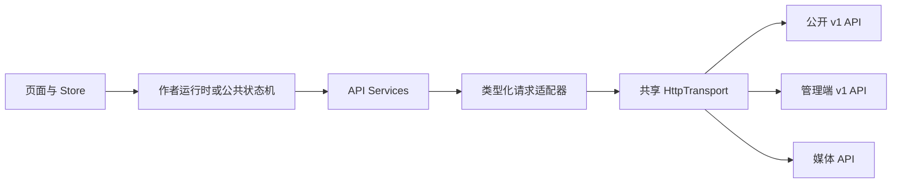

# 前端 OpenAPI 接口契约迁移修改计划

| 项目 | 内容 |
| --- | --- |
| 状态 | 待实施 |
| 适用范围 | `frontend/` 请求层、公共读取调用、作者编辑调用、相关测试与夹具 |
| 契约来源 | [`backend/api/openapi.yaml`](../backend/api/openapi.yaml) |
| 目标读者 | 前端实现者、代码评审者、接口联调与验收人员 |
| 迁移策略 | 干净切换；删除旧接口调用，不保留旧路径兼容分支 |

## 一、执行摘要

当前前端请求层处于新旧契约混用状态：公共文章列表和详情已经使用 `/api/v1/articles`，分类和标签也已经使用 v1 路径；文章创建、文章更新和正文图片上传仍调用旧接口。作者编辑器还缺少新契约要求的 `slug`、创建 `status` 和更新所需的版本控制，作者编辑详情仍使用公共文章详情路径，无法读取草稿和已归档文章。

本计划将前端切换到 `backend/api/openapi.yaml` 定义的 REST 契约：

1. 保留并校准公共文章、分类和标签读取适配器。
2. 将作者文章读取切换到管理端详情接口。
3. 将文章创建切换为 `POST /api/v1/manage/articles`，将更新切换为带 `If-Match` 的 `PATCH /api/v1/manage/articles/{article_id}`。
4. 将正文图片上传切换为 `POST /api/v1/manage/article-images`，保留图片取消接口。
5. 在领域模型和编辑器状态中补齐 `slug`、`status`、`version`，使创建和局部更新请求不会混用字段。
6. 统一解析裸资源、分页信封和 RFC 9457 `application/problem+json` 错误。
7. 同步单元测试、组件测试和 E2E 网络夹具，删除旧路径与旧字段断言。

本计划不实现真实登录、Token 或 Cookie 会话。当前 OpenAPI 没有声明 `securitySchemes`、认证路径或认证传输规则；前端现有 `auth.ts` 也明确返回 `unsupported`。受保护写入的真实联调必须等待后端明确认证协议，或使用后端提供的已授权开发环境。

## 二、已确认的现状

### 2.1 契约事实

`backend/api/openapi.yaml` 是本次迁移的唯一接口权威来源：

- 公开文章列表：`GET /api/v1/articles`。
- 公开文章详情：`GET /api/v1/articles/{article_id}`，仅返回已发布且未删除文章。
- 管理文章列表：`GET /api/v1/manage/articles`。
- 管理文章详情：`GET /api/v1/manage/articles/{article_id}`，可返回草稿、已发布和已归档文章。
- 创建文章：`POST /api/v1/manage/articles`，请求体字段为 `title`、`slug`、`digest`、`content`、`article_type_id`、`tag_ids`、`status`，状态只能为 `1` 或 `2`。
- 局部更新文章：`PATCH /api/v1/manage/articles/{article_id}`，请求体不含生命周期状态，必须携带强 `If-Match`。
- 删除文章：`DELETE /api/v1/manage/articles/{article_id}`，必须携带强 `If-Match`，成功无响应体。
- 发布和归档：分别为 `/publish` 与 `/archive`，均为 `POST`，必须携带强 `If-Match`。
- 分类和标签的列表、创建、详情、局部更新、删除均有独立 v1 路径；当前页面只实际使用列表、创建和删除。
- 正文图片上传：`POST /api/v1/manage/article-images`，multipart 字段名必须是 `file`。
- 正文图片取消：`DELETE /api/v1/article-images/{image_id}`。
- 图片媒体读取：`GET /media/article-images/{storage_key}`。
- 列表响应统一为 `{ items, page: { number, size, total_items, total_pages } }`。
- 成功写入返回裸资源；创建返回 `201`、`Location`、`ETag`；更新和生命周期动作返回新的资源与 `ETag`。
- 错误响应为 RFC 9457 风格的 `application/problem+json`，包括 `type`、`title`、`status`、`detail`、`instance`、`request_id` 和 `errors`。

详细位置：

- 路径：`backend/api/openapi.yaml:18-636`。
- 参数和响应：`backend/api/openapi.yaml:638-789`。
- 图片与分页 schema：`backend/api/openapi.yaml:790-911`。
- 错误与资源 schema：`backend/api/openapi.yaml:912-1248`。

### 2.2 前端现状

| 文件 | 当前事实 | 迁移影响 |
| --- | --- | --- |
| `frontend/src/request/api/article.ts` | 列表和公共详情已经是 v1；创建仍为 `/Article/CreateArticle`；更新仍为旧 `PUT` | 必须重写文章写入映射，并增加管理端详情与生命周期方法 |
| `frontend/src/request/api/article-image.ts` | 表单字段 `file` 正确，但上传路径为 `/api/v1/article-images` | 上传路径必须改为 `/api/v1/manage/article-images` |
| `frontend/src/request/api/article-type.ts` | v1 列表、创建、删除已接近目标 | 保留；补齐契约约束，详情/patch 是否暴露按本计划阶段执行 |
| `frontend/src/request/api/tag.ts` | v1 列表、创建、删除已接近目标 | 保留；补齐契约约束，详情/patch 是否暴露按本计划阶段执行 |
| `frontend/src/request/transport.ts` | 只有 `get`、`post`、`put`、`delete` | 增加 `patch`；删除旧 `put` 的前端使用 |
| `frontend/src/request/api/schemas.ts` | 已解析主要字段，但长度、slug、唯一性和上限约束不完整 | 按 OpenAPI 收紧边界 schema |
| `frontend/src/services/author-contracts.ts` | 文章创建和更新返回 `boolean` | 改为返回服务端文章资源，携带新 `id` 和 `version` |
| `frontend/src/services/author-runtime.ts` | 作者详情绑定公共 `services.article.detail` | 改为管理端详情；写入结果契约同步变更 |
| `frontend/src/stores/editor-draft.ts` | 草稿无 `slug`，保存快照无 `version` | 增加 slug 和版本状态，拆分 create/patch 生成逻辑 |
| `frontend/src/views/author/ArticleEditorView.vue` | 保存只发送旧写入模型，成功后只结束保存状态 | 发送新请求、处理服务端资源、更新版本并在新建成功后进入编辑地址 |
| `frontend/src/services/fake-author.ts` | Fake 创建和更新返回 `true` | 返回完整领域文章，继续支持作者页面测试 |
| `frontend/tests/e2e/t13/fixtures/api-fixtures.ts` | 仍拦截旧 `Article/*` 路径 | 改为 v1 公共读取路径 |

### 2.3 运行时地址事实

OpenAPI server 为根路径 `/`，接口自身包含 `/api/v1`。因此 `frontend/public/config.json` 的 `serverUrl` 应保持后端根地址，例如：

```json
{
  "serverUrl": "http://127.0.0.1:8080"
}
```

不得把 `/api` 再放入 `serverUrl`，否则新路径可能拼接成重复的 `/api/api/v1`。实现和测试中出现的 `http://localhost:5000/api` 应改为后端根地址，除非该值只用于不发请求的历史 fixture。

## 三、目标设计与边界

### 3.1 请求路径与领域边界

请求适配器负责把内部领域模型转换为 OpenAPI wire model，并在边界解析外部响应；页面和 Store 不直接读取 snake_case 响应，也不拼接请求 URL。



目标关系：

- 公共页面继续使用 `article.list` 和 `article.detail`。
- 作者编辑器使用 `article.manageDetail`、`article.create` 和 `article.update`。
- 作者图片生命周期使用 `articleImage.uploadImage` 和 `articleImage.deleteImage`。
- 管理端生命周期方法属于文章适配器，但没有对应现有页面时不新增 UI。
- 分类、标签公共查询继续由现有 taxonomy 适配器负责。

### 3.2 并发控制决策

前端请求更新、删除、发布和归档时统一从当前领域资源的 `version` 生成：

```http
If-Match: "7"
```

响应体中的 `version` 是前端下一次操作的版本来源。OpenAPI 同时要求响应 `ETag`，但当前后端 CORS 中间件只允许请求头，没有声明 `Access-Control-Expose-Headers`；浏览器跨源场景不能假定前端能读取 `ETag` 或 `Location`。

因此本次前端迁移：

- 不把读取响应 `ETag` 作为当前编辑器成功的前置条件。
- 创建成功后从返回资源的 `id` 构造管理端编辑地址，不依赖 `Location`。
- 更新后从返回资源的 `version` 更新本地并发版本。
- 如果未来要求前端严格校验响应头，需另行修改后端 CORS，暴露 `ETag, Location`，不在本次前端计划中暗加假设。

### 3.3 认证边界

OpenAPI 当前没有认证方案声明；前端 `frontend/src/request/api/auth.ts` 的生产适配器仍返回 `unsupported`。本次计划不：

- 猜测 Bearer Token、Cookie 或其他会话方式；
- 在 Axios 中硬编码伪造 `Authorization`；
- 将 `VITE_FAKE_AUTHOR=true` 当作后端授权；
- 修改后端 OpenAPI 或生成代码来补充未确认的认证协议。

真实管理写入的验收使用后端明确提供的授权环境或网络 stub。认证协议一旦确定，应单独更新 `auth.ts`、认证 store、HTTP 装配和路由守卫。

## 四、文件级修改计划

### 阶段 0：冻结契约与移除旧路径清单

**目标**：在改代码前固定 wire 字段、路径和现有调用边界，避免一半迁移。

**检查与产物**：

1. 以 `backend/api/openapi.yaml` 复核所有 v1 路径、状态码、请求体字段和错误 schema。
2. 在 `frontend/src` 和 `frontend/tests` 清点并替换以下旧入口：
   - `/Article/GetArticleList`
   - `/Article/GetArticle`
   - `/Article/CreateArticle`
   - `/Article/UpdateArticle`
   - `/ArticleType/GetArticleTypeDic`
   - `/Tag/GetTagDic`
   - `/api/v1/article-images` 的上传用途。
3. 区分源码、测试夹具和 `frontend/coverage` 生成物；不手工修改覆盖率生成物。
4. 记录当前没有真实认证协议的事实，写入实现注释或变更记录时不把它表述为已完成授权。

**验收**：形成旧路径清单；后续阶段结束时该清单中的生产源码路径全部为零，测试中的旧路径只允许保留在明确的迁移说明中，不能作为请求匹配条件。

### 阶段 1：扩展传输层与错误边界

#### 1.1 `frontend/src/request/transport.ts`

修改内容：

- 在 `HttpTransport` 增加 `patch(url, data?, config?)`。
- `TransportBody` 继续支持 JSON 对象和 `FormData`。
- 删除前端适配器对 `put` 的使用；待所有调用迁移后删除接口中的 `put`。
- 保持适配器只依赖最小 transport，不把 Axios 类型扩散到领域层。
- 是否暴露响应 headers 作为可选能力由实现决定；本次业务逻辑不依赖它们，避免跨源 CORS 隐藏响应头导致功能失败。

关联测试替身：

- `frontend/tests/unit/api-adapters.test.ts`
- `frontend/tests/unit/article-image-adapter.test.ts`
- `frontend/tests/unit/author-runtime.test.ts`
- `frontend/tests/component/api-services-provider.test.ts`
- `frontend/tests/component/t9-article-list.test.ts`
- 其他构造完整 `HttpTransport` 的测试文件。

#### 1.2 `frontend/src/request/http.ts`

修改内容：

- `Accept` 至少包含 `application/json` 和 `application/problem+json`。
- 保留运行时配置设置根 `baseURL` 的行为。
- 从响应 body 识别 RFC 9457 `detail`，保留当前中文错误回退。
- 不把密码、API key 或认证头拼入普通错误信息。

#### 1.3 `frontend/src/request/http-error.ts` 与 `frontend/src/types/api.ts`

修改内容：

- 定义受控的 `ProblemDetails` 内部类型或 schema，字段对应 `type`、`title`、`status`、`detail`、`instance`、`request_id`、`errors`。
- `HttpRequestError` 增加可选结构化 problem 信息，至少保留 `status`、`detail`、`request_id` 和字段错误。
- 现有调用方继续通过 `status` 判断 `404`、`409`、`412`；不在页面层解析原始 Axios response。
- 非 HTTP 异常继续转换为稳定的 `UNKNOWN` 错误。

**阶段验收**：

- `PATCH` 可以被所有适配器和测试 transport 调用。
- 400/403/404/409/412/428/500 的 problem body 能保留状态和 detail。
- 不依赖浏览器读取 `ETag` 才能完成正常请求。

### 阶段 2：收紧外部响应 schema

#### `frontend/src/request/api/schemas.ts`

按 OpenAPI 补齐当前 schema 的边界：

- `pageSchema`：`number >= 1`、`size 1..100`、`total_items >= 0`、`total_pages >= 0`。
- `articleSchema`：
  - `title` 长度 `1..120`；
  - `slug` 长度 `1..160`，正则为 `^[a-z0-9]+(?:-[a-z0-9]+)*$`；
  - `digest` 长度 `1..500`；
  - `content` 非空；
  - `tag_ids` 为正整数且不重复；
  - `status` 为 `1 | 2 | 3`；
  - 计数非负，`version` 为正整数；
  - 时间为 ISO date-time，`updated_at` 可为 `null`。
- `articleTypeSchema`：名称 `1..60`，图片 `null` 或长度不超过 `512`，`meun >= 0`。
- `tagSchema`：名称 `1..60`。
- 图片 schema：
  - `id` 必须为 32 位小写十六进制；
  - `storageKey` 必须为 32 位小写十六进制加 `.jpg` 或 `.png`；
  - `url` 必须匹配 `/media/article-images/{storage_key}`；
  - `byteSize` 不超过 `5242880`；
  - `width`、`height` 不超过 `8192`；
  - `mediaType` 仅 `jpeg | png`；
  - `status` 仅 `pending`。

保持 `z.strictObject`，让后端字段漂移在请求边界失败，而不是进入页面后静默丢失。

**阶段验收**：合法 v1 fixture 能通过；缺失版本、错误 slug、未知图片 URL、超限图片元数据和多余字段会在边界被拒绝。

### 阶段 3：重构文章领域请求模型

#### 3.1 `frontend/src/types/article.ts`

将当前把创建、更新和旧接口字段混在一起的模型拆开。推荐目标模型：

```ts
export type ArticleCreateRequest = {
  readonly title: string
  readonly slug: string
  readonly digest: string
  readonly markdown: string
  readonly articleTypeId: number
  readonly tagIds: readonly number[]
  readonly status: 1 | 2
}

export type ArticlePatchRequest = {
  readonly title?: string
  readonly slug?: string
  readonly digest?: string
  readonly markdown?: string
  readonly articleTypeId?: number
  readonly tagIds?: readonly number[]
}

export type ArticleUpdateRequest = {
  readonly id: number
  readonly version: number
  readonly changes: ArticlePatchRequest
}
```

说明：

- 内部领域模型继续使用 `markdown`、`articleTypeId`、`tagIds`；只有适配器边界转换为 `content`、`article_type_id`、`tag_ids`。
- 创建模型必须包含 `slug` 和 `status`。
- PATCH 模型不包含 `status`、`id`、`version`；`id` 在 URL，`version` 在 `If-Match`。
- 不保留 `ArticleWrite`、旧字段名或旧方法签名的兼容别名；所有调用方一次迁移。
- `ArticleDetail` 保留现有 `slug`、`status`、`version` 字段。

同步修改的直接引用：

- `frontend/src/request/api/article.ts`
- `frontend/src/services/author-contracts.ts`
- `frontend/src/services/fake-author.ts`
- `frontend/src/stores/editor-draft.ts`
- `frontend/src/views/author/ArticleEditorView.vue`
- 相关测试和 fixture。

#### 3.2 `frontend/src/stores/editor-draft.ts`

修改内容：

- `EditorDraft` 增加 `slug`。
- Store 内部保存当前编辑资源的 `version`，创建模式版本为空。
- `reset()` 设置空标题、空 slug、空正文、空分类、空标签，并清除版本。
- `load(article)` 保存文章的标题、slug、正文、分类、标签和服务端版本。
- 提供 `toCreate()`：计算摘要，清除 data URL，输出领域创建模型，状态固定为当前编辑器的草稿状态 `1`。
- 提供 `toPatch()`：输出至少一个当前编辑字段，不包含状态和并发字段。
- 提供保存成功收敛方法：用服务端返回文章更新本地草稿、saved 快照和 version。
- 保存失败时保留用户草稿和当前版本，不清空内容。

当前编辑器没有发布按钮；本次不把 `status = 2` 暗藏到保存操作中。发布必须通过独立的 publish API，待页面入口存在后再接入。

### 阶段 4：重写文章 API 适配器

#### `frontend/src/request/api/article.ts`

保留现有公共读取的领域映射，重构写入和管理端路径。

#### 4.1 公共读取

保留并验证：

```text
list(request)     -> GET /api/v1/articles
                 -> page/page_size/article_type_id/tag_id/q

detail(id)        -> GET /api/v1/articles/{id}
```

`list()` 继续将内部零基 `pageIndex` 转换为服务端从 1 开始的 `page`，响应再转换回零基页码。未指定 `sort` 时使用服务端默认 `-created_at`；不要为了迁移增加页面没有使用的排序状态。

#### 4.2 管理端读取

增加：

```text
manageList(request)  -> GET /api/v1/manage/articles
manageDetail(id)     -> GET /api/v1/manage/articles/{id}
```

`manageDetail` 与 `detail` 共享 `articleSchema` 和领域映射，但路径和权限语义不同。作者编辑必须使用 `manageDetail`，否则草稿无法加载。

#### 4.3 创建

将旧的 `/Article/CreateArticle` 替换为：

```text
POST /api/v1/manage/articles
```

领域到 wire 的唯一映射：

| 内部字段 | wire 字段 |
| --- | --- |
| `title` | `title` |
| `slug` | `slug` |
| `digest` | `digest` |
| `markdown` | `content` |
| `articleTypeId` | `article_type_id` |
| `tagIds` | `tag_ids` |
| `status` | `status` |

解析 `201` 返回的裸 `Article`，通过 `parseArticleDetail()` 返回领域文章。不要返回 `boolean`。

#### 4.4 局部更新

将旧的 `PUT /Article/UpdateArticle` 替换为：

```text
PATCH /api/v1/manage/articles/{id}
If-Match: "{version}"
```

要求：

- body 只放 `ArticlePatch` 映射字段；
- 不在 body 中放 `id`、`version`、`status`；
- `markdown` 映射为 `content`；
- `articleTypeId`、`tagIds` 映射为 snake_case；
- 解析返回的裸 `Article`；
- 将新资源交给 Store 更新本地版本。

#### 4.5 生命周期方法

本次请求层迁移必须增加以下窄方法，供现有作者能力和后续管理页面复用；本阶段不新增当前不存在的管理页面、按钮或状态机：

```text
deleteManage({ id, version })
  -> DELETE /api/v1/manage/articles/{id}
  -> If-Match: "{version}"
  -> 204，无 body

publish({ id, version })
  -> POST /api/v1/manage/articles/{id}/publish
  -> If-Match: "{version}"
  -> 解析 Article

archive({ id, version })
  -> POST /api/v1/manage/articles/{id}/archive
  -> If-Match: "{version}"
  -> 解析 Article
```

删除方法返回 `void` 或适配器内部的成功标记；发布和归档返回解析后的文章资源。三类操作都必须使用当前资源版本生成强 `If-Match`，不能回退到旧接口或省略并发控制。

#### 4.6 `frontend/src/request/api-services.ts`

继续通过一个 `ApiServices` 容器提供同一篇文章适配器实例。不要在页面内重新创建 Axios 或 API adapter。更新注释和类型，使 `article` 的方法名明确区分公共详情和管理端详情。

### 阶段 5：切换作者运行时与编辑器

#### 5.1 `frontend/src/services/author-contracts.ts`

将文章仓储契约改为：

```text
detail(id) -> 管理端文章详情
create(request) -> Promise<ArticleDetail>
update(request) -> Promise<ArticleDetail>
uploadImage(file) -> Promise<UploadedArticleImage>
deleteImage(id) -> Promise<boolean>
```

如果需要保留公共文章详情的类型接口，由 `ApiServices.article.detail` 提供，不要让作者仓储继续复用错误的公开路径。

#### 5.2 `frontend/src/services/author-runtime.ts`

修改真实作者运行时：

- `articles.detail` 绑定 `services.article.manageDetail`；
- `articles.create` 和 `articles.update` 绑定新的返回值契约；
- 图片方法保持绑定；
- Fake 身份仍只负责前端开发门禁，不代表后端一定授权。

#### 5.3 `frontend/src/services/fake-author.ts`

Fake 适配器与真实仓储保持同一返回契约：

- Fake 文章详情带合法 `slug`、`status`、`version`；
- Fake create 返回新文章资源和 `id`；
- Fake update 返回更新后的文章并递增或保持与测试约定一致的版本；
- 图片和 taxonomy 行为继续保留现有测试语义。

Fake 不应继续返回 `true`，否则无法验证真实保存成功后的资源收敛。

#### 5.4 `frontend/src/components/editor/ArticleSettings.vue`

增加受控 `slug` 字段：

- 接收 `slug` prop；
- 发出 `update:slug`；
- 显示契约要求的 slug 格式提示；
- 不在组件内自动把中文标题伪造为合法 slug；
- 保持现有标题、分类、标签和删除操作行为。

#### 5.5 `frontend/src/views/author/ArticleEditorView.vue`

修改内容：

1. 绑定新的 slug 字段。
2. 创建模式调用 `draftStore.toCreate()`，保存状态为草稿 `1`。
3. 编辑模式读取 Store 中的 version，构造 `{ id, version, changes }` 并调用 PATCH。
4. 创建或更新成功后使用服务端返回文章收敛草稿、saved 快照和 version。
5. 创建成功后使用返回的 `id` 导航到 `/author/articles/{id}/edit`，防止仍停留在新建地址而重复创建。
6. `412` 时保留草稿并提示资源已被其他操作修改；不要自动覆盖用户当前编辑内容。
7. `428`、`403`、`404`、`409` 和普通网络失败显示稳定的可操作提示。
8. 图片生命周期在文章保存成功后继续 `commit()`；保存失败时继续按图片 id 取消并保留 TTL 兜底提示。

### 阶段 6：修正正文图片适配器

#### `frontend/src/request/api/article-image.ts`

修改内容：

- 上传路径从 `/api/v1/article-images` 改为 `/api/v1/manage/article-images`。
- 保持 multipart 字段名 `file`。
- 不手工设置 `Content-Type`，让浏览器生成 boundary。
- 继续解析 `201` 裸 `ArticleImage`。
- 只向编辑器暴露 `id`、规范化 `url`、`expiresAt`；内部 schema 仍严格校验完整返回资源。
- 删除路径保持 `/api/v1/article-images/{image_id}`，成功按 `204` 返回 `true`。
- URL 必须是站内 `/media/article-images/...` 资源，不能因为 `normalizeImageUrl()` 的通用能力而放行任意外部正文图片地址。

#### `frontend/src/types/api.ts`

如果 `normalizeImageUrl()` 继续被分类图片使用，应保留其通用 HTTP(S) 行为；图片上传适配器在进入通用 URL 归一化前增加 ArticleImage 专用路径 schema，避免改变分类图片兼容性。

### 阶段 7：分类与标签适配器整理

#### 当前调用者需要的部分

保留以下已接近目标的行为：

- `GET /api/v1/article-types` 分页读取；
- `POST /api/v1/article-types` JSON 创建，wire 字段仍为 `meun`；
- `DELETE /api/v1/article-types/{id}` + `If-Match`；
- `GET /api/v1/tags` 分页读取；
- `POST /api/v1/tags` JSON 创建；
- `DELETE /api/v1/tags/{id}` + `If-Match`。

继续使用分页 envelope 和服务端返回的 `version`，不要回退到旧字典接口。

#### 契约完整性部分

本次请求层迁移一并覆盖 OpenAPI 已定义但当前页面尚未使用的 taxonomy 详情和 PATCH 方法；不新增对应 UI。

在 `article-type.ts` 和 `tag.ts` 增加：

```text
GET   /api/v1/article-types/{id}
PATCH /api/v1/article-types/{id} + If-Match
GET   /api/v1/tags/{id}
PATCH /api/v1/tags/{id} + If-Match
```

同时在 `frontend/src/types/taxonomy.ts` 增加局部更新输入和带版本的更新目标。PATCH body 只能包含资源字段，不包含 `id`、`version`；返回资源必须经过 schema 解析。页面仍只接入当前已有的列表、创建和删除能力，详情/PATCH UI 另立任务，避免引入没有用户入口的管理功能。

#### `frontend/src/views/author/TaxonomyView.vue` 与 `frontend/src/composables/use-article-tag-management.ts`

- 保留现有创建和删除流程。
- 统一捕获 `HttpRequestError`，防止 `403`、`404`、`428` 或网络错误形成未处理 Promise。
- 继续对 `409` 引用冲突和 `412` 版本冲突做不同反馈。
- 分类和标签删除成功后，列表刷新失败仍只收敛本地已删除项，并提示服务端状态需要重试。

### 阶段 8：同步测试、夹具与文档

#### 8.1 单元测试

`frontend/tests/unit/api-adapters.test.ts`：

- 保留公共文章列表、公共详情、分类和标签 v1 映射测试；
- 增加管理端详情路径测试；
- 增加文章创建 body、`201` 裸资源和返回领域文章测试；
- 增加 PATCH 路径、snake_case body、`If-Match` 和响应版本测试；
- 增加删除、发布、归档的路径和状态行为测试；
- 删除旧 `PUT`、`body`、camelCase wire body 断言。

`frontend/tests/unit/article-image-adapter.test.ts`：

- 上传路径改为 `/api/v1/manage/article-images`；
- 保留 `file` multipart 断言和不手工设置 boundary 的断言；
- 增加非法 storage key 或外部图片 URL 被拒绝的测试；
- 删除仍按响应 id，而不是从 URL 推导 id。

`frontend/tests/unit/author-runtime.test.ts`：

- transport mock 增加 `patch`；
- 验证真实作者详情调用管理端路径；
- 验证 create/update 返回完整文章并保持版本；
- 保留 Fake taxonomy 和作者运行时门禁测试。

`frontend/tests/unit/http.characterization.test.ts`：

- baseURL 断言使用后端根地址；
- 删除 `/Article/GetArticleList` 旧路径示例；
- 增加 RFC 9457 problem 字段保留测试。

所有 `HttpTransport` 工厂都必须增加 `patch`，并在删除 `put` 前完成全局调用迁移。

#### 8.2 组件测试

`frontend/tests/component/t9-article-list.test.ts`：

- mock 匹配 `/api/v1/articles`；
- response fixture 使用当前完整 `Article` 和分页 schema；
- 请求断言使用 `page`、`page_size`、`article_type_id`、`tag_id`、`q`；
- 保留加载失败、保留旧数据和重试行为。

`frontend/tests/component/t11-author-view.test.ts`：

- Fake 文章 fixture 增加 slug 和版本输入；
- 增加 slug 字段更新行为；
- 更新保存成功后验证返回文章被接收；
- 新建成功后验证从 new 路由进入带 id 的 edit 路由；
- 保留 taxonomy、图片生命周期和失败反馈测试。

`frontend/tests/component/article-editor-tag-management.test.ts`、`article-settings.test.ts`：

- 更新 `ArticleSettings` 新 prop/event；
- 确认标签选择和删除行为不被 slug 字段改动破坏。

#### 8.3 E2E 与网络夹具

`frontend/tests/e2e/task-9-article-image.spec.ts`：

- 上传匹配 `/api/v1/manage/article-images`；
- 文章保存匹配 `POST /api/v1/manage/articles`；
- fixture 返回 `201` 和完整 `Article`；
- body 断言改为 `content`、`article_type_id`、`tag_ids`、`slug`、`status`；
- 图片取消路径继续为 `/api/v1/article-images/{id}`；
- 保留上传失败、保存失败、删除失败 TTL 兜底和按 id 删除断言。

`frontend/tests/e2e/t13/fixtures/api-fixtures.ts`：

- 公共文章列表改拦截 `/api/v1/articles`；
- 公共详情改拦截 `/api/v1/articles/{article_id}`；
- 分类和标签改使用 `/api/v1/article-types`、`/api/v1/tags`；
- 公共文章 fixture 的 `status` 应为 `2`，否则与公开接口语义不符；
- 夹具保留完整新 schema 字段。

`frontend/tests/e2e/t13/failure-security.spec.ts`：

- 离线拦截从旧 `Article/GetArticle` 改为 v1 详情路径；
- failed request URL 断言同步运行时 `serverUrl` 和新路径；
- 保留 503 列表失败、详情重试和 Markdown 安全测试。

#### 8.4 文档与生成物

- `frontend/docs/development.md` 的请求适配修改路径继续有效；如新增实际维护入口，补充 `manage` 与公共路径的边界说明。
- `frontend/docs/architecture.md` 保留“页面 -> API Services -> adapter -> transport”的边界；更新任何出现旧路径的文字。
- 不手工编辑 `frontend/coverage/`；测试完成后按项目命令重新生成。
- 不复制 OpenAPI 全部字段到前端文档，避免形成第二个易漂移的契约来源；文档只链接 `backend/api/openapi.yaml`。

## 五、错误和并发行为

| 场景 | 适配器行为 | 页面或服务行为 |
| --- | --- | --- |
| `400` | 抛出包含 problem detail 的 `HttpRequestError` | 显示输入或请求失败提示；不清空草稿 |
| `403` | 保留状态和 detail | 显示无权限或操作被拒绝；不重试旧请求 |
| `404` | 保留状态 | 公共详情显示 not-found；作者详情显示资源不存在 |
| `409` | 保留状态和字段错误 | taxonomy 按引用冲突提示；文章创建按唯一性冲突提示 |
| `412` | 保留状态 | 重新读取最新资源或要求用户刷新；不自动覆盖正在编辑的草稿 |
| `428` | 保留状态 | 视为客户端并发版本缺失，修正调用路径，不做盲目重试 |
| `500` 或网络失败 | 保留 detail 或稳定网络错误 | 保留已有页面数据和可重试入口 |
| 响应 schema 不匹配 | 抛出 `ApiParseError` | 不把未验证数据写入 Store，显示稳定失败状态 |
| 图片 DELETE 失败 | 生命周期返回清理失败 | 显示 TTL 兜底提示，不重复发送同一取消请求 |

分类和标签现有 `412` 刷新后要求再次确认的行为应保留。文章编辑器不得在 `412` 后直接用服务端正文覆盖用户未保存内容。

## 六、实施顺序与依赖

| 顺序 | 阶段 | 依赖 | 可交付物 |
| --- | --- | --- | --- |
| 0 | 契约冻结与旧路径清单 | 无 | 路径、字段、状态码和旧调用清单 |
| 1 | Transport 与错误边界 | 0 | `patch`、problem 错误结构、测试 transport 更新 |
| 2 | 响应 schema | 0 | 严格 v1 schema 和边界测试 |
| 3 | 领域请求模型与草稿状态 | 2 | create/patch 分离模型、slug/version 管理 |
| 4 | 文章适配器 | 1、2、3 | 公共与管理文章端点完整映射 |
| 5 | 作者运行时与编辑器 | 4 | 作者详情、创建、更新、版本收敛和新建后导航 |
| 6 | 图片适配器 | 1、2 | 管理上传、公共取消、图片 schema 校验 |
| 7 | 分类标签整理 | 1、2 | 现有 v1 调用稳定，必要时补齐详情/patch |
| 8 | 测试、夹具和文档 | 3-7 | 旧路径清除，测试覆盖新契约 |
| 9 | 统一验证与清理 | 8 | 类型检查、相关测试、构建和运行时 smoke evidence |

阶段 1、2 可以并行实现，但阶段 4 必须等待二者完成；阶段 5 必须等待领域模型和文章适配器完成；阶段 8 必须在所有生产源码路径迁移后执行。

## 七、验证计划

### 7.1 静态验证

在 `frontend/` 执行：

```powershell
pnpm typecheck
```

验收重点：

- 不再存在文章旧 `put` 调用；
- 所有 `HttpTransport` mock 都实现 `patch`；
- `ArticleCreateRequest` 和 `ArticleUpdateRequest` 的调用者全部迁移；
- `ArticleSettings` 的 slug prop/event 类型完整；
- `AuthorArticleRepository` 的真实和 Fake 实现返回同一类型。

### 7.2 适配器验证

```powershell
pnpm test:unit -- api-adapters.test.ts article-image-adapter.test.ts http.characterization.test.ts author-runtime.test.ts
```

如果项目 Vitest 配置不接受文件参数，则执行完整单元集：

```powershell
pnpm test:unit
```

必须观察到：

- 新路径和 HTTP method 命中；
- create body 使用 `content`、`article_type_id`、`tag_ids`；
- PATCH 的 id 在 URL、版本在 `If-Match`、body 不含 status；
- 图片上传使用 manage 路径和 `file` part；
- 解析失败不会向领域层返回半成品。

### 7.3 组件验证

```powershell
pnpm test:component -- t9-article-list.test.ts t11-author-view.test.ts article-editor-tag-management.test.ts article-settings.test.ts
```

必须覆盖：

- 公共列表 v1 query 转换；
- 作者 slug 输入；
- 新建成功后的资源 id 和编辑地址；
- 更新后的 version 收敛；
- 版本冲突、保存失败和图片清理反馈。

### 7.4 构建验证

```powershell
pnpm build
```

构建证明不能有旧模型导致的 TypeScript/Vue 编译错误；它不能替代端点行为验证。

### 7.5 浏览器 smoke 验证

在后端可访问、作者写入已授权或使用受控网络 stub 的条件下，执行：

```powershell
pnpm test:e2e -- task-9-article-image.spec.ts
```

观察 Network：

1. 文章分类和标签读取命中 v1 路径。
2. 图片上传命中 `/api/v1/manage/article-images`，multipart 字段为 `file`。
3. 新建文章命中 `/api/v1/manage/articles`，状态为 `201`。
4. 更新文章命中 `PATCH /api/v1/manage/articles/{id}`，带 `If-Match: "{version}"`。
5. 保存成功不删除已提交图片；保存失败和离页只按返回图片 id 取消一次。

真实受保护 API 若因认证协议未确认而无法联调，应保留适配器单元证据和网络 stub 证据，并明确标记真实授权 smoke 未执行；不得把 Fake Auth 当作后端授权证明。

## 八、风险、回滚与恢复

### 8.1 主要风险

1. **编辑器缺少合法 slug**：后端会以 400 拒绝创建。通过新增 slug 输入和严格前端提示解决，不自动生成无法满足正则的中文 slug。
2. **公共详情与管理详情混用**：草稿会收到 404。通过 `manageDetail` 单独命名并在作者运行时绑定解决。
3. **PATCH 误传 status 或 id**：后端 schema 拒绝或破坏生命周期边界。通过独立 create/patch 类型和 wire mapper 解决。
4. **版本未更新**：首次 PATCH 成功后后续操作收到 412。通过保存成功资源回写 Store 解决。
5. **跨源读取不到 ETag/Location**：浏览器无法读取响应头。当前实现不依赖读取它们；如果以后需要，增加后端 `Access-Control-Expose-Headers` 变更。
6. **认证未定义**：真实管理写入收到 403。不能在前端猜测认证方式；等待后端协议或使用已授权联调环境。
7. **E2E 夹具仍匹配旧路径**：页面出现 404 或误判失败。阶段 8 必须同步所有网络夹具和 URL 断言。

### 8.2 回滚边界

本次迁移不修改数据库、不修改 OpenAPI、不修改后端业务数据。若验证失败：

- 在同一变更中回滚前端源码、测试和夹具即可；
- 不保留新旧接口双写或运行时按失败自动回退旧接口；
- 已经成功创建的测试文章只允许按测试数据清理流程处理，不由前端回滚逻辑删除业务数据；
- 图片上传产生的 pending 资源继续依靠显式 DELETE 或服务端 TTL 清理。

## 九、完成标准

全部满足以下条件才算完成：

- [ ] 生产源码不再调用旧文章、旧分类、旧标签或旧图片上传路径。
- [ ] 公共文章读取、管理文章读取、创建、PATCH、删除、发布、归档路径与 OpenAPI 一致。
- [ ] 创建请求包含 `slug`、`content`、`article_type_id`、`tag_ids`、`status`。
- [ ] PATCH 请求使用 URL 中的文章 id、强 `If-Match` 和不含 status 的局部 body。
- [ ] 作者编辑器能够读取草稿，创建成功能拿到服务端 id，更新成功能保存新的 version。
- [ ] 图片上传使用 `/api/v1/manage/article-images` 和 `file` multipart part。
- [ ] 图片取消仍按服务端返回 id 调用 `204` 接口。
- [ ] 外部资源、分页 envelope、problem error 和图片约束均在请求边界解析。
- [ ] 真实和 Fake 作者仓储符合同一返回契约。
- [ ] 单元测试、组件测试、构建和受控 E2E smoke 通过；未执行的真实认证联调有明确记录。
- [ ] `coverage` 等生成目录未被手工作为源码维护。
- [ ] 旧兼容别名、旧路径回退和未使用的旧请求字段已删除。

## 十、待确认但不阻塞本次公共读取迁移的问题

| 问题 | 当前证据 | 影响 | 处理方式 |
| --- | --- | --- | --- |
| 管理写入采用 Bearer、Cookie 还是其他认证方式 | OpenAPI 没有 security scheme；前端 auth 仍 unsupported | 真实作者写入联调 | 单独确认后再改认证链路，本计划不猜测 |
| 是否要求浏览器读取响应 `ETag`、`Location` | OpenAPI 要求响应头；后端 CORS 当前未暴露响应头 | 若前端要严格验证响应头，需要后端改 CORS | 当前使用响应体 `version` 和返回 `id`；需要 header 读取时另立后端变更 |
| 是否立即建设管理文章 UI | 当前只有作者编辑页和不可用管理域 | 删除、发布、归档适配器虽可先具备，页面暂无调用者 | 适配器可提供窄方法，UI 不在本次迁移范围 |
| 是否立即建设 taxonomy 详情和 PATCH UI | 当前页面只有列表、创建和删除 | 全契约覆盖会增加模型和交互范围 | 现有调用先稳定；详情/PATCH 按实际功能另立任务 |

## 十一、维护归属

- 后端接口、路径、wire 字段、状态码和响应头：[`backend/api/openapi.yaml`](../backend/api/openapi.yaml)。
- 前端外部响应边界：`frontend/src/request/api/schemas.ts` 及对应适配器。
- 前端领域模型：`frontend/src/types/`。
- 请求装配和错误归一化：`frontend/src/request/`。
- 作者跨组件写入和图片生命周期：`frontend/src/services/`。
- 页面交互和表单字段：`frontend/src/views/author/`、`frontend/src/components/editor/`。
- 行为验证：`frontend/tests/unit/`、`frontend/tests/component/`、`frontend/tests/e2e/`。

OpenAPI 字段变更后，先更新契约对应的 schema 和适配器，再更新领域模型与调用者；不要在页面层直接兼容多个 wire 版本。
